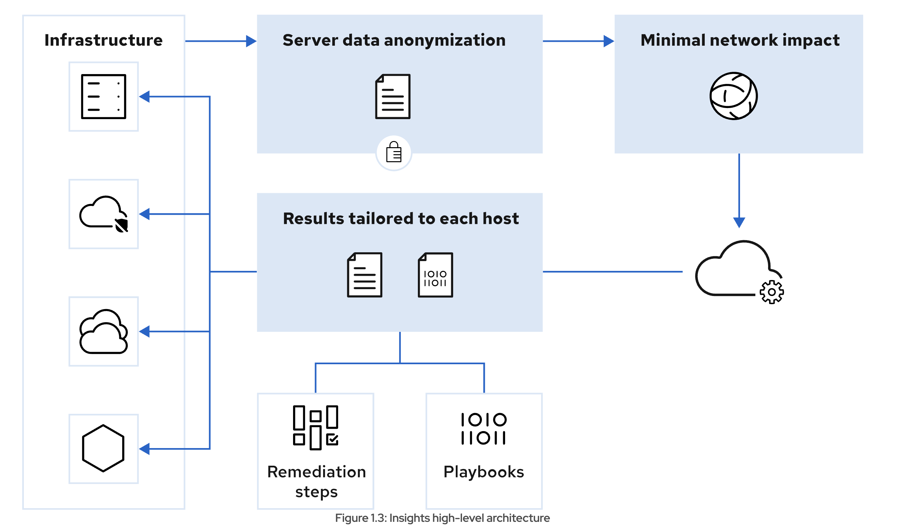

# Nội dung khóa RH 199

## No.1: Cách liên hệ support từ Red Hat hiệu quả

Generate sos report bằng command line

```bash
# cài đặt
dnf install sos

# tạo báo cáo
[root@host ~]# sos report
...output omitted...
Press ENTER to continue, or CTRL-C to quit.

Optionally, please enter the case id that you are generating this report for []:
...output omitted...
Your sosreport has been generated and saved in:
  /var/tmp/sosreport-host-2022-03-29-wixbhpz.tar.xz
..output omitted...
Please send this file to your support representative.
```

## No.2: Mô hình của Red Hat Insight



# Đoạn connection và interface chap 18 RH124 cần xem lại