# Khóa học Red Hat System Admin I (RH124)

## Chapter 1: Giới thiệu RedHat Enterprise Linux

### 1.1. Bản phân phối Linux

Là hệ điều hành được dựng từ Linux kernel mà hỗ trợ các chương trình của người dùng và các thư viện.

Được phát triển bởi nhiều cộng đồng phát triển hợp tác với nhau với từng thành phần.

Một bản phân phối cung cấp phương thức vài đặt và quản lý hệ thống Linux dễ dàng

### 1.2. Hệ sinh thái Red Hat Enterprose Linux

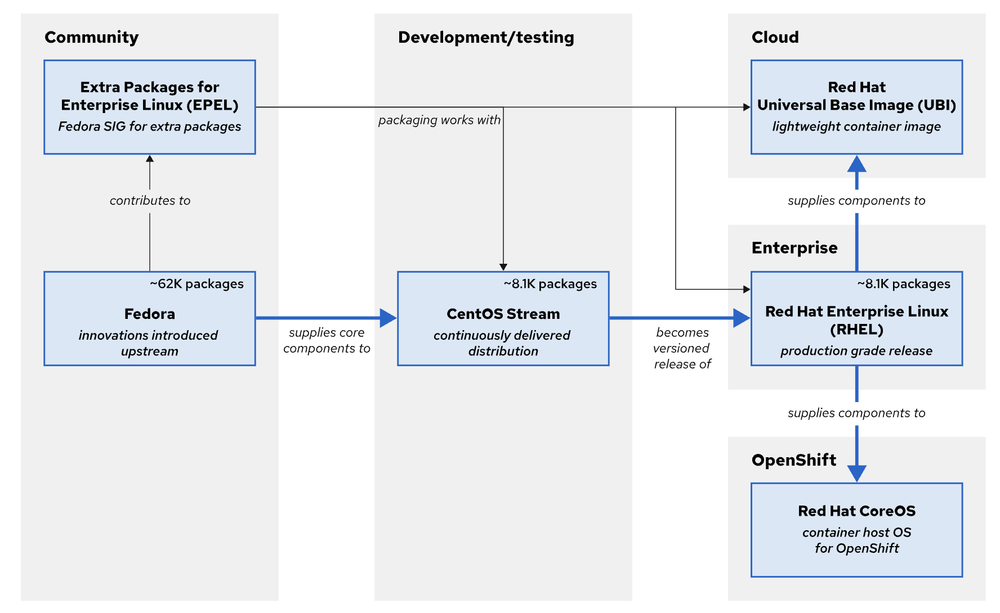

---

## Chapter 2: Truy cập Command Line

### 2.1. Gồm 3 thành phần 

- Command: câu lệnh để chạy
- Options: các tùy chọn để điều chỉnh behavior của command
- Arguments: là các mục tiêu của câu lệnh (các biến truyền vào)

### 2.2. Logging vào hệ thống

Gồm 2 loại console: physical console và virtual console
- Physical console là đăng nhập trực tiếp vào máy
- Virtual console là đăng nhập bằng các lệnh như ssh từ xa

```bash
# lệnh ssh
ssh remoteuser@remotehost

ssh -i mylab.pem remoteuser@remotehost

```

Một số câu lệnh

```bash
wc -lwc /etc/passwd # xem số dòng, số từ, số ký tự của 1 file

useradd <tên-user> # tạo user 

passwd # đổi pass user hiện tại

su - <tên-user> # switch sang user khác -> bỏ trống nếu muốn chuyển sang user root

# các lệnh head, tail, less

!26 # chạy lệnh có stt 26 trong ds các lệnh đã nhập trong history

!ls # tìm các lệnh bắt đầu bằng ls trong ds các lệnh trong history

file <đường-dẫn-file> # xem loại của file

```

Phím tắt:
- Ctrl A: nhảy về đầu command
- Ctrl E: nhảy về cuối command
- Ctrl U; xóa từ đầu đến con trỏ 
- Crtl K: xóa từ con trỏ đến cuối

---

## Chapter 3: Sử dụng manual pages hỗ trợ tìm thông tin

### 3.1. Các thông tin của man page

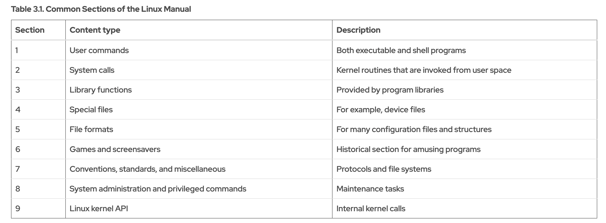

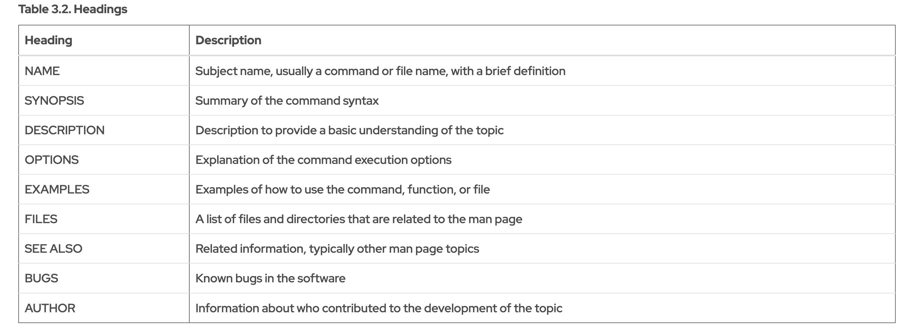

### 3.2. Các câu lệnh liên quan

```bash
man ssh # xem thông tin lệnh ssh

man -k passwd # tìm các câu lệnh có pattern passwd

man 1 passwd # xem ttin câu lệnh trong TH có 2 câu lệnh giống nhau khác section

```

Khi xem man page, sử dụng /<nhập-string> để tìm kiếm trong page

---

## Chapter 4: Đăng ký hỗ trợ hệ thống từ RedHat

### 4.1. Giới thiệu

Việc đăng ký hệ thống của bạn bằng tài khoản Red Hat giúp hệ thống có thể sử dụng các dịch vụ hỗ trợ và cập nhật phần mềm.

Lợi ích:
- Truy cập vào các kho repo (cập nhập bản vá, sửa lỗi, v.v)
- Sử dụng được RedHat Insight 
- Có đội ngũ RedHat hỗ trợ 24/7 tùy vào mức độ

### 4.2. Mô hình SCA (Simple Content Access)

Từ 2024, RedHat chuyển qua mô hình SCA, giúp đơn giản hóa việc quản lý hệ thống và license.

-> Chỉ cần lấy subcription hợp lệ của tổ chức, có thể dùng để đăng nhập cho nhiều hệ thống

Sử dụng rhc:

```bash
# Sử dụng rhc
rhc connect

# Đăng ký bằng subcription
rhc connect --activation-key=<tên-key> --organization=<org-ID>

# Nếu không muốn kích hoạt tính năng:
rhc connect --disable-feature=analytics,remote-management
```

Mặc định, rhc sẽ kích hoạt 3 tính năng:
- Kho repo
- RedHat Insight
- remote-management (quản lý từ xa)

Sử dụng subcription-manager:

```bash
# Sử dụng subscription-manager
subscription-manager register

# Xem status của subcription
subscription-manager status

# Mặc định, subscription-manager không bật insight nên phải manual
insights-client --register

```

### 4.3. System Purpose

Là một cơ chế dán nhãn cho hệ thống RHEL nhằm:
- Gợi ý cho Red Hat chọn subscription phù hợp nhất
- Giúp quản lý inventory dễ hơn trong môi trường lớn
- Tự động hóa việc gán subscription (dùng activation key có ràng buộc system purpose)

Các tag của system purpose bao gồm:
- Role: RHEL Server, RHEL Station, RHEL Compute Node
- Service-level: Premium, Standard, Self-sipport
- Usage: Production, Dev/Test, Disaster Recovery

```bash
# Set sys purpose cho hệ thống
subscription-manager syspurpose role \
--set 'Red Hat Enterprise Linux Workstation'

```

### 4.4. Kiểm tra cert của hệ thống

Hệ thống đã đăng ký sẽ lưu một vài cert trong thư mục /etc/pki:
- /etc/pki/product-default: giúp nhận diện các sản phẩm đã cài trên hệ thống
- /etc/pki/consumer: giúp các nền tảng của Red Hat nhận dạng hệ thống
- /etc/pki/entitlement: là cert giúp hệ thống truy cập vào kho repo

## Chapter 5: Trợ giúp từ AI bằng RedHat Enterprise Linux Lightspeed

Gồm 2 thành phần chính:
- Trợ lý dòng lệnh
- Gợi ý các gói cài đặt khi cài image

### 5.1. Trợ lý dòng lệnh

Sử dụng IBM watsonx AI API large language model (LLM), đây là model được host bên ngoài và cung cấp cho các hệ thống RHEL như 1 SaaS 

```bash
# Cài đặt
dnf install command-line-assistant

# Hỏi
c chat "How do I list running services?"

# Vào interacive mode
c chat --interactive

# Đặt câu hỏi với output từ câu lệnh
journalctl -u httpd.service --since "1 hour ago" | \
c chat "What could be causing errors in these logs?"

# Đặt câu hỏi với dữ liệu từ file ( AI không thể tự đọc dữ liệu file nên phải đưa dữ liệu ra command line)
cat /var/log/messages | c chat "Look for critical errors in this log file."
```

---

## Chapter 6: Làm quen với hệ thống phân cấp file-system 

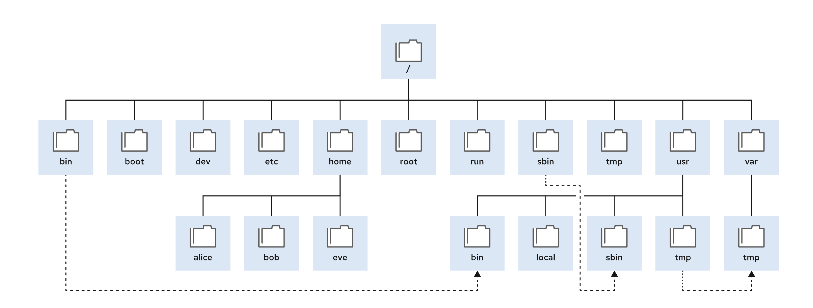

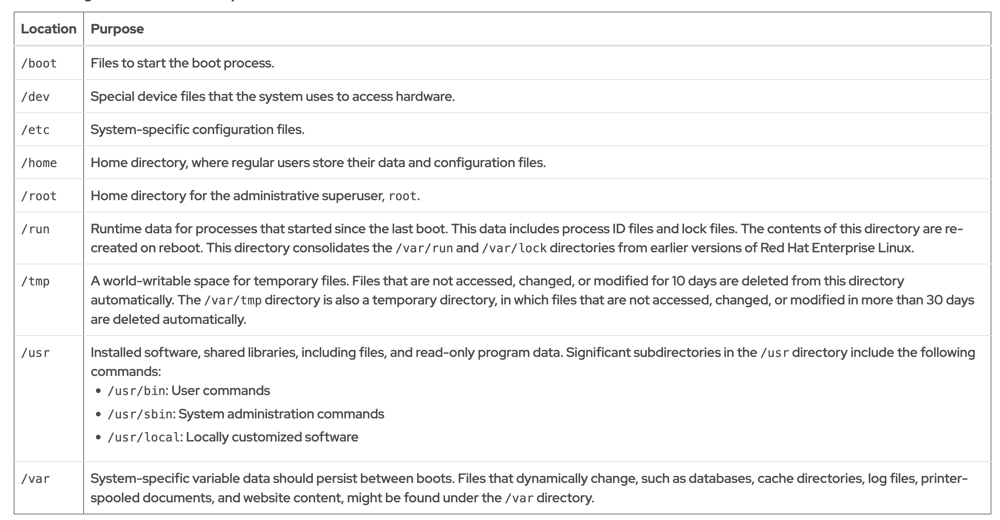

### 6.1. Đường dẫn tương đối, tuyệt đối

Đường dẫn tuyệt đối là đường dẫn bắt đầu từ thư mục gốc (/)

Đường dẫn tương đối thì bắt đầu từ thư mục hiện tại đang làm việc

```bash
# lệnh touch sẽ cập nhập timestamp của file và sẽ tạo file nếu chưa tồn tại
touch thesis_chap2.txt

# lệnh này giúp đưa về thư mục đang làm việc trước đó
cd -

# lệnh này đưa về thư mục home của người dùng
cd
```

---

## Chapter 7: Quản lý file từ command line

### 7.1. Một số câu lệnh tuogw tác với file/folder

```bash
# Tạo file bằng touch

# Tạo folder bằng mkdir

# Copy file bằng cp

# Copy folder bằng cp -r 
cp -r /etc/folder /var/folder

# Rename file/folder bằng mv
mv thesis_chapter2.txt thesis_chapter2_reviewed.txt

mv /etc/old-name /etc/new-name

# Xóa file bằng rm

# Xóa folder rỗng bằng rm -r hợc rmdir

# Xóa folder có nội dung bằng rm -i hoặc rm -f

```

### 7.2. Tạo liên kết giữa các file

Có thể tạo nhiều file name cùng trỏ về cùng 1 file, các file name này gọi là links

Gồm 2 loại liên kết (links):
- hard link
- symbolic link

#### Hard Links

Thông thường, mỗi file sẽ có một hard link, chính là đường dẫn tuyệt đối đến file 

Tạo thêm 1 liên kết cho 1 file đã tồn tại:
```bash
# ví dụ thư mục làm việc hiện tại đang có file tên là newfile.txt
# ta sẽ tạo thêm 1 liên kết để trỏ vào file này ở thư mục /tmp
ln newfile.txt /tmp/newfile-hlink2.txt
```

Sau khi tạo kết nối, 2 file sẽ có cùng một inode number, chính là vị trí của dữ liệu ở dưới hệ thống lưu trữ.

Nếu 1 trong các liên kết bị xóa (ví dụ xóa file newfile.txt) thì các liên kết còn lại vẫn có dữ liệu như thường, dữ liệu chỉ bị xóa khi hard link cuối cùng bị xóa

Hạn chế:
- Chỉ có thể sử dụng hard links với các file thông thường, không thể tạo hard links cho folder hoặc các file đặc biệt
- Chỉ sử dụng hard links nếu cả 2 file có cùng file system

#### Symbolic Links (Soft Links)

Symbolic Links không phải là một file thông thường như hard link, nó là 1 loại file đặc biệt trỏ vào file/folder khác

Ưu điểm:
- Có thể liên kết 2 file ở các file system khác nhau
- Có thể trỏ đến các file đặc biệt và các folder

```bash
# Tạo symbolic link cho file newfile.txt
ln -s /home/user/newfile.txt /tmp/newfile-symlink.txt

# Symbolic link bắt đầu bằng 'l' thay vì dấu '-'
user@host:~$ ls -l newfile-link2.txt /tmp/newfile-symlink.txt
-rw-rw-r--. 1 user user 12 May 30 19:19 newfile-link2.txt
lrwxrwxrwx. 1 user user 11 May 30 20:59 /tmp/newfile-symlink.txt -> /home/user/newfile-link2.txt
```

Khi file gốc bị xóa, symbolic vẫn tồn tại nhưng sẽ không có mục tiêu trỏ vào, gọi là "dangling symbolic link" và sẽ không còn nội dung để lấy ra

**Lưu ý**: nếu tạo lại file có tên tương tự tại vị trí cũ, "dangling symbolic link" sẽ trở lại bình thường và trỏ vào file mới -> thành "symbolic link"

Hard links thì không như vậy, nếu đã xóa hard link và tạo lại file cùng tên ở vị trí cũ, nó vẫn sẽ không link đến file đã xóa.

Điều này là do sự khác biệt giữa cơ chế hoạt động của 2 liên kết:
- Hard link trỏ tên vào dữ liệu nằm trên thiết bị lưu trữ
- Symbolic link trỏ tên vào một tên khác, và tên khác đó mới trỏ xuống data trên thiết bị lưu trữ

Nếu tạo 1 symbolic link cho folder, khi cd vào folder symbolic link, cd sẽ hiển thị như một folder bình thường và ls nội dung cũng sẽ như vậy.

Nếu thêm option -P thì khi cd vào folder symbolic sẽ tự di chuyển đến folder gốc mà nó được link

```bash
user@host:~$ ln -s /etc /home/user/configfiles
user@host:~$ cd /home/user/configfiles
user@host:~/configfiles$ pwd
/home/user/configfiles
user@host:~/configfiles$ cd -P /home/user/configfiles
user@host:/etc$ pwd
/etc
```

### 7.3. Shell expansion

Khi chạy các lệnh trong shell bash, shell sẽ xử lý câu lệnh qua nhiều phần mở rộng (expansion) rồi mới thực hiện lệnh. Có thể sử dụng các mở ộng này để thực hiện các task khó hơn:
- Pathname expansion: cho phép chọn 1 hay nhiều file bằng pattern matching
- Brace expansion: generate nhiều string hoặc ký tự
- Tilde expansion:
- Variable expansion: thay thế các text bằng các giá trị đã lưu trong biến của shell
- Command substitution: thay thế text bằng các output của lệnh

#### 7.3.1. Pathname expansion

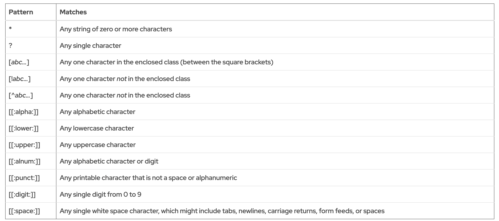

```bash
# VD
user@host:~/glob$ ls
able  alfa  baker  bravo  cast  charlie  delta  dog  easy  echo

# Hiển thị các file/folder bắt đầu bằng chữ a
user@host:~/glob$ ls a*
able  alfa

# Hiển thị các file/folder có chứa chữ a
user@host:~/glob$ ls *a*
able  alfa  baker  bravo  cast  charlie  delta  easy

# Hiển thị các file/folder bắt đầu bằng chữ a hoặc c
user@host:~/glob$ ls [ac]*
able  alfa  cast  charlie

# Hiển thị các file/folder tên có 5 chữ
user@host:~/glob$ ls ?????
baker  bravo  delta

```

#### 7.3.2. Brace expansion

Sử dụng dấu ngoặc nhọn trong câu lệnh để tạo chuỗi ký tự mong muốn

```bash
# Lệnh echo in ra màn hình một chuỗi văn bản
user@host:~/glob$ echo {Sunday,Monday,Tuesday,Wednesday}.log
Sunday.log Monday.log Tuesday.log Wednesday.log 
```

#### 7.3.3. Tilde expansion

Tương tự cái trên, nhưng sử dụng dấu '~' để tạo chuỗi ký tự mong muốn

```bash
user@host:~/scripts$ echo ~
/home/user
user@host:~/scripts$ echo ~manager
/home/manager
```

#### 7.3.4. Variable expansion

Một biến hoạt động như một nơi chứa các giá trị vào bộ nhớ.

```bash
user@host:~$ USERNAME=operator
user@host:~$ echo $USERNAME
operator
```

#### 7.3.5. Command expansion

Cho phép thay thế/thêm vào câu lệnh các output của câu lệnh khác

```bash
user@host:~/glob$ echo Today is $(date +%A).
Today is Wednesday.
```

Với một số ký tự đặc biệt dễ bị nhầm sang các expansion, thêm dấu '\' trước ký tự để giữ nguyên giá trị của nó trong câu lệnh

```bash
user@host:~/glob$ echo The value of $HOME is your home directory.
The value of /home/user is your home directory.

user@host:~/glob$ echo The value of \$HOME is your home directory.
The value of $HOME is your home directory.
```

## Chapter 8: Edit file text

Sử dụng vim để edit file (vim là phiên bản cải thiện của vi editor)

Gồm 4 mode:

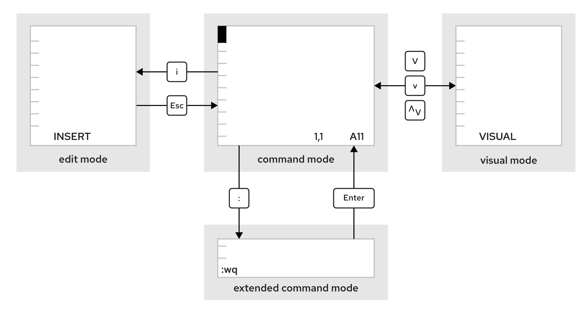

Một số từ khóa và câu lệnh:
- U: hoàn tác các chỉnh sửa gần đây
- X: xóa một ký tự
- :w lưu file và ở lại chế độ command
- :wq lưu file và thoát khỏi vim
- :q! thoát vim và hủy bỏ các thay đổi

## Chapter 9: Chuyển hướng các Input và Output 

### 9.1. Standard

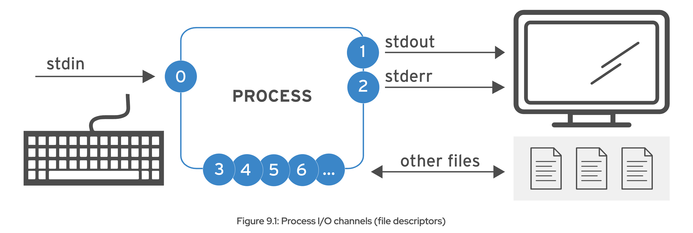

### 9.2. Chuyển hướng output tới 1 file

| Usage                  | Giải thích        |
| -----------------------| ----------------- |
| > FILE                 | Ghi stdout (kết quả) vào file, ghi đè nội dung cũ nếu file đã tồn tại               |
| >> FILE                | Ghi stdout vào file, nối thêm vào cuối file nếu đã tồn tại               |
| 2> FILE                | Ghi stderr (lỗi) vào file, ghi đè nội dung cũ nếu có               |
| 2> /dev/null           | Bỏ qua lỗi (ẩn stderr bằng cách lưu vào /dev/null)               |
| > FILE 2>&1            | Ghi cả stdout và stderr vào file, ghi đè lên nội dung cũ nếu đã tồn tại               |
| &> FILE                | Tương tự lệnh trên               |
| >> FILE 2>&1           | Ghi cả stdout và stderr vào file, nối thêm vào cuối file nếu đã tồn tại               |
| &>> FILE               | Tương tự lệnh trên               |

```bash
# Chuyến hướng kết quả đến my-result.txt, lỗi đến errors.txt
user@host:~$ find /etc > my-results.txt 2> errors.txt

```

Lưu ý: Hai câu lệnh sau khác nhau hoàn toàn:
- '> output.log 2>&1' -> stdout lưu vào output.log và stderr theo stdout nên cũng vào output.log
- '2>&1 > output.log' -> stderr lúc này theo stdout (vẫn đang hướng đến terminal) và hiển thị ra terminal, chỉ stdout ghi vào file

Giải pháp: dùng cú pháp gộp
```bash
&> output.log        # tương đương với: > output.log 2>&1
&>> output.log       # tương đương với: >> output.log 2>&1
```

Lưu ý:

```bash
# lệnh này ghi được 4 lệnh vào file
user@host:~$ cat step1.sh step2.log step3 step4 > /tmp/all-four-steps-in-one

# lệnh này chỉ ghi file step4 vì đã ghi đè các file trước
user@host:~$ cat step1.sh > /tmp/all-four-steps-in-one
user@host:~$ cat step2.log > /tmp/all-four-steps-in-one
user@host:~$ cat step3 > /tmp/all-four-steps-in-one
user@host:~$ cat step4 > /tmp/all-four-steps-in-one

```

### 9.3. Xây dựng pipeline

Pipeline là một chuỗi gồm 1 hoặc nhiều lệnh được phân tách bằng ký tự '|'. Pipeline kết nối đầu ra của câu lệnh trước đến đẩu vào cảu câu lệnh sau nó.

```bash
# Ví dụ
user@host:~$ ls -t | head -n 10 > /tmp/first-ten-changed-files
```

Chú ý: Khi kết hợp chuyển hướng với pipeline cùng lúc, shell sẽ thiết lập đường ống trước, sau đó chuyển hướng đầu vào/ra. Lúc đó, nếu đặt chuyển hướng trong pipeline thì đầu ra sẽ đi đến file và không đi vào câu lệnh tiếp theo -> pipeline hoạt động không như mong muốn.

```bash
# trong vd này, đầu ra được chuyển hướng đến saved-output và lệnh less không hiển thị gì trên terminal
user@host:~$ ls > /tmp/saved-output | less

```

Để khắc phục, sử dụng lệnh 'tee'. Lệnh này sẽ sao chép các input cho các câu lệnh tiếp theo mà vẫn chuyển hướng các output cần thiết đến file.

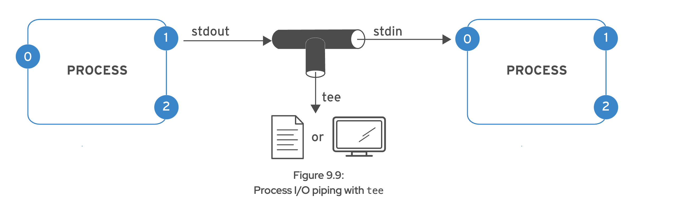

```bash
# pipeline sau chuyển hướng đầu ra của lệnh ls đến file, sau đó đưa nó vào lệnh less
user@host:~$ ls -l | tee /tmp/saved-output | less

# nếu để tee tại điểm kết thúc pipeline, stdout vừa lưu vào file vừa in ra terminal
user@host:~$ ls -t | head -n 10 | tee /tmp/ten-last-changed-files

# để thêm nội dung thay vì ghi đè trong lệnh tee, sử dụng option -a
user@host:~$ ls -l | tee -a /tmp/append-files

```

Quan trọng: nếu muốn gửi cả stdout và stderr vào lệnh tiếp theo trong pipeline, không dùng được '&>' vì nó không hỗ trợ pipeline '|' -> sử dụng '2>&1' thay thế.

## Chapter 10: Quản lý các user và group ở local

### 10.1. Linux user

Một user cung cấp các ranh giới về quyền, bảo mật giữa người và các tiến trình có thể chạy lệnh.

User có username để nhận dạng và được phân biệt với nhau bằng ID duy nhất (UID). Các user của người dùng thường sẽ được yêu cầu 1 password để log in.

Tài khoản người dùng là nền tảng của bảo mật trong hệ thống Linux.

Mỗi tiến trình (process) đều chạy dưới tên 1 user cụ thể.

Mỗi file có người dùng cụ thể làm chủ sở hữu. 

Các loại user:
- Super user: tài khoản admin của hệ thống, có UID là 0 và có full quyền
- System user: là các tài khoản user được sử dụng bởi các tiến trình cung cấp các dịch vụ hỗ trợ của hệ thống (các tiến trình này gọi là daemon). Các tài khoản này thường được cấp cho các daemon để bảo mật file liên quan đến tiến trình cũng như tách biệt các tài nguyên này khỏi user thường.
- Regular user: các tài khoản thường, dành cho người dùng thông thường. CÓ một vài hạn chế truy cập vào hệ thống.

Một số câu lệnh:

```bash
id # xem thông tin của người dùng hiện tại

id user2 # xem thông tin một người dùng có tên là user2
```

Xem thông tin nhiều user cùng lúc:

```bash

useradd <tên-user> # tạo user 

passwd # đổi pass user hiện tại

su - <tên-user> # switch sang user khác -> bỏ trống nếu muốn chuyển sang user root

# ban đầu, tạo user bằng root sẽ ko có pass, sau khi tạo user cần gán pass cho user
sudo passwd <tên-user>

cat /etc/passwd # xem thông tin các user và UID tương ứng

result: user01:x:1000:1000:User One:/home/user01:/bin/bash

# user01 - username
# x - mật khẩu đã được mã hóa của user (không xem được)
# 1000 - UID của user
# 1000 - group ID của user (GID)
# User One - Mô tả
# /home/user01 - thư mục home của user
# /bin/bash - chương trình shell mặc định của user này khi log in

# Chỉnh sửa user
usermod 
```

### 10.2. Linux Group

Một group là một tập hợp các user cùng chia sẻ quyền truy cập vào các file và tài nguyên hệ thống.

Sử dụng group để gán quyền cho tập hợp nhiều user.

Tương tự user, group cũng có group name và group ID.

Thông tin các group lưu trong file /etc/group.

```bash
user01@host:~$ cat /etc/group
...output omitted...
group01:x:10000:user01,user02,user03

# group01 - tên group
# x - mật khẩu của group
# 10000 - GID
# user01, user02, user03 - các user nằm trong group

```

Mỗi user có duy nhất một Primary group. Primary group sở hữu các file mà user của nó tạo ra.

Khi tạo 1 user, 1 Primary group tương ứng sẽ được tạo (cùng tên với user name). Primary group chỉ có một thành viên.

Supplementary group là các group bình thường, được tạo ra để chia sẻ quyền. 

Một user có thể nằm trong nhiều group và có quyền truy cập tất cả tài nguyên của các group.

### 10.3. Một số điều về super user

Khi user sử dụng lệnh với sudo để dùng quyền root, các câu lệnh này sẽ được lưu trong file /var/log/secure

File /etc/sudoers là file cấu hình cho các lệnh sudo, file này chỉ có thể sửa khi sử dụng lệnh visudo.

```bash
# nội dung file /etc/sudoers
%wheel        ALL=(ALL:ALL)       ALL

# %wheel - tên group
# ALL (1) - trên bất cứ host nào có file này
# ALL (2) - bất kỳ user nào của group wheel
# ALL (3) - có thể thực hiện lệnh như mọi group khác
# ALL (4) - có thể chạy bất kỳ lệnh nào

```

UID Ranges:
- 0: UID của root user
- 1-200: UID của các process hệ thống
- 201-999: UID của các tiến trình hệ thống không sở hữu file
- 1000+: UID của user bình thường

### 10.4. Quản lý Group

```bash
# tạo group với GID chỉ định bằng option -g
root@host:~# groupadd -g 10000 group01

# Tạo system group bằng option -r
root@host:~# groupadd -r group02

# Xóa group
root@host:~# groupdel group02

# Chỉnh sửa group
root@host:~# groupmod -g 20000 group0022

# Đổi group của user02 sang group 01
usermod -g group01 user02

# Thêm user03 vào group01
groupmod -aU user03 group01
```

### 10.5. Quản lý user nâng cao

Trước đây, các mật khẩu đã được mã hóa được lưu trong file /etc/passwd file. Hiện tại, các password này được lưu trong /etc/shadow file.

```bash
root@host:~# cat /etc/shadow
...output omitted...
user03:$y$j9T$qybndwEWzHhr0uTGAwO4Q0$OuNgGC5Mx2RrCO4JOXtR2VJfTA8dLPxa7NV1tvhziHC:20222:0:99999:7:2:20282::

# user03 - tên user
# $y$j…​.ziHC - pass đã hash
# 20222 - ngày thay đổi mật khẩu gần nhất (cần đổi lại về bằng epoch)
# 0 - số ngày ít nhất từ ngày đổi đến khi có thể đổi mk lần nữa
# 99999 - số ngày tối đa không đổi mk thì sẽ bị hết hạn, nếu để trống nghĩa là không bao h hết hạn
# 7 - cảnh báo trước 7 ngày trước khi mk hết hạn
# 2 - số ngày kể từ khi hết hạn mk đến khi tài khoản bị khóa
# 20282 - số ngày mk sẽ hết hạn từ khi bắt đầu đổi, để trống nghĩa là không bao h hết hạn

```

Định dạng của mật khẩu shadow (các mục ngăn cách bằng dấu '$'):
- y - thuật toán băm được sd (y = yescrypt, 6 = SHA-512, 5 = SHA-256)
- j9T - các tham số điều chỉnh hành vi của mã hóa yescrypt (các loại mã hóa khác ko có phần này)
- qy...Q0 - mã sd để băm mật khẩu, chọn random
- 0u...HC - mã hash của mật khẩu

Luồng hoạt động khi user đăng nhập:
- User nhập pass để log in
- Hệ thống tìm user trong /etc/shadow
- Kết hợp mã băm và pass mà người dùng nhập vào -> ra mật khẩu đã băm
- So sánh với mã băm trong file xem có khớp không

Cấu hình các mốc thời gian của pass

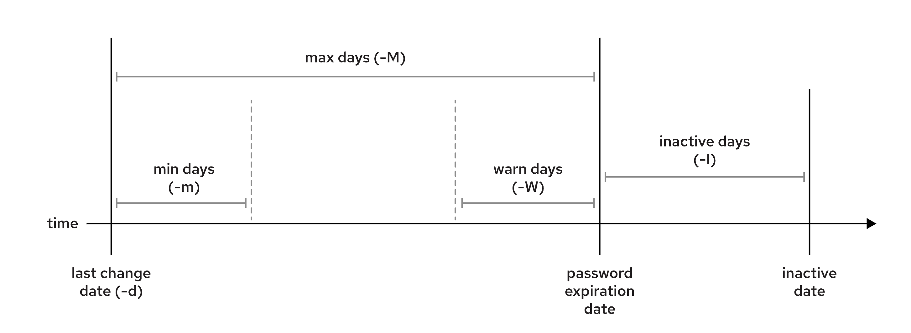

Có thể sửa các mốc tgian này bằng lệnh chage (not 'change')

```bash
# các option như hình
root@host:~# chage -m 0 -M 90 -W 7 -I 14 sysadmin05

# -E set ngày hết hạn pass
root@host:~# chage -E $(date -d "+30 days" +%F) cloudadmin10

# -l hiển thị chính sách mật khẩu cho user
root@host:~# chage -l cloudadmin10

Last password change					: May 14, 2025
Password expires					: Aug 12, 2025
Password inactive					: never
Account expires						: never
Minimum number of days between password change		: 0
Maximum number of days between password change		: 90
Number of days of warning before password expires	: 7

# yêu cầu user đổi pass ngay lần log in tiếp theo
root@host:~# chage -d 0 cloudadmin10

# lock user đến 1 ngày nhất định
root@host:~# usermod -L -e 2025-06-01 cloudadmin10

```

Nếu muốn sửa các config về ngày hết hạn của pass cho mọi user, sửa file /etc/login.defs

## Chapter 11: Quản lý quyền truy cập file

### 11.1. Quyền truy cập

Có 3 quyền chính:
- r (read): có thể đọc nội  dung file, có thể liệt kê danh sách file trong folder
- w (write): có thể thay đổi nội dung file, có thể tạo/xóa các file trong folder
- x (execute): có thể thực hiện file, folder có thể trở thành thư mục làm việc hiện tại

### 11.2. Đổi quyền truy cập file

Có 2 phương pháp thay đổi:
- Symbolic method: sử dụng ký hiệu và toán tử (vd: a+rw ~ thêm quyền read write cho mọi người dùng)
- Octal method: sử dụng số (r=4, w=2, x=1)


```bash
chmod a+r file.pdf

chmod 774 file.pdf
```

### 11.3. Quyền sở hữu

Mặc định, quyền sở hữu 1 file thuộc về user tạo ra nó và Permission group của user đó.

Chỉ root user có thể thay đổi quyền sở hữu của file

Để thay đổi quyền sở hữu, dùng lệnh chown
```bash
chown owner:group filename

# vd: muốn đổi quyền sở hữu của owner
chown user1 app.conf

# vd: muốn đổi quyền sở hữu của group
chown :admin app.conf
```

### 11.4. Quyền đặc biệt

Là loại quyền thứ 4, cung cấp các tính năng truy cập bổ sung vượt xa những gì các quyền cơ bản cho phép

- u+s (suid) file được thực thi với tư cách người dùng sở hữu file, ko phải người đang chạy file (4)

- g+s (sgid) file được thực thi với tư cách group sở hữu file, với folder, các file trong folder có cùng group sở hữu với folder (2)

- o+t (sticky) chỉ có tác dụng với folder, user chỉ có thể xóa các file mà user sở hữu trong 1 folder (1)

```bash
chmod u+s filename

# thêm quyền sgig (2) vào trước các quyền mặc định
chmod 2770 filename

# để xóa quyền đặc biệt, cần 2 số 0
chmod 00770 filename
```

### 11.5. Quyền mặc định

Cần sử dụng umask để quản lý các quyền mặc định của 1 file được tạo ra.

Mục đích để đảm bảo bảo mật của hệ thống, khiến kẻ tấn công ko tạo được tệp mã độc và chạy chúng.

```bash
# xem umask hiện tại
umask

# đổi umask
umask 0027

# 0022 - rw-r-r--
# 0027 - rw-r----
# 0002 - rw-rw-r--

```

Cách tính umask
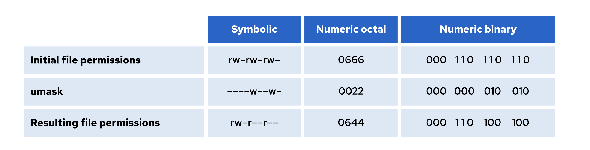

## Chapter 12: Quản lý gói phần mềm bằng RPM

### 12.1. RPM

RPM packet manager được phát triển bởi Red Hat, gồm 4 thành phần: name-version-release.arch và một surfix .rpm

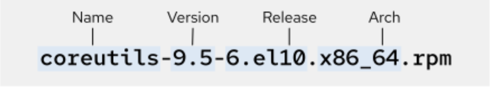

```bash
# Cài đặt 1 package bằng rpm
rpm -ivh podman-5.4.0-1.el10.x86_64.rpm

# Gỡ 1 package
rpm -e podman-5.4.0-1.el10.x86_64.rpm

```

**Extract gói RPM**

Sử dụng lệnh rpm2cpio để chuyển RPM packet sang cpio archive

RPM giống như dpdk bên Ubuntu, còn dnf với yum tương tự apt bên Ubuntu

### 12.2. DNF

RHEL 10 gồm 2 kho repo chính:
- BaseOS: chứa các gói thành phần cốt lõi của hệ thống (bash, systemd, dnf, v.v) và được quản lý chặt chẽ bởi Red Hat
- Application Stream Repo: chứa các gói ứng dụng, ngôn ngữ lập trình, runtime, v.v

```bash
dnf install httpd

dnf info httpd
```

Dnf cũng có thể cài/xóa các nhóm phần mềm, là một tập hợp các phần mềm được cài cùng nhau

```bash
dnf group install 'System Tools'

dnf group list
```

Tất cả các thao tác của dnf được lưu tại file /var/log/dnf.rpm.log

Để xem danh sách các kho repo của hệ thống
```bash
dnf repolist all

# với các repo đã add vào hệ thống, có thể enable/disable 
dnf config-manager --enable rhel-10-for-x86_64-baseos-debug-rpms
```

Để add thêm kho repo, có thể sd 1 trong 2 cách:
- tạo thêm 1 file .repo trong folder /etc/yum.repos.d/ 
- thêm một [repository] section trong file /etc/dnf/dnf.conf

Red Hat khuyến nghị sd cách thêm file .repo và sửa file dnf.conf nếu cần thêm các cấu hình cho repo.

Lệnh dnf sẽ tìm kiếm trong cả 2 vị trí, tuy nhiên sẽ tìm kiếm các file .repo trước.

Nội dung file .repo gồm:
- URL của kho repo
- name - tên, mô tả repo
- enable GPG key hay không

Một cách khác để add repo nhanh chóng là sử dụng lệnh
```bash
root@host:~# dnf config-manager \
--add-repo="https://https://dl.fedoraproject.org/pub/epel/10/Everything/x86_64/"
```

Để verify các gói đã ký, hãy down các key về /etc/pki/rpm-gpg/ và trong file dnf.conf hãy chỉ định đường dẫn đến vị trí GPG key để verify.

```bash
# ví dụ
[EPEL]
name=EPEL 10
baseurl=https://dl.fedoraproject.org/pub/epel/10/Everything/x86_64/
enabled=1
gpgcheck=1
gpgkey=file:///etc/pki/rpm-gpg/RPM-GPG-KEY-EPEL-10
```

## Chapter 13: Cài đặt, update ứng dụng bằng Flatpak

### 13.1. Flatpak

Mô hình đóng gói ứng dụng thành các package trong Linux còn nhiều hạn chế:
- Phải tùy chỉnh ứng dụng cho từng phiên bản Linux cụ thể
- Phát triển và bảo trì khó do khác nhau giữa môi trường sản xuất và phát triển

Flatpak giải quyết các vấn đề trên bằng cách sd khái niệm server-side container và công nghệ nhân Linux.

Khi ứng dụng được đóng gói bằng Flatpak image, nó có thể chạy ổn định trên phần lớn các bản phân phối Linux ở các version khác nhau. Việc crash do các lỗi dependencies không còn.

Với Flatpak, các app được build và chạy trên các môi trường độc lập gọi là sandbox. Ứng dụng chỉ có thể truy cập nội dung bên trong sandbox, quyền truy cập các tài nguyên khác là không thể nếu user không đặc biệt gán quyền vào.

Với Flatpak, các app sử dụng thư viện của app, không phải thư viện của hệ thống.

Việc duy trì các bản copy khác nhau cho mỗi app tiêu tốn nhiều không gian, vì vậy, các app chia sẻ chung 1 Flatpak runtime.

Flatpak runtime là file-system image với các thư viện ở cấp độ hệ thống và các file khác.

Một hệ thống sẽ tạo nhiều runtime cho mỗi app, các runtime lấy nguồn thư viện chung ở các Flatpak remote repo

```bash
# cài đặt
dnf install flatpak

# ds các remote repo (--detail)
flatpak remotes -d 

# liệt kê các app có sẵn trên remote repo
flatpak remote-ls --app

# thêm remote repo
flatpak remote-add --if-not-exists fedora \
oci+https://registry.fedoraproject.org

# xóa remote repo
flatpak remote-delete fedora

```

## Chapter 14: Truy cập các phương tiện

### 14.1. File system và Block devices

RHEL sử dụng Extents file system (XFS) là file system mặc định.

RHEL cũng hỗ trợ Extended file systemm (ext4) để quản lý các file cục bộ.

Từ RHEL 10, Extensible file allocation table (exFAT) được hỗ trợ cho sd các phương tiện di động.

Các lệnh mount và unmount

### 14.2. Xác định vị trí file

```bash
updatedb

locate filename

# tìm file real time với lệnh find
find / -name sshd_config # tìm file sshd_config trong thư mục gốc (/)

# tìm file theo wildcards 
find / -name '*pass*'

# tìm file dựa trên chủ sở hữu
find -user developer

# tìm file dựa trên quyền thực thi
find /home -perm 764

```

## Chapter 15: Đo đạc và quản lý các tiến trình

### 15.1. Quản lý các tiến trình

Sử dụng lệnh ps để liệt kê các tiến trình

Foreground - tiến trình đang chạy trên terminal

Background - tiến trình chạy ngầm

Mỗi session của terminal có 1 foreground và nhiều background

Để chạy 1 lệnh ở background, sd '&'

```bash
# chạy lệnh sleep 1000 ở background, kqua trả về number mà shell asign và PID
sleep 1000 &

result: [1] 5947
```

Nếu chạy 1 pipeline ở background thì PID trả về sẽ là PID của command cuối trong pipeline

Dùng lệnh 'jobs' để hiển thị ds các job trong session của shell

Mang các tiến trình background lên foreground
```bash
# %1 là job number mà shell gán cho background
user@host:~$ fg %1
sleep 10000
```

Gửi tiến trình từ foreground -> background: sau khi gõ lệnh, bấm Ctrl Z, tiến trình sẽ bị gửi đến background và dừng lại

Để chạy tiếp tiến trình, nhập lệnh
```bash
# %1 là number mà shell cấp cho tiến trình
bg %1
```

**Quản lý các tiến trình với tín hiệu**

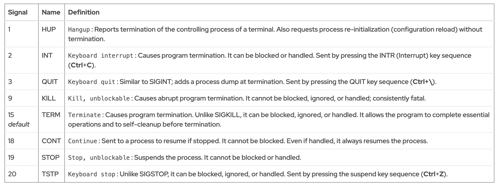

### 15.2. Quản lý các tiến trình cụ thể

Sử dụng lệnh pkill để gửi tín hiệu đến 1 hoặc nhiều tiến trình khớp với các tiêu chuẩn đề ra.

```bash
root@host:~# pgrep -l -u bob
6964 bash
6998 sleep
6999 sleep
7000 sleep
root@host:~# pkill -SIGKILL -u bob
root@host:~# pgrep -l -u bob
```

Khi các tiến trình đích nằm trong cùng một phiên đăng nhập, việc tắt tất cả các tiến trình của người dùng có thể không cần thiết.

Trong trường hợp này, bạn có thể xác định thiết bị đầu cuối của người dùng cho phiên, sau đó chỉ tắt các tiến trình tham chiếu đến cùng ID thiết bị đầu cuối

```bash
root@host:~# pgrep -l -u bob
7391 bash
7426 sleep
7427 sleep
7428 sleep
root@host:~# w -u bob
USER     TTY      FROM             LOGIN@   IDLE   JCPU   PCPU WHAT
bob      tty3                      18:37    5:04   0.03s  0.03s -bash
root@host:~# pkill -t tty3
root@host:~# pgrep -l -u bob
7391 bash
```

Tương tự với việc xóa tiến trình cha và các tiến trình con, khi xóa cũng sẽ còn lại tiến trình cha, vì tín hiệu chỉ được gửi đến các tiến trình con của nó

```bash
root@host:~# pstree -p bob
bash(8391)─┬─sleep(8425)
           ├─sleep(8426)
           └─sleep(8427)
root@host:~# pkill -P 8391
root@host:~# pgrep -l -u bob
bash(8391)
root@host:~# pkill -SIGKILL -P 8391
root@host:~# pgrep -l -u bob
bash(8391)
```

### 15.3. Đăng xuất người dùng bằng quyền admin

Có nhiều lý do phải đăng xuất user khác:
- User vi phạm bảo mật
- User dùng nhiều tài nguyên
- User có quyền truy cập sai vào tài liệu

Để đăng xuất user, xác định session sẽ xóa bằng lệnh 'w'

```bash
user@host:~$ w -f
 12:43:06 up 27 min,  5 users,  load average: 0.03, 0.17, 0.66
USER  TTY   FROM                LOGIN@   IDLE   JCPU   PCPU WHAT
root  tty2                      12:26   14:58   0.04s  0.04s -bash
bob   tty3                      12:28   14:42   0.02s  0.02s -bash
user  pts/1 desktop.example.com 12:41    2.00s  0.03s  0.03s w
user@host:~$
```

Lệnh who chỉ cung cấp thông tin cơ bản về các user đã logged in

```bash
user@host:~$ who
root     tty2         2025-06-09 12:26 (tty2)
bob      tty3         2025-06-09 12:28 (tty3)
user     pts/1        2025-06-09 12:41 (desktop.example.com)
```

Sau đó, xóa session của user (vd: xóa session của bob)
```bash
sudo pkill -t tty3
```

### 15.4. Monitoring

Load average (tải trung bình) là phép đo thể hiện tải của hệ thống trong một khoảng thời gian, thu thập sau mỗi 5s

Tải TB là trung bình số lượng tiến trình đang đợi yêu cầu của nó được hoàn thành trước khi chạy các thao tác tiếp theo (yêu cầu này có thể là đợi CPU để chạy tiến trình, đợi một thao tác trên disk, v.v)

```bash
user@host:~$ uptime
 15:29:03 up 14 min,  2 users,  load average: 2.92, 4.48, 5.20
```

3 giá trị tải lần lượt là trong tgian 1, 5 và 15 phút trước

Nếu nguyên nhân khiến tải TB chậm là CPU thì cần tính toán giá trị tải gần đúng cho mỗi CPU xem hệ thống có đang chờ đợi lâu không

```bash
# xem số lượng CPU, ở đây là 4 cpu dual core
user@host:~$ lscpu
Architecture:        x86_64
CPU op-mode(s):      32-bit, 64-bit
Byte Order:          Little Endian
CPU(s):              4
On-line CPU(s) list: 0-3
Thread(s) per core:  2
Core(s) per socket:  2
Socket(s):           1
NUMA node(s):        1
...output omitted...
```

Sau đó, tính tải trên mỗi CPU trong 1, 5 và 15 phút vừa qua
```bash
# From ``lscpu``, the system has four logical CPUs, so divide by 4:
#                               load average: 2.92, 4.48, 5.20
#           divide by number of logical CPUs:    4     4     4
#                                             ----  ----  ----
#                       per-CPU load average: 0.73  1.12  1.30
#
# This system's load average appears to be decreasing.
# With a load average of 2.92 on four CPUs, all CPUs were in use ~73% of the time.
# During the last 5 minutes, the system was overloaded by ~12%.
# During the last 15 minutes, the system was overloaded by ~30%.
```

Với monitor real time, sử dụng lệnh 'top'

## Chapter 16: Quản lý dịch vụ và daemon

### 16.1. Xác định các tiến trình chạy tự động

Daemon là các tiến trình đợi hoặc chạy ở background, thường kết thúc bằng 'd' như httpd, chronyd, v.v

Systemd là tiến trình daemon đầu tiên (PID 1)

Systemd daemon sử dụng unit để quản lý các object:
- Service units - có file .service, có thể sử dụng để start thường xuyên như web server
- Socket units - có file .socket, đại diện cho các giao tiếp liên tiến trình mà systemd giám sát, khi máy khách kết nối với socket, systemd khởi động một socket daemon và chuyển kết nối đến nó
- Path units - file .path, trì hõa hoạt động của một service tới khi file system có thay đổi nào đó 

```bash
# liệt kê danh sách unit loại service kể cả đang chạy hay đã dừng
systemctl list-units --type=service --all

# kiểm tra trạng thái của dịch vụ
systemctl is-active sshd.service

# liệt kê danh sách các unit sshd cần để hoạt động
systemctl list-dependencies sshd.service

# liệt kê các unit cần NetworkManager để hoạt động
systemctl list-dependencies --reverse NetworkManager.service
```

**Masking và Unmasking services**

Một số service trên hệ thống có thể xung đột với nhau (vd: 2 service cùng sử dụng để quản lý mail: postfix và sendmail)

Việc sử dụng masking giúp ngăn admin vô tình khởi động một dịch vụ gây conflict với dịch vụ khác

Masking tạo một link ở thư mục cấu hình /dev/null giúp chặn dịch vụ khởi động.

```bash
# để mask một dịch vụ dùng lệnh sau
systemctl mask sendmail.service

# sau khi mask, chạy lệnh start service sẽ trả về lỗi
# để unmask , gõ lệnh
systemctl unmask sendmail.service

# để service chạy hoặc không chạy khi boot hệ thống
systemctl enable/disable sshd.service

# việc enable/disable service sẽ không thực hiện ngay trong session bạn đang gõ lệnh, để thực hiện ngày, thêm option --now
systemctl enable/disable --now sshd.service
```

## Chapter 17: Networking

### 17.1. Mô hình OSI và TCP/IP

### 17.2. Tên giao diện mạng trong RHEL (Network interface)

Mỗi thiết bị mạng trong hệ thống được xác định và cấu hình bằng tên duy nhất của nó.

Trong Red Hat Enterprise Linux 7 trở lên, hệ thống tạo ra các tên giao diện mạng nhất quán, tồn tại qua các lần khởi động lại.

Các tên này dựa trên thông tin từ phần mềm hệ thống, cấu trúc bus Kết nối Thành phần Ngoại vi (PCI) và loại thiết bị mạng.

Tên giao diện bắt đầu bằng loại giao diện mạng:
- Ethernet: en
- WLAN: wl
- WWWAN: ww

Phần còn lại dựa trên thông tin từ phần cứng của server hoặc được định nghĩa dựa trên vị trí của thiết bị trên cấu trúc PCI:
- oN chỉ một thiết bị tích hợp (onboard device) với đánh số N trên server (eno3)
- sN chỉ một thiết bị nằm trong khe cắm PCI (PCI hotplug) ở slot N (ens3)
- pMsN chỉ một thiết bị nằm trên bus M ở slot N (enp2s3)

### 17.3. Ipv4

Địa chỉ Ipv4 gồm 32 bit, chia thành 4 octet, mỗi octet có 8 bit, giá trị từ 0 -> 255

Gồm 2 phần:
- prefix - giúp xác định subnet ảo/ vật lý
- định danh của host - xác định máy host trong subnet (các host trong cùng subnet có prefix giống nhau)

Netmask (mặt nạ mạng) là chuỗi bit giúp xác định bao nhiêu bit dành cho phần prefix, network mask càng dàng thì càng có ít bit cho các host -> ít host trong subnet

Network mask có 2 cách biểu diễn: /16 hoặc 255.255.0.0

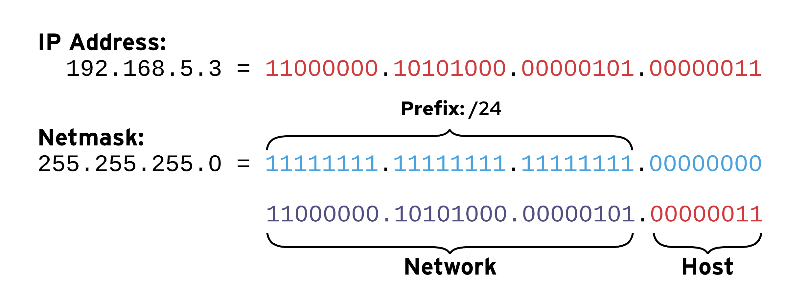

Ví dụ:

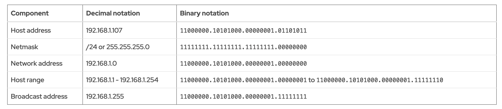

```bash
# có thể sd ipcalc để tính các địa chỉ cần thiết
user@host:~$ ipcalc 10.1.1.18/8
Address:	10.1.1.18
Network:	10.0.0.0/8
Netmask:	255.0.0.0 = 8
Broadcast:	10.255.255.255

Address space:	Private Use
HostMin:	10.0.0.1
HostMax:	10.255.255.254
Hosts/Net:	16777214
```

Máy host có thể tùy chỉnh các setting Ipv4 của mình tại DHCP server

### 17.4. Ipv6

Gồm 128 bit, biểu diễn dưới dạng 8 nhóm, mỗi nhóm 4 chữ số thập lục phân, mỗi chữ số biểu diễn 4 bit -> một nhóm biểu diễn 16 bit

vd: 2001:0db8:0000:0010:0000:0000:0000:0001

Một số lưu ý:
- Loại bỏ bất kỳ số 0 nào đứng đầu trong 1 nhóm (vd: 0010 -> 10, 0000 -> 0)
- Một hoặc nhiều nhóm 0000 liên tiếp có thể được thay thế bằng dầu '::', dấu '::' chỉ được xuất hiện 1 lần trong địa chỉ ip
- Luôn sử dụng chữ thường (a -> f) cho các chữ số thập lục phân
- Không nên sử dụng '::' để rút gọn một nhóm 0000, hãy giữ nó cho các nhóm 0000 liên tiếp
- Nếu một địa chỉ chứa 2 nhóm 0000 liên tiếp có độ dài bằng nhau thì hãy rút ngắn nhóm bên trái thành '::' và nhóm ':0:' cho các nhóm bên phải

Địa chỉ Ipv6 gồm 2 phần:
- prefix - xác định subnet
- interface ID - xác định interface cụ thể trên subnet (2 interface trong cùng subnet ko thể cùng ID)

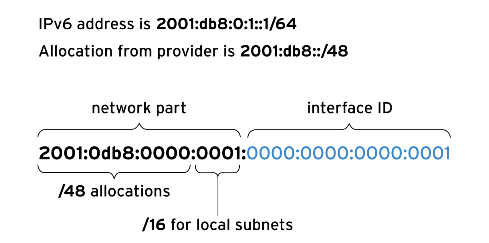

### 17.5. Cấu hình network

```bash
# xác định các interface trong hệ thống
ip link show

# kiểm tra hiệu suất của interface
user@host:~$ ip -s link show ens3
2: ens3: <BROADCAST,MULTICAST,UP,LOWER_UP> mtu 1500 qdisc fq_codel state UP ...
    link/ether 52:54:00:00:fa:0a brd ff:ff:ff:ff:ff:ff
    RX:  bytes packets errors dropped  missed   mcast
      10398126   75186      0       3       0       0
    TX:  bytes packets errors dropped carrier collsns
      22214542   68283      0       0       0       0
    altname enp0s3
    altname enx52540000fa0a

# ktra kết nối giữa 2 host
ping -c 3 192.0.2.254

# có thể chỉ định truyền bằng interface nào, truyền bn gói
ping6 -c 1 fe80::f482:dbff:fe25:6a9f%ens4
```

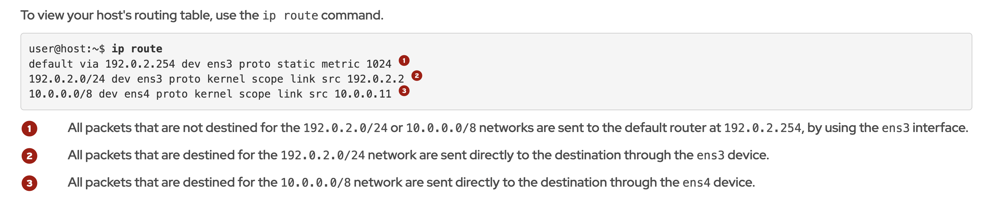

Để trace đường đi của một remote host đến hệ thống hiện tại, sd lệnh traceroute hoặc tracepath (2 lệnh này đều gửi gói tin UDP để tracing)

Có thể đổi sang dùng ICMP (-I) hoặc TCP (-T) bằng cách thêm option khi sd traceroute

```bash
user@host:~$ tracepath access.redhat.com
...output omitted...
 4:  71-32-28-145.rcmt.qwest.net                          48.853ms asymm  5
 5:  dcp-brdr-04.inet.qwest.net                          100.732ms asymm  7
 6:  206.111.0.153.ptr.us.xo.net                          96.245ms asymm  7
 7:  207.88.14.162.ptr.us.xo.net                          85.270ms asymm  8
 8:  ae1d0.cir1.atlanta6-ga.us.xo.net                     64.160ms asymm  7
 9:  216.156.108.98.ptr.us.xo.net                        108.652ms
10:  bu-ether13.atlngamq46w-bcr00.tbone.rr.com           107.286ms asymm 12
...output omitted...

# với Ipv6, dùng tracepath6
tracepath6 2001:db8:0:2::451

# một lệnh khác là mtr cũng giúp trace đường đi đến 1 host
user@host:~$ mtr -r -c 5 access.redhat.com
Start: 2025-05-29T22:41:52+0000
HOST: servera                     Loss%   Snt   Last   Avg  Best  Wrst StDev
  1.|-- classroom.lab.example.com  0.0%     5    0.4   0.4   0.3   0.5   0.1
  2.|-- 72.32.49.3                 0.0%     5    1.0   1.3   0.9   2.3   0.6
  3.|-- 72.32.28.27                0.0%     5    1.3   1.5   1.3   1.7   0.2
  4.|-- aggr172b-54-cored.dfw3.ra  0.0%     5    1.0   1.0   0.8   1.0   0.1
  5.|-- dcpe3-cored.dfw3.rackspac  0.0%     5    1.9   2.1   1.9   2.5   0.2
  6.|-- 10.25.1.101                0.0%     5    2.0   2.0   2.0   2.1   0.1
  7.|-- equinix-dfw2.netarch.akam  0.0%     5   15.8  15.9   6.3  27.9   9.0
...output omitted...
```

### 17.6. Troubleshooting cổng và các vấn đề dịch vụ

```bash
# sd lệnh ss để xem các cổng
ss -tan
```

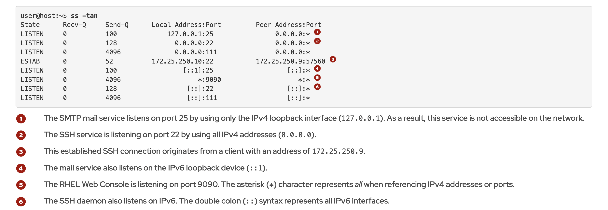

## Chapter 18: Quản lý cấu hình mạng

Dịch vụ Network Manager giúp quản lý các thiết bị mạng và kết nối, 1 thiết bị là interface ảo/vật lý giúp quản lý traffic mạng.

Mỗi kết nối (network profile hay connection) có các cấu hình riêng liên quan đến interface và có ID duy nhất giúp match với cấu hình đó.

Các cấu hình được lưu trong /etc/NetworkManager/system-connection/

```bash
# xem thông tin mạng
root@host:~# nmcli dev status
DEVICE  TYPE      STATE                   CONNECTION
ens3    ethernet  connected               ethernet-ens3
lo      loopback  connected (externally)  lo

# xem các connection
root@host:~# nmcli con show --active
NAME           UUID                                  TYPE      DEVICE
ethernet-ens3  fab1e257-61a6-3526-abf9-8c50c83a28c7  ethernet  ens3
lo             e6274c48-3de6-4a73-b088-f3abde27842f  loopback  lo

# Thêm connection 
root@host:~# nmcli con add ifname enp8s0 type ethernet
Connection 'ethernet-enp8s0' (db408049-af1d-44df-b451-6c7f4dbf352b) successfully added.

# thêm connection với config
root@host:~# nmcli con add con-name enp9s0 type ethernet ifname enp9s0 \
ipv4.method manual ipv4.addresses 192.168.0.5/24 ipv4.gateway 192.168.0.254
Connection 'enp9s0' (1a2ddcef-9daa-4610-9214-1c11d23bef3b) successfully added.

# quản lý trạng thái 
nmcli con up enp8s0

nmcli dev dis enp8s0

# update connection
root@host:~# nmcli con mod enp8s0 ipv4.addresses 192.0.2.2/24 \
ipv4.gateway 192.0.2.254 connection.autoconnect yes

# Hoặc có thể thay đổi cấu hình của interface trong /etc/NetworkManager/system-connection/ sau đó dùng
nmcli con reload enp8s0

# xóa interface
nmcli con del enp8s0

```

Đổi hostname
```bash
# tạm thời
root@host:~# hostname
host.example.com
root@host:~# hostname web1.example.com
root@host:~# hostname
web1.example.com

#vĩnh viễn
root@host:~# hostnamectl hostname
host.example.com
root@host:~# hostnamectl hostname db1.example.com
root@host:~# hostnamectl hostname
db1.example.com

```

**Cấu hình phân giải tên các host**

Là một DNS nhẹ nằm trên máy local giúp phân giải tên ở local trước khi hỏi DNS server. Cấu hình nằm ở file /etc/hosts hoặc /etc/resolv.conf

Cũng có thể cấu hình DNS cho từng interface trong file config của interface

```bash
# sd lệnh host/ dig để phân giải hostname
dig servera.lab.example.com

host servera.lab.example.com
```

## Chapter 19: Cấu hình và bảo mật cho SSH

Khi máy khách muốn ssh vào máy chủ, trước tiên máy chủ sẽ gửi public key về máy khách để máy khách kiểm tra.

Sau đó máy khách sẽ tạo 1 khóa bí mật tạm thời để giao tiếp và gửi cho máy chủ.

Có thể cấu hình các ssh client để quản lý cách máy của bạn handle host key với 2 file
- /etc/ssh/ssh_config - file này cấu hình cho toàn bộ user trong hệ thống
- ~/.ssh/config - file này cấu hình cho 1 user, sẽ override lại file trên nếu khác config

Để kết nối đến máy chủ, đầu tiên dùng ssh-keygen để lấy thông tin về fingerprint của máy chủ

Gửi fingerprint cho quản trị viên máy khách, máy khách dùng lệnh ssh và so sánh fingerprint -> lưu vào known_hosts

**Quản lý known_hosts**

Nếu host key của máy chủ thay đổi, lần ssh sau sẽ gặp cảnh báo.

Phải xóa key cũ trong known_host:
- cách 1: mở file known_host và tìm đúng host name -> xóa
- cách 2: dùng lệnh 'ssh-keygen -R <tên-host>' hoặc 'ssh-keygen -R <tên-host> -f /etc/ssh/ssh_known_hosts'

Sau đó, tự động thêm host key mới bằng lệnh:
```bash
ssh-keyscan <tên-host> >> ~/.ssh/known_hosts

# hoặc lấy thủ công như ban đầu
```

**Quản lý ssh bằng file key**

ssh bằng private key tiện lợi và bảo mật hơn vì ssh ko cần pass

Trên máy khách, tạo cặp khóa private-public

Trên máy chủ, lưu public key vào file ~/.ssh/authorized_keys

Private key phải có quyền truy cập là 600

Nếu private key có pass phrase mà muốn ssh không cần nhập pass phrase, sử dụng ssh-agent để thêm private key vào, sau đó chỉ cần nhập 1 lần

Quản lý cấu hình ssh trên máy chủ bằng file /etc/ssh/sshd_config sau đó reload sshd

Các cấu hình khác có thể sd file ~/.ssh/config
