# Khóa học Red Hat System Admin II (RH134)

## Chapter 1: Cải thiện năng suất command line

Kỹ năng viết shell script là điều cần thiết đối với quản trị viên hệ thống trong bất kỳ môi trường vận hành nào. Shell script giúp cải thiện hiệu quả và độ chính xác của việc hoàn thành các tác vụ thường xuyên.

Nên viết shell script với các trình soạn thảo nâng coa như vim hoặc emacs

### 1.1. Viết bash scripts cơ bản

Dòng đầu tiên của scripts bắt đầu với '#!'
```bash
#!/usr/bin/bash -> OS như fedora hoặc RHEL mới

# hoặc
#!/bin/bash -> OS truyền thống Ubuntu, CentOS...
```

Nếu scripts được lưu trong các thư mục bin chứa câu lệnh (các folder bin thường được chỉ định trong biến môi trường PATH), có thể chạy trực tiếp scripts bằng tên của scripts như 1 command thông thường

```bash
[user@host ~]$ which hello
~/bin/hello

[user@host ~]$ echo $PATH
/home/user/.local/bin:/home/user/bin:/sbin:/bin:/usr/sbin:/usr/bin:/usr/local/sbin:/usr/local/bin
```

Một vài ký tự và từ có thể có ý nghĩa đặc biệt, để viết các ký tự này bthg, dùng \ ở trước chúng hoặc thêm ' ' và " "

```bash
[user@host ~]$ echo # not a comment #

[user@host ~]$ echo \# not a comment #
# not a comment
[user@host ~]$ echo \# not a comment \#
# not a comment #
[user@host ~]$ echo '# not a comment #'
# not a comment #
```

Dấu ' ' sẽ diễn giải toàn bộ câu lệnh theo đúng nghĩa đen, trong khi dấu " " vẫn cho phép chèn các lệnh và tên biến.
```bash
[user@host ~]$ echo "Will variable $var evaluate to $(hostname -s)?"
Will variable host evaluate to host?

[user@host ~]$ echo 'Will variable $var evaluate to $(hostname -s)?'
Will variable $var evaluate to $(hostname -s)?
```

Để cung cấp output cho shell scripts, sử dụng 'echo' để gửi các message cho STDOUT (ở đây là terminal) hoặc có thể sử dụng redirect để lưu STDOUT vào các file (> và >>)

```bash
[user@host ~]$ cat ~/bin/hello
#!/usr/bin/bash

echo "Hello, world"

[user@host ~]$ hello
Hello, world
```

Lệnh 'echo' cũng được sử dụng để hiển thị thông tin hoặc thông báo lỗi, good practice là redirect các lỗi đến STDERR để tách chúng khỏi các STDOUT thông thường.

```bash
[user@host ~]$ cat ~/bin/hello
#!/usr/bin/bash

echo "Hello, world"
echo "ERROR: Houston, we have a problem." >&2

exec 2>> /path/to/error.log  # tất cả STDERR sau này sẽ ghi vào file

[user@host ~]$ hello 2> hello.log
Hello, world

[user@host ~]$ cat hello.log
ERROR: Houston, we have a problem.
```

| Ký hiệu | Chức năng                       |
| ------- | ------------------------------- |
| `>`     | Redirect STDOUT vào file        |
| `>>`    | Append STDOUT vào file          |
| `>&2`   | Chuyển hướng STDOUT sang STDERR |
| `2>`    | Redirect STDERR vào file        |

### 1.2. Kiểm tra logic

Để đảm bảo các điều kiện bất ngờ không làm gián đoạn scripts, cần phải kiểm tra các input của scripts. Có thể xác định logic của scripts đã đúng chưa bằng lệnh 'test'.

| Option          | Ý nghĩa                                      |
| --------------- | ---------------------------------------------|
|  gt             | Lớn hơn (greater than)                       |
|  ge             | Lớn hơn hoặc bằng (greater than or equal)    |
|  lt             | Nhỏ hơn (lower than)                         |
|  le             | Lớn hơn (lower than or equal)                |
|  =or==          | Bằng nhau (giống nhau)                       |
|  !=             | Khác nhau                                    |
|  z              | Độ dài bằng 0                                |
|  n              | Độ dài khác 0                                |
|  f              | file tồn tại                                 |
|  d              | folder tồn tại                               |
|  L              | file có symbolic link                        |
|  r              | user có quyền đọc                            |
|  ne             | không bằng                                   |
|  eq             | bằng                                         |

Ví dụ:
```bash
[user@host ~]$ test 1 -gt 0 ; echo $?
0
[user@host ~]$ test 0 -gt 1 ; echo $?
1
[user@host ~]$ [[ abc = abc ]]; echo $?
0
[user@host ~]$ [[ abc == def ]]; echo $?
1
[user@host ~]$ STRING=''; [[ -z "$STRING" ]]; echo $?
0
[user@host ~]$ STRING='abc'; [[ -n "$STRING" ]]; echo $?
0
```

### 1.2. Vòng lặp và điều kiện trong shell scripts

Vòng lặp trong scripts có syntax như sau:
```bash
for VARIABLE in LIST; do
COMMAND VARIABLE
done
```

Các giá trị của LIST được lưu như là một VARIBALE trong shell, và các câu lệnh lấy giá trị từ các VARIABLE đó

```bash
[user@host ~]$ for HOST in host{1,2,3}; do echo $HOST; done
host1
host2
host3
```

Sau khi 1 scripts đã chạy toàn bộ nỗi dung, process sẽ thoát và trả quyền cho tiến trình cha của nó. Tuy nhiên, có thể thoát scripts trước khi chạy hết các lệnh bằng 'exit'

Sử dụng exit với giá trị 0 -> 255, các giá trị này biểu diễn exit code. Exit code này sẽ được trả về cho tiến trình cha để biểu thị trạng thái khi thoát.

Exit code 0 biểu duễn scripts đã hoàn thành mà ko có lỗi, tất cả các exit code khác đều thể hiện scripts đã gặp lỗi. Exit code nào đại diện cho lỗi nào thì tùy vòa việc định nghĩa của người lập trình scripts.

Để nhận exit code của câu lệnh cuối cùng đã chạy xong, sử dụng biến ? như sau: '$?'
```bash
[user@host bin]$ cat hello
#!/usr/bin/bash
echo "Hello, world"
exit 0

[user@host bin]$ ./hello
Hello, world

[user@host bin]$ echo $?
0
```

**if-else**

Syntax của điều kiện if:
```bash
if <CONDITION>; then
      <STATEMENT>
      ...
      <STATEMENT>
fi

# ví dụ
[user@host ~]$ systemctl is-active psacct > /dev/null 2>&1
[user@host ~]$ if  [[ $? -ne 0 ]]; then sudo systemctl start psacct; fi
```

Syntax của if-else:
```bash
if <CONDITION>; then
      <STATEMENT>
      ...
      <STATEMENT>
else
      <STATEMENT>
      ...
      <STATEMENT>
fi

# ví dụ
[user@host ~]$ systemctl is-active psacct > /dev/null 2>&1
[user@host ~]$ if  [[ $? -ne 0 ]]; then \
sudo systemctl start psacct; \
else \
sudo systemctl stop psacct; \
fi
```

Syntax của if-then-elif-then-else:
```bash
if <CONDITION>; then
      <STATEMENT>
      ...
      <STATEMENT>
elif <CONDITION>; then
      <STATEMENT>
      ...
      <STATEMENT>
else
      <STATEMENT>
      ...
      <STATEMENT>
fi

# ví dụ
[user@host ~]$ systemctl is-active mariadb > /dev/null 2>&1
[user@host ~]$ MARIADB_ACTIVE=$?
[user@host ~]$ sudo systemctl is-active postgresql > /dev/null 2>&1
[user@host ~]$ POSTGRESQL_ACTIVE=$?
[user@host ~]$ if  [[ "$MARIADB_ACTIVE" -eq 0 ]]; then \
mysql; \
elif  [[ "$POSTGRESQL_ACTIVE" -eq 0 ]]; then \
psql; \
else \
sqlite3; \
fi
```

trong case này, bash sẽ thực hiện TH nào match đầu tiên từ trên xuống dưới theo thứ tự và skip các điều kiện còn lại. Nếu ko có điều kiện nào match thì sẽ thực hiện lệnh else.

**Match text với simple regular expression**

ví dụ:
```bash
cat
dog
concatenate
dogma
category
educated
boondoggle
vindication
chilidog
```

Tìm các từ có bắt đầu bằng cat -> ^cat
```bash
cat
category
```

Tìm các từ có kết thúc bằng dog -> dog$
```bash
dog
chilidog
```

Tìm các dòng chứa duy nhất từ cat -> ^cat$
```bash
cat
```

**Match text với extended regular expression**

Tìm từ có chứa cụm từ c theo sau là 1 ký tự bất kỳ rồi đến ký tự t -> c.t
```bash
cat
concatenate
c$t
```

Tìm các từ chứa cụm cat, cot hoặc cut -> c[aou]t

Tìm các từ có chứa cụm bắt đầu bằng c và kết thúc bằng t, không quan trọng đoạn giữa -> c.*t
```bash
cat
coat
culvert
ct # đoạn giữa là rỗng 
```

Tìm các từ có chứa cụm bắt đầu bằng c và kết thúc bằng t, đoạn giữa chỉ gồm các ký tự trong ds [a,o,u] -> c[aou]*t

Tìm các từ chúa cụm bắt đầu bằng c kết thúc bằng t, ở giữa có đúng 2 ký tự -> c.\{2\}t

**Match regular expression ở command line**

Sử dụng lệnh 'grep'
```bash
[user@host ~]$ grep '^computer' /usr/share/dict/words
computer
computerese
computerise
computerite

# sử dụng nhiều match expression
[root@host ~]# cat /var/log/secure | grep -e 'pam_unix' \
-e 'user root' -e 'Accepted publickey' | less
Mar  4 03:31:41 localhost passwd[6639]: pam_unix(passwd:chauthtok): password changed for root
Mar  4 03:32:34 localhost sshd[15556]: Accepted publickey for devops from 10.30.0.167 port 56472 ssh2: RSA SHA256:M8ikhcEDm2tQ95Z0o7ZvufqEixCFCt+wowZLNzNlBT0
Mar  4 03:32:34 localhost systemd[15560]: pam_unix(systemd-user:session): session opened for user devops(uid=1001) by (uid=0)
```

Trong vim, để tìm kiếm các dòng match với expression, nhập '/' sau đó nhập expression và Enter để tìm.

## Chapter 2: Lập lịch cho các task trong tương lai

### 2.1. Lập lịch một user job đã bị hoãn (deferred jobs)
Một số câu lệnh/pipeline có thể cần chạy tại một thời điểm cụ thể (vd: tác vụ bảo trì chỉ chạy vào ban đêm), các lệnh được lập lịch này gọi là các tasks hay các jobs. Deferred xác định rằng các task này sẽ chạy trong tương lai.

Để lập lịch deferred job, sử dụng lệnh 'at'. 'At' cung cấp một system daemon atd và các câu lệnh atq để tương tác với daemon

User có thể xếp các tác vụ vào atd daemon bằng lệnh 'at', atd daemon gồm 26 queue từ a -> z theo thứ tự chữ cái càng sau thì có độ ưu tiên hệ thống càng thấp

Sử dụng cú pháp 'at TIMESPEC' để lên lịch chạy các task

TIMESPEC chỉ định thời gian để tác vụ chạy

Sau khi nhập lệnh at, nhập các câu lệnh cần chạy, hoàn tất bằng cách nhấn Ctrl D

Có thể dùng shell scripts thay cho các lệnh nhập thủ công

```bash
at now +5min < myscript

at 21:03 < myscript
```

TIMESPEC có thể sử dụng các kiểu thời gian:
- now +5min - chạy sau 5 phút
- teatime tomorrow - chạy vào teatime (16h) ngày mai
- noon +4days - chạy vào buổi trưa 4 ngày sau
- chạy vào 5h chiều ngày 03/08/2021

Nếu chỉ có thời gian, ngày sẽ tự động chỉ định là hôm nay hoặc ngày mai tùy TH
```bash
at 21:03 < myscript   # Nếu giờ hiện tại là 21:01, tác vụ sẽ chạy lúc 21:03 cùng ngày.
at 21:00 < myscript   # Nếu giờ hiện tại đã qua 21:00, tác vụ sẽ chạy vào ngày hôm sau.
```

**Quản lý các deferred jobs**

Sử dụng lệnh atq hoặc 'at -l' để xem danh sách các jobs đang pending của user hiện tại
```bash
[user@host ~]$ atq
28  Mon May 16 05:13:00 2022 a user
29  Tue May 17 16:00:00 2022 h user
30  Wed May 18 12:00:00 2022 a user

# 28 là job number
# Mon May 16 05:13:00 2022 - thòi điểm chạy jobs
# a - job được lập lịch trong queue a (queue mặc định là a)
# user - người sở hữu job

# xóa job
atrm <JOBNUMBER>
```

### 2.2. Lập lịch cho các user jobs định kỳ (Recurring jobs)

RHEL cung cấp daemon crond được bật mặc định, 'crond' đọc nhiều file cấu hình: 1 file cấu hình mỗi user và một set các file hệ thống.

Mỗi user có 1 file cá nhân mà họ edit cấu hình bằng lệnh 'crontab -e'

Khi chạy các job định kỳ, các file này cung cấp các điều khiển chi tiết cho admin và user. Nếu job không có chuyển hướng vào file, crond sẽ email bất kỳ output hay lỗi nào đến job owner.

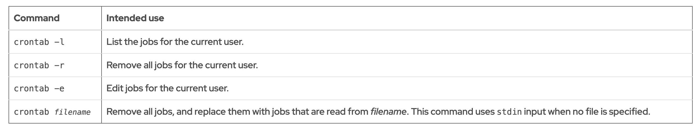

User có đặc quyền có thể sử dụng 'crontab -u' đẻ sưa job của user khác

Lệnh crontab ko được sử dụng để quản lý các job hệ thống. Không nên sử dụng crontab với quyền root

**Mô tả format của user job**

Sử dụng lệnh 'crontab -e' để chỉnh sửa file crontab, lệnh này sẽ gọi trình soạn thảo mặc định vim để sửa đổi file.

Các quy tắc trong file crontab:
- Mỗi job chỉ sử dụng 1 dòng duy nhất trong file crontab
- Các dòng trống giúp dễ đọc hơn
- Dòng chú thích bắt đầu bằng '#'
- Biến môi trường có định dạng NAME=value, có ảnh hưởng đến tất cả các dòng sau đó (biến mặc định là SHELL). Biến MAILTO chỉ định địa chỉ email sẽ nhận output.

Cấu trúc file crontab:
```bash
# phút giờ ngày tháng thứ lệnh
```

Crontab không hỗ trợ chỉ định năm nên nếu muốn chỉ định năm cụ thể cần dùng 'at' hoặc systemd timers

```bash
# ví dụ
0 0 1 1 * [ "$(date +\%Y)" = "2026" ] && echo "Happy New Year 2026"
```

Cách sử dụng các ký tự:
- \* chạy ở tất cả các giá trị có thể có
- Số - chỉ định thời gian cụ thể
- x-y - chạy trong phạm vi x -> y
- x,y - danh sách các giá trị
- */x - chạy theo chu kỳ x (vd '*/7' là chạy mỗi 7 phút)
- 3 chữ cái viết tắt cho tháng (Jan, Feb...) và thứ (Mon, Tue...)

Ví dụ:
```bash
# lệnh này sẽ chạy định kỳ bakup vào 9:00 ngày 3/2 hàng năm
0 9 3 2 * /usr/local/bin/yearly_backup

# Gửi email đến mail với nội dung "Chime" mỗi 5 phút từ 9:00 đến 16:00 mỗi thứ 6 trong tháng 7
*/5 9-16 * Jul 5 echo "Chime"

# Từ thứ hai -> chủ nhật được đánh index 0 -> 7 và thứ sáu = 5
# Tương tự, với tháng, thay vì dùng 3 chữ cũng có thể dùng 1-12 cho mỗi tháng

# chạy báo cáo ngày vào 23:58 từ t2 -> t6 
58 23 * * 1-5 /usr/local/bin/daily_report

# Gửi email với tiêu đề checking in vào đại chỉ mail developer@example.com vào 9:00 mỗi ngày trong tuần
0 9 * * 1-5 mutt -s "Checking in" developer@example.com % Hi there, just checking in.
```

### 2.3. Lập lịch các system job định kỳ (Recurring system jobs)

Các task hệ thống định kỳ nên được chạy từ tài khoản root thay vì từ user

Lập lịch các task hệ thống bằng cách sửa file hệ thống crontab thay vì sử dụng lệnh crontab

Crontab toàn cục trong file /etc/crontab cho phép cấu hình các task định kỳ của hệ thống với trường bổ sung để chỉ định tài khoản mà job sẽ chạy

Cấu trúc file crontab:
```bash
SHELL=/bin/bash
PATH=/sbin:/bin:/usr/sbin:/usr/bin
MAILTO=root

# For details see man 4 crontabs

# Example of job definition:
# .---------------- minute (0 - 59)
# |  .------------- hour (0 - 23)
# |  |  .---------- day of month (1 - 31)
# |  |  |  .------- month (1 - 12) OR jan,feb,mar,apr ...
# |  |  |  |  .---- day of week (0 - 6) (Sunday=0 or 7) OR sun,mon,tue,wed,thu,fri,sat
# |  |  |  |  |
# *  *  *  *  * user-name  command to be executed
```

Nên có các file cấu hình trong /etc/cron.d/ chứa các tùy chỉnh của từng cron job, để tránh việc update gói sẽ ghi đè file /etc/crontab và mất jobs

Cron cũng có các thư mục riêng để chứa các tập lệnh được thực hiện định kỳ:
- /etc/cron.hourly/ - Chạy mỗi giờ
- /etc/cron.daily/ - Chạy mỗi ngày
- /etc/cron.weekly/ - Chạy mỗi tuần
- /etc/cron.monthly/ - Chạy mỗi tháng

Các file trong các thư mục này phải là các scripts đã được cấp quyền thực thi, không phải các file crontab (sử dụng chmod +x <script-name>)

**Sử dụng Anacron để quản lý các job định kỳ**

Anacron là công cụ giúp chạy các công việc định kỳ mà không bị bỏ qua nếu hệ thống bị tắt hoặc hibernated

File cấu hình /etc/anacrontab đảm bảo các job đã lên lịch luôn chạy cà không bị skip kể cả khi hệ thống bị tắt.

Ví dụ, khi một system job chạy daily không được thực hiện tại thời gian nó được chỉ định do hệ thống đang reboot thì sau khi hệ thống ready sẽ thực hiện system job đó.

Tham số 'Delay in minutes' trong file /etc/anacrontab có thể chỉ định thời gian tối đa job cho phép delay

Thư mục /var/spool/anacron/ giúp lưu timestamp của các job đã được chạy trong /etc/anacrontab để biết lần cuối cùng job chạy.

Cấu trúc file anacrontab:
- period-in-day: số ngày giữa 2 lần chạy của job, có thể sử dụng macro thay vì số (@daily = 1, @wweekly = 7, @monthly = 30)
- delay-in-minutes: thời gian trễ để chạy job sau khi hệ thống sẵn sàng, giúp tránh việc job chạy ngay lập tức sau khi khởi động
- job-identifier: tên định danh
- command: lệnh thực thi

```bash
<period-in-days> <delay-in-minutes> <job-identifier> <command>

# vd
1 5 daily_backup /usr/local/bin/backup.sh
```

File anacrontab cũng có các biến môi trường với syntax NAME=value. Biến START_HOURS_RANGE chỉ định thời gian job có thể chạy trong khoảng nào, nếu hệ thống bật ngoài giờ này, job sẽ thực hiện vào ngày kế tiếp.

**Systemd timer**

Là một đơn vị dùng để kích hoạt các đơn vị khác (ví dụ file .service) theo thời gian định sẵn.

Systemd timer giúp thay thế cron hoặc anacron trong nhiều tình huống, đồng thời ghi log vào journal giúp dễ giám sát và debug.

Systemd timer service cũng là một dịch vụ được gọi bởi sysstat-collect.timer để thu thấp thống kê hệ thống mỗi 10 phút, file cấu hình là /usr/lib/systemd/system/sysstat-collect.timer

Cấu trúc file:
```bash
...output omitted...
[Unit]
Description=Run system activity accounting tool every 10 minutes

[Timer]
OnCalendar=*:00/10

[Install]
WantedBy=sysstat.service

# OnCalendar=*:00/10 -> kích hoạt service mỗi 10 phút
```

Tên của file .timer phải trùng với tên file .service nó sẽ gọi (vd: backup.timer sẽ gọi unit backup.service)

Một số cấu hình timer:

OnCalendar: lên lịch cố định theo ngày, giờ

```bash
# format
OnCalendar=DayOfWeek Year-Month-Day Hour:Minute:Second
```

- OnCalendar=daily: mỗi ngày 
- OnCalendar=Mon *-*-* 12:00:00 → mỗi thứ Hai lúc 12:00
- OnCalendar=2022-04-* 12:35,37,39:16 → mỗi ngày trong tháng 4/2022 lúc 12:35:16, 12:37:16, 12:39:16
- OnCalendar=0/3:00	-> Mỗi 3 giờ (0h, 3h, 6h, 9h…)
- OnCalendar=*:00/2	-> Mỗi 2 phút

OnUnitActiveSec=15min → chạy sau 15 phút kể từ lần cuối kích hoạt

OnBootSec=1min → chạy sau 1 phút kể từ lúc máy khởi động

Lưu ý: không sửa trưc tiếp các file trong /usr/lib/systemd/system vì sẽ bị ghi đè ngay khi update.

Thay vào đó, hãy tạo 1 bản copy ở /etc/systemd/system và sửa bản copy.

Sau khi đã chỉnh sửa file tại /etc/systemd/system, chạy systemctl reload để nạp cấu hình mới.

Cuối cùng, enable timer bằng 'systemctl --now'

Các file .timer và .service thường được lưu ở 1 trong 2 thư mục:
- /usr/lib/systemd/system - chứa các file cấu hình của systemd do các gói phần mềm cài đặt, dễ bị ghi đè khi update gói
- /etc/systemd/system - chứa các file cấu hình do người dùng tạo, không bị thay đổi theo hệ thống. Các file trong thư mục này sẽ ghi đè các file của thư mục trên nếu có cùng tên

### 2.4. Quản lý các file tạm thời

Các ứng dụng và dịch vụ quan trọng thường sd các file tạm thời để lưu dữ liệu như thư mục /tmp hay lưu các vị trí cụ thể cho các task ở /run, chỉ tồn tại trong bộ nhớ. Các thư mục này sẽ bị xóa khi hệ thống reboot

Việc các thư mục bị xóa có thể khiến các daemon và scripts hoạt động không chính xác.

Việc quản lý các file tạm thời là quan trọng để tránh việc chiếm dụng quá nhiều dung lượng đĩa và dữ liệu cũ không cần thiết.

RHEL sử dụng systemd-tmpfiles, nó cung cấp các phương pháp có cấu trúc và có thể cấu hình để quản lý các folder và file tạm thời

Khi hệ thống khởi động, một trong các dịch vụ đầu tiên là systemd-tmpfiles-setup. Dịch vụ này sẽ chạy lệnh 'systemd-tmpfiles' với option --create và --remove giúp đọc hướng dẫn từ các file cấu hình:
- /usr/lib/tmpfiles.d/*.conf
- /run/tmpfiles.d/*.conf
- /etc/tmpfiles.d/*.conf

Các cấu hình này sẽ liệt kê các file, folder mà systemd-tmpfiles-setup được tạo/sửa/xóa và bảo vệ file/folder với các quyền

**Dọn dẹp file tạm thời bằng systemd timer**

Để tránh việc hệ thống lâu dài chiếm dụng hết không gian đĩa với dữ liệu cũ, systemd-tmpfiles-clean.timer là một timer systemd được sử dụng để dọn dẹp các tệp tin tạm theo định kỳ. Timer này kích hoạt dịch vụ systemd-tmpfiles-clean.service, chạy lệnh systemd-tmpfiles --clean để dọn dẹp tệp tin tạm.

Timer này được cấu hình trong file systemd-tmpfiles-clean.timer.
```bash
# /usr/lib/systemd/system/systemd-tmpfiles-clean.timer
[Unit]
Description=Daily Cleanup of Temporary Directories
Documentation=man:tmpfiles.d(5) man:systemd-tmpfiles(8)
ConditionPathExists=!/etc/initrd-release

[Timer]
OnBootSec=15min
OnUnitActiveSec=1d
```

OnBootSec=15min: Timer sẽ kích hoạt dịch vụ systemd-tmpfiles-clean.service 15 phút sau khi hệ thống khởi động.

OnUnitActiveSec=1d: Timer sẽ tiếp tục kích hoạt dịch vụ này mỗi 24 giờ (1 ngày) sau lần kích hoạt trước đó.

**Dọn dẹp file tạm thời thủ công**

Câu lệnh systemd-tmpfiles --clean là công cụ để dọn dẹp các tệp tạm thời trong hệ thống, giúp giải phóng không gian ổ đĩa và loại bỏ những tệp không còn được sử dụng.

Câu lệnh này sẽ quét qua các tệp cấu hình đã được chỉ định, kiểm tra các tệp và thư mục, và tự động xóa các tệp không còn được truy cập hoặc thay đổi trong một khoảng thời gian nhất định

Syntax của các file cấu hình .conf:
```bash
Type, Path, Mode, UID, GID, Age, and Argument

# vd
D /home/student 0700 student student 1d

# Tạo thư mục /home/student nếu chưa tồn tại, nếu đã tồn tại, sẽ xóa tất cả các tệp trong thư mục này.

# Các tệp không được thay đổi hoặc truy cập trong vòng một ngày (1d) sẽ bị xóa khi thực hiện câu lệnh systemd-tmpfiles --clean
```

Type: chỉ định hành động mà hệ thống phải thực hiện
- d: Tạo thư mục nếu chưa tồn tại.
- D: Tạo thư mục nếu chưa tồn tại và xóa nội dung bên trong nếu tồn tại.
- L: Tạo liên kết tượng trưng (symlink).
- Z: Đặt lại quyền sở hữu, quyền truy cập và các bối cảnh SELinux cho tệp hoặc thư mục.

Path: đường dẫn đến file/folder cần thao tác

Mode: Quyền truy cập (permissions) cho tệp hoặc thư mục.

UID/GID: Người sở hữu (user ID) và nhóm sở hữu (group ID) cho tệp hoặc thư mục.

Age: Thời gian tối đa mà tệp có thể không được thay đổi trước khi bị xóa (ví dụ: 1d cho một ngày).

Argument: Tham số bổ sung cho hành động cần thực hiện (nếu có).

**Quy tắc ưu tiên**
Câu lệnh sẽ đọc cấu hình trong các folder chứa quy tắc tạo, sửa, xóa và bảo vệ tệp:
- /etc/tmpfiles.d/*.conf - chứa các cấu hình tùy chỉnh của user, có ưu tiên cao nhất 
- /run/tmpfiles.d/*.conf - chứa các tệp cấu hình tạm thời được sd bới các daemon hoặc app trong hệ thống. Có mức ưu tiên trung bình và thường là các tệp cấu hình tạm thời
- /usr/lib/tmpfiles.d/*.conf - đây là các tệp cấu hình gốc từ các gói phần mềm và có ưu tiên thấp nhất (ko nên chỉnh sửa trực tiếp các file này)

## Chapter 3: Phân tích và lưu trữ logs

### 3.1. Mô tả kiến trúc ghi log của RHEL

Khi hệ điều hành hoạt động, kernel (nhân hệ điều hành) và các tiến trình khác sẽ ghi lại những sự kiện (events) xảy ra – như khởi động, lỗi, đăng nhập, khởi chạy dịch vụ, v.v.

Có thể xem nội dung log bằng các lệnh như:
- less
- tail

RHEL sử dụng kiến trúc ghi log chuẩn dựa trên giao thức syslog, gồm 2 dịch vụ chính:
- systemd-journald (dịch vụ trung tâm)
- rsyslog (dịch vụ truyền thống)

**systemd-journald**

Thu thập log từ nhiều nguồn:
- Kernel
- Quá trình khởi động hệ thống
- Output từ các daemon (chạy nền)
- Các sự kiện syslog

Ghi log theo định dạng cấu trúc, có chỉ mục (structured, indexed journal)

Mặc định lưu trong RAM → không tồn tại sau khi khởi động lại.

**rsyslog**

Đọc các log từ journald

Xử lý và ghi log ra các file trong hệ thống

Có thể:
- Ghi ra các file khác nhau tùy theo loại sự kiện
- Gửi log tới máy chủ log bên ngoài (centralized logging)

Các thư mục lưu trữ log trong /var/log
- /var/log/messages	- Hầu hết log syslog thông thường
- /var/log/secure - Log về bảo mật, xác thực (login, sudo, SSH,...)
- /var/log/maillog - Log liên quan đến hệ thống mail
- /var/log/cron - Log các tác vụ theo lịch (cron jobs)
- /var/log/boot.log - Log quá trình khởi động (boot)

Một số ứng dụng không sử dụng syslog, mà tự lưu log riêng (vd: Apache lưu tại /var/log/httpd/ hoặc /var/log/apache2/)

### 3.2. File cấu hình rsyslog

File cấu hình rsyslog nằm ở /etc/rsyslog.conf và các cấu hình bổ sung (nếu có) nằm ở /etc/rsyslog.d/*.conf

```bash
#### RULES ####

# Log all kernel messages to the console.
# Logging much else clutters up the screen.
#kern.*                                                 /dev/console

# Log anything (except mail) of level info or higher.
# Don't log private authentication messages!
*.info;mail.none;authpriv.none;cron.none                /var/log/messages

# The authpriv file has restricted access.
authpriv.*                                              /var/log/secure

# Log all the mail messages in one place.
mail.*                                                  -/var/log/maillog


# Log cron stuff
cron.*                                                  /var/log/cron

# Everybody gets emergency messages
*.emerg                                                 :omusrmsg:*

# Save news errors of level crit and higher in a special file.
uucp,news.crit                                          /var/log/spooler

# Save boot messages also to boot.log
local7.*                                                /var/log/boot.log
```

Mỗi dòng gồm: <nguồn-sự-kiện>.<mức-độ-qtrong>    đường_dẫn_log

Nguồn sk (Facilities)

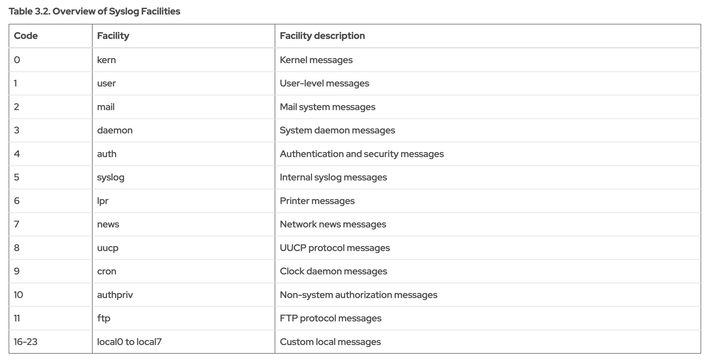

Mức độ quan trọng (Priorities)

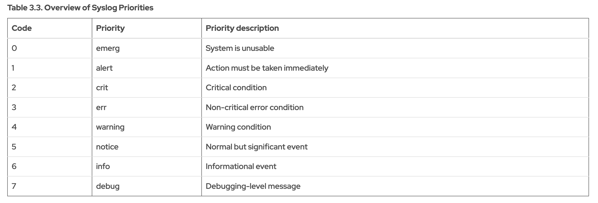

Có thể dùng ký tự \* để đại diện cho tất cả mức độ quan trọng
```bash
authpriv.*    /var/log/secure
```

**Log Rotation**

Lệnh 'logrotate' giúp giới hạn dung lượng log bằng cách:
- Đổi tên file log cũ (thêm ngày, ví dụ: messages-20220320)
- Tạo file log mới
- Thông báo cho dịch vụ ghi log (nếu cần)

Các log cũ sẽ bị xóa sau 1 khoảng thời gian

'logrotate' chạy hàng ngày (qua cron hoặc systemd timer)

Các file logrotate:
- /etc/logrotate.conf - Cấu hình tổng (global)
- /etc/logrotate.d/ - Thư mục chứa cấu hình riêng cho từng dịch vụ
- /var/lib/logrotate/status - Theo dõi trạng thái log đã xoay vòng

Ví dụ:
```bash
/var/log/httpd/*.log {
    daily                # Xoay log mỗi ngày
    missingok            # Không báo lỗi nếu log không tồn tại
    rotate 7             # Giữ lại 7 bản log cũ
    compress             # Nén log cũ (gzip)
    delaycompress        # Nén log từ lần xoay kế tiếp
    notifempty           # Không xoay nếu log rỗng
    create 0640 root root # Tạo log mới với quyền
    sharedscripts        # Chạy script sau khi xoay 1 lần cho toàn bộ file
    postrotate
        /bin/systemctl reload httpd.service > /dev/null 2>/dev/null || true
    endscript
}
```

Kiểm tra hoạt động logrotate:
```bash
# chạy thử
logrotate -d /etc/logrotate.conf

# chạy thật
logrotate -f /etc/logrotate.conf
```

Logrotate thường được chạy định kỳ thông qua:
- cronjob hàng ngày
```bash
/etc/cron.daily/logrotate
```
- systemd timer (chỉ có trên RHEL 9+)
```bash
systemctl status logrotate.timer
```

**Cấu trúc 1 dòng log syslog**

```bash
Mar 20 20:11:48 localhost sshd[1433]: Failed password for student from 172.25.0.10 port 59344 ssh2

# Mar 20 20:11:48	Dấu thời gian khi sự kiện xảy ra
# localhost	Tên máy chủ (host) gửi thông điệp log
# sshd[1433]	Tên tiến trình (sshd) và PID (1433) gửi thông điệp
# Failed password for student...	Nội dung log – báo lỗi đăng nhập thất bại cho user student
```

Sử dụng lệnh 'tail -f' để theo dõi log đang ghi theo tgian thực
```bash
# Lệnh này sẽ hiển thị 10 dòng cuối trong file log và liên tục in ra dòng mới được ghi.
tail -f /var/log/secure
```

**Tạo syslog thủ công**

Mục đích:
- Giúp kiểm tra xem cấu hình ghi log đã hoạt động đúng chưa
- Kiểm tra phân quyền file log
- Mô phỏng sự kiện cho debug
- Chèn logger vào shell sscripts để ghi log hoạt động của scripts vào syslog

Câu lệnh:
```bash
logger -p authpriv.notice "Testing secure log"
```

### 3.3. Review System journal

Systemd-journald là dịch vụ lưu các dữ liệu log trong một file nhị phân có cấu trúc, được lập chỉ mục gọi là journal. Dữ liệu này bao gồm các thông tin bổ sung về log của sự kiện.

Để xem các log của từ journal, sử dụng lệnh journalctl để xem tất cả các log hoặc tìm kiếm một vài sự kiện đặc biệt.

Nếu chạy lệnh với quyền root, sẽ xem được tất cả log. User thường cũng có thể xem log nhưng sẽ bị hạn chế xem 1 số log nhất định

```bash
[root@host ~]# journalctl -n 5
Mar 15 04:42:17 host.lab.example.com systemd[1]: Started Hostname Service.
Mar 15 04:42:47 host.lab.example.com systemd[1]: systemd-hostnamed.service: Deactivated successfully.
Mar 15 04:47:33 host.lab.example.com systemd[2127]: Created slice User Background Tasks Slice.
Mar 15 04:47:33 host.lab.example.com systemd[2127]: Starting Cleanup of User's Temporary Files and Directories...
Mar 15 04:47:33 host.lab.example.com systemd[2127]: Finished Cleanup of User's Temporary Files and Directories.
```

Để có thể xem thêm nội dung chi tiết hơn của journal log, bật verbose output
```bash
[root@host ~]# journalctl -o verbose
```

### 3.4. Lưu trữ các system journal

Mặc định RHEL 9 lữu trữ các system journal trong thư mục /run/log và bị hệ thống xóa khi reboot

Có thể đổi cấu hình của systemd-journald trong file /etc/systemd/journald.conf để các journal log được lưu lại sau khi reboot

Thông số Storage trong file sẽ quy định cách lưu trữ log của hệ thống:
- persistent - Lưu log vĩnh viễn tại /var/log/journal (nếu chưa có thì systemd-journald sẽ tạo thư mục này)
- volatile - Lưu tạm thời tại /run/log/journal (mặc định nếu chưa cấu hình gì)
- auto - Nếu tồn tại /var/log/journal thì dùng chế độ persistent, ngược lại dùng volatile
- none - Không lưu log, nhưng vẫn có thể gửi log đi nơi khác (ví dụ qua mạng)

Phải kết hợp lưu log vĩnh viễn và log rotate để không bị đầy dung lượng

Để kiểm tra dung lượng log hiện tại:
```bash
journalctl | grep -E 'Runtime Journal|System Journal'
Mar 15 04:21:14 localhost systemd-journald[226]: Runtime Journal (/run/log/journal/4ec03abd2f7b40118b1b357f479b3112) is 8.0M, max 113.3M, 105.3M free.
```

Để lưu log vĩnh viễn:
- tạo folder /var/log/journal (nếu chưa có)
- Sửa file cấu hình /etc/systemd/journald.conf - đổi Storage=Persistent
- khởi động lại systemd-journald

Khi sd journalctl sẽ hiển thị log của tất cả các lần boot, để phân biệt cần thêm option -b
```bash
journalctl -b # xem log của lần boot hiện tại 
journalctl -b -1 # xem log của lần boot trước đó
journalctl --list-boots # xem ds các lần khởi động mà hệ thống ghi nhận
```

### 3.5. Duy trì thời gian chính xác

Để xem thông tin về thời gian hiện tại, múi giờ, đồng bộ NTP:
```bash
timedatectl

Local time:       Wed 2022-03-16 05:53:05 EDT
Universal time:   Wed 2022-03-16 09:53:05 UTC
RTC time:         Wed 2022-03-16 09:53:05
Time zone:        America/New_York (EDT, -0400)
System clock synchronized: yes
NTP service:      active
RTC in local TZ:  no
```

Thiết lập múi giờ:
```bash
timedatectl list-timezones # Xem danh sách các múi giờ

tzselect # Xác định múi giờ theo vị trí địa lý , đưa ra tên múi giờ phù hợp (không thay đổi hệ thống).

timedatectl set-timezone <múi_giờ> # Đặt múi giờ cho hệ thống

timedatectl set-timezone Asia/Ho_Chi_Minh

timedatectl set-ntp true/false # Bật/Tắt đồng bộ hóa NTP

timedatectl set-time "2025-08-07 09:00:00" # Cập nhật thủ công thời gian hệ thống khi đã tắt NTP
```

**Cấu hình và giám sát dịch vụ chronyd**

chronyd giúp đồng bộ thời gian hệ thống bằng cách điều chỉnh Real-Time Clock (RTC) của máy, so với các máy chủ NTP được cấu hình.

Nếu không có mạng, chronyd sẽ tính độ lệch (drift) của RTC và lưu thông tin này vào file do driftfile chỉ định trong /etc/chrony.conf.

Mặc định, chronyd sử dụng các máy chủ NTP từ NTP Pool Project (các máy chủ công cộng) để đồng bộ thời gian, không cần cấu hình thêm.

Nếu máy nằm trong mạng nội bộ (không ra Internet), cần thay đổi máy chủ NTP trong file /etc/chrony.conf.

Stratum là tầng (độ sâu) của máy chủ NTP trong chuỗi đồng bộ:
- Stratum 0: Nguồn đồng hồ chuẩn độ chính xác cao (ví dụ: đồng hồ nguyên tử).
- Stratum 1: Máy chủ trực tiếp kết nối với Stratum 0.
- Stratum 2: Máy tính lấy đồng bộ từ Stratum 1, v.v.

Các loại nguồn thời gian trong chrony.conf
- server: máy chủ NTP ở tầng trên (stratum thấp hơn), được ưu tiên.
- peer: máy đồng cấp (stratum ngang bằng).

Có thể khai báo nhiều server hoặc peer, mỗi dòng một địa chỉ máy chủ hoặc peer.

Sử dụng chronyc để giám sát chronyd
```bash
chronyc sources # Kiểm tra các nguồn thời gian mà chronyd đang sử dụng

chronyc sources -v # Kiểm tra chi tiết các nguồn thời gian mà chronyd đang sử dụng

  .-- Source mode  '^' = server, '=' = peer, '#' = local clock.
 / .- Source state '*' = current best, '+' = combined, '-' = not combined,
| /             'x' = may be in error, '~' = too variable, '?' = unusable.
||                                                 .- xxxx [ yyyy ] +/- zzzz
||      Reachability register (octal) -.           |  xxxx = adjusted offset,
||      Log2(Polling interval) --.      |          |  yyyy = measured offset,
||                                \     |          |  zzzz = estimated error.
||                                 |    |           \
MS Name/IP address         Stratum Poll Reach LastRx Last sample
===============================================================================
^* 172.25.254.254                3   6    17    26  +2957ns[+2244ns] +/-   25ms
```

chronyd rất quan trọng để giữ thời gian chính xác cho hệ thống, đặc biệt trong các môi trường cần đồng bộ log hoặc các dịch vụ nhạy cảm với thời gian

## Chapter 4: Lưu trữ và chuyển các file

### 4.1. Quản lý lưu trữ các file đã nén

Archive là một file duy nhất (file bình thường hoặc thiết bị lưu trữ như ổ đĩa, USB, v.v) chứa nhiều file con khác

Archive giống như 1 hộp đựng nhiều file để dễ dàng quản lý, di chuyển hoặc sao lưu

Vậy, điểm khác nhau giữa archive file và folder là gì?

| Tiêu chí             | Folder (Thư mục) | Archive (Tệp lưu trữ) |
|----------------------|------------------|---------------------------|
|Tồn tại               | Trực tiếp trên hệ thống tập tin | Là một tệp duy nhất trên hệ thống |
|Có thể chứa file/thư mục con? | Có | Có |
|Có thể truy cập trực tiếp?	   | Có (cd, ls, open...)|Không (cần giải nén hoặc dùng lệnh để xem)|
|Có thể nén không?	           | Không (tự thân thư mục không nén được)	|Có thể nén để giảm dung lượng|
|Dùng để backup/chuyển file?   | Không tiện (nhiều file riêng lẻ)	|Rất tiện (gom lại 1 file duy nhất)|
|Dễ truyền qua mạng/email?     | Không (nhiều file rời rạc)|	Có (1 file duy nhất)|
|Thay đổi nội dung dễ không?   | Rất dễ (copy, move, delete…)	|Không dễ (phải giải nén rồi nén lại)|


File archive có thể lưu trên hệ thống file-system hoặc lưu trực tiếp vào các thiết bị lưu trữ như:
- ổ đĩa bằng (tape drive)
- USB (flash drive)
- Đĩa CD/DVD, ổ cứng rời ...

File archive có thể được tạo ra mà không cần nén hoặc nén tùy nhu cầu sd

Archive là một thuật ngữ phổ biến và có rất nhiều các loại file archive khác nhau. Một số loại archive thường gặp:
- .zip - sd chủ yếu trên Win, có thể nén và chứa nhiều file
- .tar - là định dạng archive ko nén trên Linux, thường được kết hợp với các thuật toán nén như gzip, xz để tạo ra các file như .tar.gz, .tar.xz
- .rar - một định dạng archive phổ biến trên Win

Nén (compression) có thể được sd để giảm kích thước của file archive

Trên Linux, tar là công cụ chuẩn để làm việc cới archive. Chức năng của tar:
- Tạo file archive từ các file
- Nén file archive
- Liệt kê nội dung file archive
- Giải nén

Cấu trúc file archive dạng .tar:
- Metadata chứa thông tin của file (tên, kích thước, quyền...)
- Dữ liệu
- Index giúp tìm và trích xuất file 

Tar cũng có thể xem nội dung của file archive đã nén mà không cần giải nén

Các option:

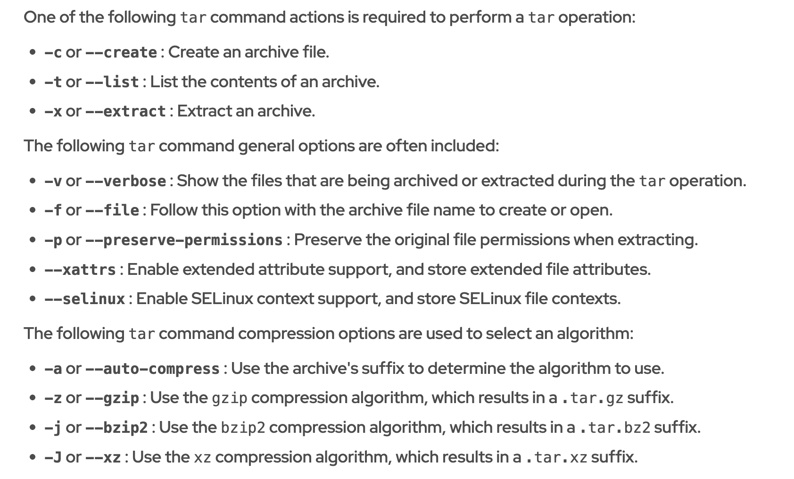

Câu lệnh:
```bash
# tạo file archive
tar -cf <tên-file-archive> <các-file/folder-trong-đó>

# vd
tar -cf mybackup.tar myapp1.log myapp2.log myapp3.log
```

Khi tạo file archive, các file gốc sẽ được copy bản sao vào file archive chứ ko bị di chuyển.

Nếu sử dụng đường dẫn tuyệt đối từ thư mục '/', tar sẽ loại bỏ dấu '/' đi (ví dụ: /etc/mess -> etc/mess).

Điều này giúp tránh ghi đè lên file hệ thống khi giải nén, các file giải nén sẽ nằm đúng vị trí file archive. Các nội dung vẫn sẽ được đưa vào file archive đầy đủ.

```bash
tar -cf etc-backup.tar /etc

# nội dung file .tar
etc/
etc/fstab
etc/hosts
...
```

Để liệt kê nội dung file
```bash
[root@host ~]# tar -tf /root/etc.tar
etc/
etc/fstab
etc/crypttab
etc/mtab
...output omitted...
```

Để giải nén file .tar và lấy các nội dung, cần có 1 folder trống để đưa nội dung vào đó, tránh việc bị ghi đè 1 số file lên các file hiện tại (nếu trùng tên)

Việc giải nén sẽ đưa các file trong archive ra thư mục đang làm việc

```bash
[user@host ~]# pwd
/home/user
[user@host ~]# ls
archive.tar
[user@host ~]# tar -tf /archive.tar
documents/file1.txt
documents/file2.txt
...output omitted...
[user@host ~]# tar -xf archive.tar
[user@host ~]# ls
archive.tar documents
[user@host ~]# ls ./documents
file1.txt file2.txt
```

Nếu cần chỉ định nơi giải nén
```bash
tar -xf archive.tar -C /đường/dẫn/đích
```

**Tạo 1 file archive đã bị nén (compression)**

|Loại nén|Tùy chọn|Đuôi file|Ưu điểm|Nhược điểm|
|--------|--------|---------|-------|----------|
|gzip	|-z	|.tar.gz|	Nhanh, tương thích cao|	Tỉ lệ nén thấp hơn|
|bzip2	|-j|	.tar.bz2|	Nén tốt hơn gzip|	Chậm hơn|
|xz	|-J|	.tar.xz	|Tỉ lệ nén cao nhất|	Chậm nhất, không luôn có sẵn|

```bash
# gzip
tar -czf /root/etcbackup.tar.gz /etc

# bzip2
tar -cjf /root/logbackup.tar.bz2 /var/log

# xz
tar -cJf /root/sshconfig.tar.xz /etc/ssh
```

**Giải nén file archive đã nị nén bởi các thuật toán**

Cú pháp:
```bash
tar -xf file.tar.gz
```

Mặc định, tar sẽ tự xem đuôi file để biết thuật toán nén và giải nén, không cần chỉ định option

Nếu có chỉ định option mà không đúng với thuật toán nén sẽ gây lỗi

```bash
tar -xzf file.tar.xz
# kqua
gzip: stdin: not in gzip format
tar: Child returned status 1
tar: Error is not recoverable: exiting now
```

### 4.2. Truyền file có bảo mật giữa các hệ thống

Sử dụng SSH để truyền file, 2 công cụ phổ biến:
- sftp - an toàn, giống ftp + ssh
- tcp - copy nhanh qua ssh

Với sftp, phải tạo kết nối trước
```bash
[user@host ~]$ sftp remoteuser@remotehost
remoteuser@remotehost's password: password
Connected to remotehost.
sftp>
```

Sau khi kết nối thành công, bạn sẽ ở sftp và trên máy remote. Lúc này, các câu lệnh tạo file sẽ tạo trên máy remote

```bash
# upload file từ local lên remote
sftp> put /path/to/localfile /remote/path/targetfile

# download file từ remote về local
sftp> get /remote/path/remotefile /local/path/localfile

# Tải file từ remote đến thư mục làm việc tại local
# chỉ hỗ trợ down về, cách này ko put file lên được
sftp user@host:/remote/path/file


```

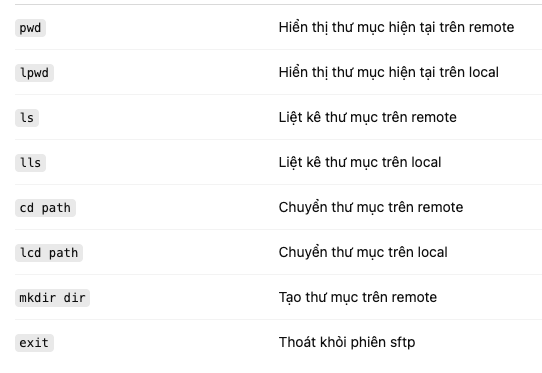

Với scp thì đơn giản hơn, chỉ cần gõ lệnh để download hoặc upload file
```bash
# syntax
scp [source] [destination]

# download từ remote -> local
scp user@remotehost:/etc/yum.conf /home/user

# upload local -> remote
scp myscript.sh user@remotehost:/home/user/

# thêm option -r cho folder
scp -r folder/ user@remotehost:/home/user/
```

Trước RHEL 9, scp dùng giao thức cũ rcp – có lỗ hổng bảo mật (CVE-2020-15778).

Từ RHEL 9, scp mặc định dùng giao thức sftp (an toàn hơn).

Đừng dùng option -0 vì nó ép dùng giao thức cũ → có thể bị tấn công

### 4.3. Đồng bộ hóa file giữa các hệ thống 1 cách bảo mật

Lệnh rsync là 1 cách khác để copy file từ hệ thống này sang hệ thống khác, giúp đồng bộ dữ liệu giữa máy local và remote.

Tool này dùng thuật toán để thay đổi lượng dữ liệu copy ít nhất có thể bằng cách chỉ đồng bộ hóa các phần đã bị thay đổi

rsync bảo toàn quyền, chủ sở hữu, thời gian chỉnh sửa... nếu dùng đúng tùy chọn.

```bash
# syntax
rsync [options] SOURCE DESTINATION

# kết nối chiều nào cũng như nhau
rsync -av /local/path user@remote:/remote/path

rsync -av user@remote:/remote/path /local/path
```

Các option của rsync
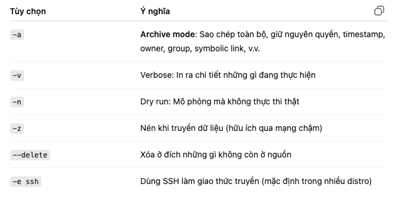

Nếu có option -a (archive mode) thì sẽ có thêm các option bổ sung

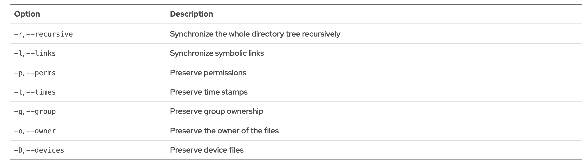

Để sd các flag con của option -a thì nên ghi rõ từng flag. Nếu chỉ gõ -a thì tương đương với -rlptgoD
```bash 
rsync -rlt --no-p --no-g --no-o /src/ /dest/

rsync -rltv --no-p --no-g --no-o /src/ /dest/
```

Dấu '/' ở cuối đường dẫn có ảnh hưởng đến cách đông bộ giữa 2 file:
```bash
# Chỉ nội dung thư mục /src sẽ được chép vào /dest
rsync -av /src/ /dest/

# Thư mục /src sẽ được chép vào dưới dạng /dest/src/
rsync -av /src /dest/
```

Có thêm 2 option giúp bảo toàn các thuộc tính mở rộng
- -A bảo toàn Access Control Lists (ACLs)
- -X bảo toàn SELinux file contexts

## Chapter 5: Điều chỉnh (Tune) hiệu suất hệ thống

### 5.1. Điều chỉnh Tuning Profile

tuned là một daemon (dvu ngầm) của hệ thống dùng để điều chỉnh các tham số của hệ thống (điều chỉnh động hoặc tĩnh) bằng cách sử dụng tuning profile - phản ánh các yêu cầu cụ thể của workload

tuned điều chỉnh cả statically (cố định) và dynamically (động, thay đổi theo tải hệ thống)

|Static Tuning|	Dynamic Tuning|
|---|-----|
|Thiết lập một lần khi khởi động	|Theo dõi và điều chỉnh trong thời gian thực|
|Không thay đổi khi hệ thống bận	|Thay đổi phù hợp với workload hiện tại|
|Dễ cấu hình, ít tiêu tốn tài nguyên|	Phức tạp hơn nhưng tối ưu hiệu suất tốt hơn|

Các loại tuning profile (RHEL 9)
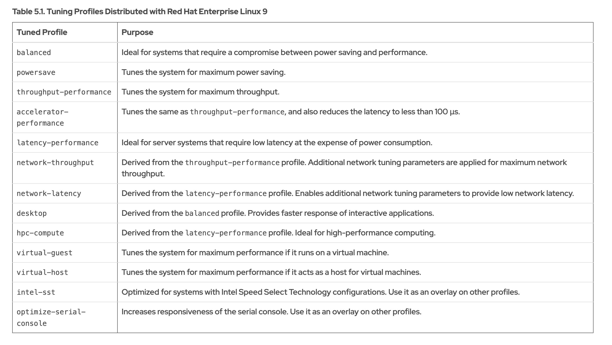

**Static Tuning**

Điều chỉnh tĩnh apply các cài đặt hệ thống khi dịch vụ tuning start hoặc khi áp dụng profile mới

```bash
# Cài tuned
dnf install tuned -y
systemctl enable --now tuned

# chọn profile
tuned-adm profile throughput-performance

# lúc này, các tham số trong profile sẽ được áp dụng ngay lập tức và sẽ ko đổi đến khi apply profile mới

# ktra profile đang hoạt động
tuned-adm active
```

**Dynamic Tuning**

Mặc định, dynamic tuning tắt, cần cấu hình thủ công
```bash
# File cấu hình: /etc/tuned/tuned-main.conf
dynamic_tuning = 1         # bật dynamic tuning
update_interval = 10       # cập nhật mỗi 10 giây
```

Mặc định cấu hình của hệ thống là file /usr/lib/tuned. Các profile do user tùy chỉnh nằm ở /etc/tuned

Tương tự các file cấu hình khác, ko nên sử ở /usr/lib vì dễ bị thay đổi khi package update. Hãy copy sang /etc/tuned và sửa.

Hệ thống sẽ ưu tiên sd các file ở /etc/tuned/

Một số câu lệnh:
```bash
# Danh sách profile có sẵn
tuned-adm list

# Kiểm tra profile đang dùng
tuned-adm active

# Kích hoạt một profile
tuned-adm profile throughput-performance

# xem mô tả profile
tuned-adm profile_info profile-name

# gợi ý profile phù hợp với hệ thống
tuned-adm recommend

# tắt tuned và hủy áp dụng các profile
tuned-adm off
```

### 5.2. Cấu hình việc lập lịch cho các tiến trình (Influence Process Scheduling)

Các hệ thống hiện đại sd CPU multi-cores, multi-thread giúp thực thi đồng thời nhiều tiến trình song song, gây ra bão hòa CPU

Linux sử dụng kỹ thuật gọi là time-slicing hoặc multitasking để quản lý các tiến trình

Hệ điều hành sử dụng bộ lập lịch tiến trình (process scheduler) để liên tục chuyển đổi giữa các process (các thread) đang chờ được xử lý

Trên mỗi lõi CPU, các tiến trình không chạy đồng thời thực sự, mà được chia thời gian rất nhỏ (time slices) — thường là vài mili-giây.

Mỗi tiến trình đều có một mức độ ưu tiên (priority) để hệ điều hành quyết định nên cấp CPU cho tiến trình nào trước.

Linux dùng nhiều chính sách lập lịch (scheduling policies):
- SCHED_OTHER (hay SCHED_NORMAL) – dùng cho tiến trình thông thường.
- SCHED_FIFO, SCHED_RR – dùng cho tiến trình real-time.

Chính sách SCHED_OTHER sử dụng thuật toán Completely Fair Scheduler (CFS) để chọn tiến trình tiếp theo.

CFS tổ chức tiến trình trong một cây nhị phân (binary tree) thay vì sd hàng đợi, binary tree có thứ tự:
- Thời gian CPU đã sử dụng (ít hơn -> được xử lý trước)
- Nice value (có thể thay đổi)

Các tiến trình SCHED_NORMAL có real-time priority là 0, tức là các tiến trình real-time luôn có độ ưu tiên cao hơn

Priority là mức độ quan trọng mà hệ điều hành dùng để quyết định tiến trình nào sẽ được CPU xử lý trước khi có nhiều tiến trình đang chờ cùng lúc

**Nice value**

Là giá trị ảnh hưởng đến độ ưu tiên của tiến trình trong CFS do người dùng thay đổi, ảnh hường gián tiếp đến priority của tiến trình trong hệ thống

Nằm trong khoảng -20 (độ ưu tiên cao nhất) -> 19 (độ ưu tiên thấp nhất), các tiến trình có Nice value mặc định là 0

Nice value không đảm bảo tuyệt đối CPU time

Chỉ user root mới có quyền thay đổi nice của các tiến trình và giảm nice (tăng độ ưu tiên).

User bình thường chỉ có thể tự giảm độ ưu tiên của các tiến trình user đó sở hữu

**Quan hệ giữa nice value và priority**

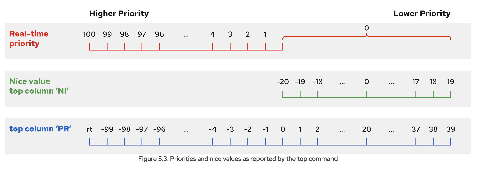

Tiến trình real-time không sử dụng nice, tuy nhiên có priority cao nên được ưu tiên so với các tiến trình thông thường

Các tiến trình thường (ko phải real-time) mới cần sử dụng CFS để quyết định priority, các tiến trình này dựa trên:
- Nice value
- Tgian sử dụng CPU
- Loại tiến trình

Để xem các tiến trình cùng với Nice value và Priority, sử dungjL
- top - xem tiến trình, PR, NI, %CPU
- ps - xem thông tin tiến trình và các scheduling class (CLS)

```bash
# lệnh top
Tasks: 192 total,   1 running, 191 sleeping,   0 stopped,   0 zombie
%Cpu(s):  0.0 us,  1.6 sy,  0.0 ni, 96.9 id,  0.0 wa,  0.0 hi,  1.6 si,  0.0 st
MiB Mem :   5668.6 total,   4655.6 free,    470.1 used,    542.9 buff/cache
MiB Swap:      0.0 total,      0.0 free,      0.0 used.   4942.6 avail Mem

    PID USER      PR  NI    VIRT    RES    SHR S  %CPU  %MEM     TIME+ COMMAND
      1 root      20   0  172180  16232  10328 S   0.0   0.3   0:01.49 systemd
      2 root      20   0       0      0      0 S   0.0   0.0   0:00.01 kthreadd
      3 root       0 -20       0      0      0 I   0.0   0.0   0:00.00 rcu_gp
      4 root       0 -20       0      0      0 I   0.0   0.0   0:00.00 rcu_par_gp

# lệnh ps
[user@host ~]$ ps axo pid,comm,nice,cls --sort=-nice
  PID COMMAND          NI CLS
   33 khugepaged       19  TS
   32 ksmd              5  TS
  814 rtkit-daemon      1  TS
    1 systemd           0  TS
    2 kthreadd          0  TS
    5 kworker/0:0-cgr   0  TS
    7 kworker/0:1-rcu   0  TS
    8 kworker/u4:0-ev   0  TS
   15 migration/0       -  FF
...output omitted...
```

Các tiến trình mới được tạo thường sẽ kế thừa nice value từ tiến trình cha và thường bằng 0

```bash
# thêm nice -n <giá-trị> để thêm nice value cho tiến trình khi bắt đầu chạy
nice -n 15 sleep 60 &

# nếu ko chỉ định 1 giá trị, nice sẽ +10 vào nice value của lệnh
nice sleep 60 &

# thay đổi nice của tiến trình đang chạy với renice và PID
renice -n 19 <PID>
```

## Chapter 6: Quản lý bảo mật SELinux

### 6.1. Giới thiệu SELinux

SELinux (security enhanced linux) là một tính năng bảo mật quan trọng của Linux. Quyền truy cập vào các file, port và các tài nguyên đều được quản lý ở mức chi tiết.

Ví dụ, file permission quản lý truy cập vào file của user và group, tuy nhiên, nó không thể ngăn chặn 1 người dùng có quyền truy cập file sử dụng file vào mục đích ko rõ ràng.

SELinux bao gồm các chính sách dành riêng cho ứng dụng mà các nhà phát triển ứng dụng định nghĩa để khai báo những hành động và quyền truy cập nào được phép đối với từng tệp thực thi nhị phân, tệp cấu hình và tệp dữ liệu mà ứng dụng sử dụng

SELinux áp dụng 1 bộ quy tắc (policy) truy cập, xác định các hành động được phép giữa các tiến trình và tài nguyên, các tiến trình chỉ được phép truy cập các tài nguyên mà chính sách SELinux hoặc cài đặt của chúng chỉ định.

Ngay cả khi ứng dụng có lỗi bảo mật, SELinux vẫn có thể ngăn chặn sự lợi dụng các lỗi đó, miễn là policy SELinux giới hạn đúng những gì ứng dụng được phép làm.

Đây là một lớp bảo mật bổ sung bên cạnh các lớp truyền thống như firewall, file permission.

Trong RHEL, các ứng dụng hoặc service có SELinux 'target policy' sẽ chạy ở 1 domain riêng (confined domain)

Các ứng dụng không có chính sách sẽ chạy trong domain unconfined và không bị quản lý bởi SELinux

SELinux có 3 chế độ hoạt động:
- Enforcing: SElinux cưỡng chế thực hiện các policy đã loaded (là chế độ mặc định trên RHEL), mọi hoạt động trái với policy sẽ bị block và ghi vào log
- Permissive: SELinux vẫn hoạt động, ghi nhận các vi phạm về policy, tuy nhiên chỉ log lại lỗi chứ ko chặn các hoạt động vi phạm -> sd để debug
- Disable: tắt hoàn toàn SELinux

Các log sẽ được ghi trong /var/log/audit/audit.log

Từ RHEL 9 trở đi, bạn không thể tắt SELinux bằng cách sửa file /etc/selinux/config, để tắt SELinux, sửa tham số 'selinux=0' và reboot hệ thống

### 6.2. Các concetps cơ bản của SELinux

Mục tiêu chính của SELinux là bảo vệ dữ liệu người dùng khỏi việc sử dụng sai mục đích bởi các ứng dụng hoặc dịch vụ hệ thống bị xâm phạm.

Hầu hết các Linux admin đều quen thuộc với mô hình user, group và world wide permission truyền thống, hay còn gọi là Discretionary Access Control (DAC)

SELinux là module bảo mật dành cho kernel của hệ thống

SELinux cung cấp một lớp bảo mật bổ sung dựa trên đối tượng (object-based), được định nghĩa trong các quy tắc chi tiết, được gọi là Mandatory Access Control (MAC)vì các chính sách áp dụng cho tất cả người dùng và không thể bypass đối với những người dùng cụ thể bằng các thiết lập cấu hình.

Các context gồm 4 thành phần:


```bash
[root@host ~]# ps axZ
LABEL                               PID TTY      STAT   TIME COMMAND
system_u:system_r:kernel_t:s0         2 ?        S      0:00 [kthreadd]
system_u:system_r:kernel_t:s0         3 ?        I<     0:00 [rcu_gp]
system_u:system_r:kernel_t:s0         4 ?        I<     0:00 [rcu_par_gp]
...output omitted...
[root@host ~]# systemctl start httpd
[root@host ~]# ps -ZC httpd
LABEL                               PID TTY          TIME CMD
system_u:system_r:httpd_t:s0       1550 ?        00:00:00 httpd
system_u:system_r:httpd_t:s0       1551 ?        00:00:00 httpd
system_u:system_r:httpd_t:s0       1552 ?        00:00:00 httpd
system_u:system_r:httpd_t:s0       1553 ?        00:00:00 httpd
system_u:system_r:httpd_t:s0       1554 ?        00:00:00 httpd
[root@host ~]# ls -Z /var/www
system_u:object_r:httpd_sys_script_exec_t:s0 cgi-bin
system_u:object_r:httpd_sys_content_t:s0 html
```

SELinux kiểm soát sâu hơn dựa trên các type context. Mỗi tiến trình, port và file đều có label và các policy chỉ cho phép một tiến trình với context nhất định được truy cập vào file hay port có label phù hợp

Sau khi đã gán label (context) cho các file, port và process, SELinux có các file cấu hình để định nghĩa các policy theo mong muốn

vd: process có context 'httpd_t' chỉ được phép đọc các file có context 'httpd_sys_content_t' và sử dụng các port có context 'http_port_t'

Để quản lý user, SELinux sử dụng user riêng khác với user thông thường. Để gán policy cho user, làm các bước sau:
- tạo SELinux user
- gán SELinux user vào user
- gán role và domain phù hợp cho SELinux user hoặc tạo các policy cho SELinux user

**Thay đổi SELinux mode**

Để thay đổi chế độ hoạt động của SELinux, sử dụng lệnh 'getenforce'

```bash
# ktra mode hiện tại
getenforce

# thay đổi mode tạm thời (sẽ bị reset sau reboot)
setenforce Enforcing

setenforce 1 # lệnh này cũng sd mode Enforcing
```

Để thay đổi mode mặc định của SELinux (thay đổi vĩnh viễn kể cả reboot), sửa dòng 'SELINUX=permissive' trong file /etc/selinux/config

**Quản lý SELinux context của file**

Các context của file được lưu trong 1 file-based database nằm ở thư mục /etc/selinux/targeted/contexts/files/file_contexts

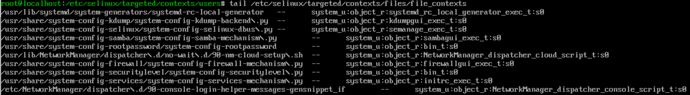

Hoặc cũng có thể xem bằng lệnh 'semanage'

Các context khác được lưu như sau:
- user - nằm ở /etc/selinux/targeted/contexts/users/* (có thể xem bằng lệnh 'semanage')
- port - ko lưu file riêng, xem bằng 'semanage port -l'
- process - ko lưu tĩnh mà được gán khi bắt đầu chạy và được gán context dựa vào các policy và domain mà process thuộc về.

Logic kế thừa context của các folder:
- Nếu tạo file trong thư mục đã có policy được định nghĩa rõ ràng, file sẽ được gán context đúng, phù hợp theo policy
- Nếu folder ko có policy thì file sẽ kế thừa context của folder
- Khi di chuyển file (mv) thì inode giữ nguyên -> context ko đổi
- Khi copy file sang thư mục mới, tạo inode mới -> conext được áp dụng theo thư mục đích như nội dung 1 và 2

**Thay đổi SELinux context**

Có 3 câu lệnh để thay đổi SELinux context:
- semanage fcontext
- restorecon
- chcon

Cách khuyến nghị: semanage fcontext + restorecon

Sử dụng 'semanage fcontext' để tạo/sửa rule trong policy, xác định đường dẫn file hoặc thư mục cụ thể sẽ có context nào

Sau đó, restorecon sẽ áp dụng lại context theo policy đã định nghĩa (trong đó có rule mới add)

```bash
# tạo rule
semanage fcontext -a -t <type> <path> 

# áp dụng context mới
restorecon <path>
```

Lệnh 'chcon' sẽ thay đổi trực tiếp context của file/folder nhưng ko thay đổi policy. Khi hệ thống reboot hoặc restorecon thì các context này sẽ bị ghi đè lại

Biểu thức (/.*) trong policy thường được gắn vào sau tên một thư mục trong policy SELinux, có nghĩa là "tất cả file hoặc folder trong thư mục đều sẽ áp dụng policy này"

```bash
/var/www/cgi-bin(/.*)?  all files  system_u:object_r:httpd_sys_script_exec_t:s0

# /var/www(/.*)? sẽ bao gồm /var/www và tất cả các thư mục con, file con bên trong nó như /var/www/html/index.html, /var/www/css/style.css, v.v.
```

Các lệnh 'semanage' cơ bản:

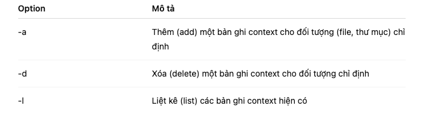

```bash
# xem context file chỉ định
[root@host ~]# ls -Z /var/www/html/file*
unconfined_u:object_r:user_tmp_t:s0 /var/www/html/file1
unconfined_u:object_r:httpd_sys_content_t:s0 /var/www/html/file2

# liệt kê các context mặc định theo policy
[root@host ~]# semanage fcontext -l
...output omitted...
/var/www(/.*)?       all files    system_u:object_r:httpd_sys_content_t:s0
...output omitted...

# Cập nhật context theo policy mới nhất
[root@host ~]# restorecon -Rv /var/www/
Relabeled /var/www/html/file1 from unconfined_u:object_r:user_tmp_t:s0 to unconfined_u:object_r:httpd_sys_content_t:s0

# thêm policy cho 1 folder
[root@host ~]# semanage fcontext -a -t httpd_sys_content_t '/virtual(/.*)?'

# xem các policy đã được custom khác với các policy mặc định của linux
[root@host ~]# semanage fcontext -l -C
```

**Cấu hình SELinux policy với booleans**

Sau khi nhà phát triển đã viết các SELinux targeted policy, có thể thêm các behavior (hành vi mở rộng) cho policy, giúp policy linh hoạt hơn trong từng tình huống.

Các behavior này là optional (ko bắt buộc) và có thể bật/tắt bằng SELinux Booleans

Policy thì ko thể bật/tắt linh hoạt được

Các hành vi mở rộng này còn phụ thuộc vào từng ứng dụng cụ thể, và cần phải tìm hiểu cũng như bật/tắt phù hợp với ứng dụng.

Các booleans theo dịch vụ được ghi chép trong man page của dịch vụ tương ứng

Sử dụng lệnh 'getsebool' để liệt kê 

```bash
# liệt kê các Booleans có sẵn của các policy và trạng thái hiện tại
[root@host ~]# getsebool -a
abrt_anon_write --> off
abrt_handle_event --> off
abrt_upload_watch_anon_write --> on
...output omitted...

# Bật/tắt trạng thái của các behavior, sử dụng option -P để bật/tắt vĩnh viễn (cập nhập policy file)
setsebool -P abrt_handle_event on

# liệt kê trạng thái của 1 behavior đã biết tên
[root@host ~]# getsebool httpd_enable_homedirs
httpd_enable_homedirs --> off

# kiểm tra trạng thái chi tiết của behavior
[root@host ~]# semanage boolean -l | grep httpd_enable_homedirs
httpd_enable_homedirs          (on   ,  off)  Allow httpd to enable homedirs

# on - trạng thái hiện tại
# off - trạng thái mặc định khi reboot 

# liệt kê các behavior có setting khác với setting khi reboot, dùng option -C
[root@host ~]# semanage boolean -l -C
```

### 6.3. Điều tra và giải quyết các vấn đề của SELinux

Cần hiểu rõ các nguyên tắc hoạt động của SELinux:
- SELinux sd chính sách dạng 'targeted' - chỉ giám sát 1 số dịch vụ cụ thể
- Mỗi dòng trong policy định nghĩa các tiến trình có context nào sẽ được cho phép các hành động (action) nào với tài nguyên có context nào
- Các action có thể có: system call, kernel function...
- Nếu ko có rule cho action trong policy thì mặc định action sẽ bị chặn
- RHEL đã có các policy ổn định nên rất hiếm khi xảy ra lỗi, thường là do dev cấu hình sai dịch vụ hoặc sai policy

Một số cách debug:
- Đọc mô tả trong man page (tìm kiếm tên-dịch-vụ + _selinux)
- Đôi khi cấu hình booleans thôi là chưa đủ, cần cấu hình thêm ở ngoài SELinux (vd: đã enable SELinux nhưng dịch vụ chưa được cấp user permission, file permission(rwx)...)

**Giám sát các lỗi vi phạm SELinux**

Khi SELinux ngăn chặn một hành động, một thông điệp gọi là AVC (Access Vector Cache) sẽ được ghi vào file log /var/log/audit/audit.log.

Để hỗ trợ xử lý lỗi, dịch vụ SELinux troubleshooting (được cung cấp bởi gói setroubleshoot-server) sẽ:
- Theo dõi các sự kiện AVC.
- Gửi thông báo tóm tắt đến file /var/log/messages.
- Gợi ý các lệnh xử lý lỗi.

Quy trình xử lý lỗi khi SELinux ngăn chặn 1 hành động:
- Xem log trong /var/log/audit/audit.log hoặc /var/log/messages
- Tìm UUID nếu có và dùng 'sealert -l <UUID>' để xem chi tiết 
- Sử dụng 'restorecon', hoặc tạo policy với 'audit2allow' nếu cần

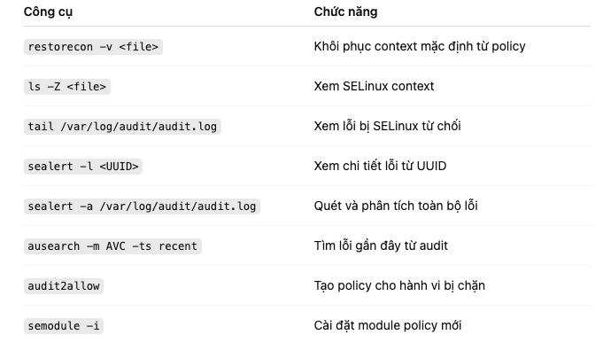

## Chapter 7: Quản lý Storage cơ bản

### 7.1. Tạo phân vùng, định dạng hệ thống tệp tin (file system) và gắn vĩnh viễn (persistent mounts)

**Phân vùng ổ đĩa**

Phân vùng ổ đĩa (disk partitioning) là quá trình chia ổ cứng vật lý thành nhiều vùng logic (partitions). Mỗi phân vùng có thể dùng cho mục đích khác nhau.

Lợi ích của việc phân vùng:
- Giới hạn không gian lưu trữ cho ứng dụng hoặc người dùng.
- Tách biệt hệ điều hành với dữ liệu người dùng → dễ bảo trì, backup.
- Tạo phân vùng swap riêng cho bộ nhớ ảo.
- Tăng hiệu quả trong việc chẩn đoán và sao lưu.

**MBR Partition**

MBR (Master Boot Record) là một chuẩn phân vùng cũ, dùng phổ biến trên các hệ thống sử dụng BIOS.

Số phân vùng tối đa: 4 phân vùng

Có thể tạo nhiều phân vùng hơn bằng cách tạo extended partition chứa logical partitions (tối đa 15 phân vùng trên Linux)

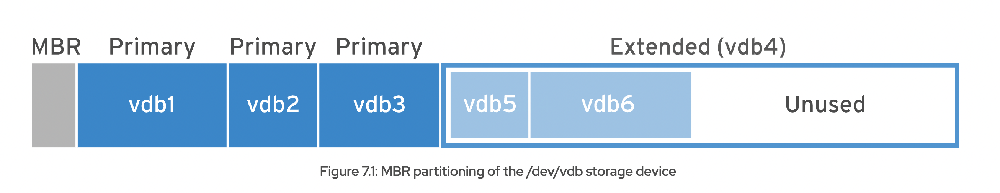

Kích thước đĩa tối đa: 2 TiB (do giới hạn 32-bit địa chỉ hóa)

Vị trí MBR nằm ở sector đầu tiên (512 bytes) của ổ đĩa, chứa:
- Thông tin bootloader để khởi động hệ điều hành
- Bảng phân vùng cho tối đa 4 phân vùng chính (primary)

Hỗ trợ các hệ thống dùng BIOS (Legacy boot)

**GPT Partition**

GPT (GUID Partition Table) là sơ đồ phân vùng hiện đại, được sử dụng chủ yếu trên các hệ thống dùng UEFI firmware. Nó khắc phục hoàn toàn các hạn chế của MBR và mang lại nhiều tính năng mạnh mẽ, an toàn hơn.

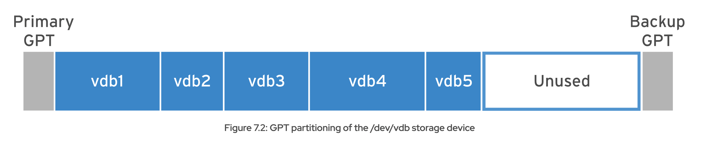

| Tiêu chí                | GPT                                                | MBR                                      |
| ----------------------- | -------------------------------------------------- | ---------------------------------------- |
| Dùng với firmware       | UEFI                                           | BIOS                                     |
| Kích thước đĩa tối đa   | \~8 ZiB (Zebibyte) = 8 tỷ TiB                  | 2 TiB                                |
| Số phân vùng            | 128 hoặc nhiều hơn                             | 4 primary (15 nếu dùng extended/logical) |
| Phát hiện lỗi           | ✅ CRC32 checksum cho GPT header và partition table | ❌ Không có                               |
| Dự phòng bảng phân vùng | ✅ Có bảng phụ dự phòng ở cuối ổ đĩa                | ❌ Không có                               |
| Mã định danh phân vùng  | GUID (Globally Unique ID)                      | Dựa vào thứ tự                           |

GPT dùng 64-bit địa chỉ logic (LBA) để định vị các khối dữ liệu → hỗ trợ đĩa rất lớn.

Mỗi phân vùng và ổ đĩa có một GUID duy nhất → dễ quản lý, đồng bộ.

Tự động kiểm tra lỗi với checksum → phát hiện khi bảng phân vùng bị hỏng.

Bảng phân vùng GPT được lưu ở:
- Đầu đĩa (Primary GPT Header)
- Cuối đĩa (Backup GPT Header)

**Quản lý phân vùng**

Sử dụng parted (một partition editor) để thực hiện các thao tác với phân vùng:
- Tạo mới phân vùng
- Xoá phân vùng
- Đổi loại phân vùng
- In bảng phân vùng

Các câu lệnh:
```bash
# xem thông tin phân vùng
parted /dev/<tên_ổ_đĩa> print

# mở chế độ tương tác
[root@host ~]# parted /dev/vda
```

**Viết bảng phân vùng (partition table) cho ổ đĩa mới**

Khi bắt đầu phân vùng ổ đĩa, bước 1 là ghi nhãn đĩa (disk label).

Disk label sẽ xác định pattitioning scheme sẽ sd:
- MBR: sử dụng lệnh mklabel msdos
- GPT: sử dụng lệnh mklabel gpt

Câu lệnh mẫu:
```bash
# Ghi nhãn MBR
parted /dev/vdb mklabel msdos

# Ghi nhãn GPT
parted /dev/vdb mklabel gpt
```

Lưu ý: lệnh mklabel sẽ xóa toàn bộ bảng phân vùng hiện tại.

Nếu ổ đĩa đã có dữ liệu hoặc phân vùng:
- Tất cả phân vùng và dữ liệu hiện tại sẽ bị mất
- Nếu disk label mới thay đổi ranh giới phân vùng, dữ liệu trong các tập tin cũ sẽ ko thể truy cập được

-> Chỉ sử dụng mklabel khi ko cần dữ liệu cũ

**Tạo phân vùng MBR**

Sau khi tạo bảng phân vùng, thực hiện tạo phân vùng MBR

Vào chế độ tương tác (interactive mode)
```bash
parted /dev/vdb
```

Tạo phân vùng bằng lệnh mkpart
```bash
(parted) mkpart

# sau đó, chọn các thông tin phân vùng 
Partition type?  primary/extended? primary 

File system type?  [ext2]? xfs

Start? 2048s
End? 1000MB

# lệnh mkpart chỉ thực hiện tạo 1 phân vùng, nếu cần thêm thì phải lặp lại bước này
```

Cập nhật hệ thống để nhận phân vùng mới:
```bash
[root@host ~]# udevadm settle
```

Nếu muốn tạo phân vùng nhanh mà ko vào chế độ tương tác, sd lệnh:
```bash
[root@host ~]# parted /dev/vdb mkpart userdata xfs 2048s 1000MB
```

**Tạo phân vùng GPT**

Thực hiện các bước tương tự MBR:

```bash
parted /dev/vdb # vào interactive mode

(parted) mkpart # tạo phân vùng mới

# fill thông tin
Partition name?  []? userdata

File system type?  [ext2]? xfs

Start? 2048s
End? 1000MB

# cập nhật hệ thống
udevadm settle
```

Sử dụng 1 câu lệnh ngắn gọn:
```bash
parted /dev/vdb mkpart userdata xfs 2048s 1000MB
```

**Xóa phân vùng (áp dụng cho cả MBR và GPT)**

```bash
# Vào tương tác mode
parted /dev/vdb

# lấy thông tin về số thứ tự của phân vùng
(parted) print

Number  Start   End     Size   File system  Name       Flags
 1      1049kB  1000MB  999MB  xfs          userdata

# xóa phân vùng
(parted) rm 1
```

Nếu phân vùng vừa xóa từng được gắn tự động qua fstab, cần xóa dòng tương ứng trong /etc/fstab để tránh lỗi khi khởi động

Xóa phân vùng bằng 1 lệnh:
```bash
parted /dev/vdb rm 1
```

**Tạo file system (hệ thống tệp)**

Sau khi tạo phân vùng, cần phải tạo file system để có thể lưu trữ và quản lý dữ liệu trên đó

Các hệ thống tệp được hỗ trợ trên RHEL:
- xfs: mặc định và được khuyên dùng
- ext4 : phổ biến, linh hoạt
- ngoài ra còn 1 số loại file system tùy nhu cầu sd: vfat, ntfs...

Tạo file system:
```bash
mkfs.xfs /dev/vdb1

mkfs.ext4 /dev/vdb1
```

Lệnh mkfs.* sẽ xóa toàn bộ dữ liệu nếu phân vùng đã có dữ liệu trước đó

**Mount file system**

Bước cuối cùng là mount thư mục vào phân vùng để sd
```bash
mount /dev/vdb1 /mnt # thư mục mount point /mnt phải tồn tại
```

Sau khi mount, các dữ liệu của phân vùng có thể truy cập khi vào folder đã mount

Kiểm tra lại thư mục xem đã mount chưa
```bash
mount | grep vdb1

/dev/vdb1 on /mnt type xfs (rw,relatime,...)
```

Để mount vĩnh viễn (tự động mount lại sau khi reboot), thêm line vào file /etc/fstab theo cấu trúc

```bash
<device> <mount_point> <filesystem_type>   <options> <dump> <fsck>
```

Để lấy thông tin file system. sd lệnh 'llsblk'
```bash
lsblk - fs

# thêm dòng vào /etc/fstab
UUID=a1234bcd-56ef-7890-gh12-ijkl3456mnop   /mnt   xfs   defaults   0 0
```

Tải lại cấu hình fstab (ko cần rebot)
```bash
systemctl daemon-reload
```

Lưu ý: nhập sai trong /etc/fstab có thể khiến hệ thống ko khởi động được. Thực hiện ktra bằng:
```bash
findmnt --verify
```

### 7.2. Quản lý Swap space
 
Swap space là một vùng trên ổ đĩa, được quản lý bởi hệ thống quản lý bộ nhớ của kernel

Swap space được dùng để bổ sung RAM cho hệ thống bằng cách giữa các trang ko hoạt động trong memory

Bộ nhớ ảo (virtual memory) của hệ thống bao gồm RAM và Swap

Flow hoạt động:
- Khi RAM sắp hết, kernel tìm các trang bộ nhớ ít được sử dụng (idle memory page)
- Các trang này (idle page) được ghi vào swap
- RAM lúc này sẽ được reassigne cho các tiến trình khác đang cần
- Khi chương trình (program) cần dữ liệu đã bị swap -> kernel swap 1 idle page khác sang ổ đĩa -> tải lại page cần dùng từ page vào RAM

Lưu ý:
- Swap chậm hơn RAM rất nhiều vì nằm trên ổ đĩa
- Ko nên dùng Swap để thay thế RAM, nó chỉ là hỗ trợ tạm thời

**Tính dung lượng swap space**

Việc tính toán swap space hợp lý rất quan trọng để đảm bảo hiệu năng và tính ổn định của hệ thống:
- Swap là bộ nhớ phụ của RAM, tính toán đúng swap giúp hệ thống sông sót qua các tình huống thiếu RAM tạm thời
- Đảm bảo chức năng ngủ đông (hibernation) hoạt động: cần Swap > RAM để lưu toàn bộ nội dung của RAM -> Swap
- Phù hợp với yêu cầu workload của hệ thống

Bảng khuyến nghị:
| **Dung lượng RAM** | **Dung lượng Swap đề xuất** | **Nếu cần Hibernation**         |
| ------------------ | --------------------------- | ------------------------------- |
| ≤ 2 GB             | Gấp **2 lần** RAM           | Gấp **3 lần** RAM               |
| 2 GB – 8 GB        | **Bằng** RAM                | Gấp **2 lần** RAM               |
| 8 GB – 64 GB       | **Ít nhất 4 GB**            | Gấp **1.5 lần** RAM             |
| > 64 GB            | **Ít nhất 4 GB**            | ❌ Không khuyến nghị hibernation |

**Tạo swap space**

Tương tự việc tạo 1 phân vùng:
```bash
# interactive mode
[root@host ~]# parted /dev/vdb

# tạo phân vùng và điền thông tin 
(parted) mkpart

Partition name?  []? swap1
File system type?  [ext2]? linux-swap
Start? 1001MB
End? 1257MB

# cập nhật
[root@host ~]# udevadm settle

# sửa file /etc/fstab nếu cần
```

**Format swap space**

Sử dụng lệnh 'mkswap' để gắn chữ ký swap lên phân vùng.

Hệ thống sẽ ko định dạng toàn bộ như mkfs mà chỉ ghi 1 block đầu -> phần còn lại kernel dùng để chứa các memory page

```bash
[root@host ~]# mkswap /dev/vdb2
Setting up swapspace version 1, size = 244 MiB (255848448 bytes)
no label, UUID=39e2667a-9458-42fe-9665-c5c854605881
```

**Active swap space**

```bash
# kích hoạt
swapon /dev/vdb2

# xem kết quả sau khi bật swap
free
swapon --show

# tắt swap
swapoff /dev/vdb2

# kích hoạt tất cả các swap space đã được list trong /etc/fstab
swapon -a
```

Nếu tắt swap đang chứa dữ liệu, swapoff sẽ:
- Cố gắng chuyển dữ liệu của swap đó về RAM hoặc sang các swap space khác
- Nếu ko đủ RAM, hệ thống sẽ báo lỗi

**Active swap space vĩnh viễn**

Thêm nội dung vào /etc/fstab
```bash
UUID=39e2667a-9458-42fe-9665-c5c854605881   swap   swap   defaults   0 0
```

Ý nghĩa từng trường thông tin:
| **Trường**                  | **Ý nghĩa**                                                                                    |
| --------------------------- | ---------------------------------------------------------------------------------------------- |
| `UUID=...` hoặc `/dev/vdb2` | Thiết bị swap (ưu tiên dùng `UUID` để tránh thay đổi thứ tự thiết bị)                          |
| `swap`                      | Trường "mount point", dùng từ khóa `swap` vì thiết bị swap không được gắn vào hệ thống tập tin |
| `swap`                      | Loại hệ thống tập tin (filesystem type)                                                        |
| `defaults`                  | Tùy chọn mount, bao gồm `auto` để bật khi khởi động                                            |
| `0`                         | Không cần sao lưu (dump)                                                                       |
| `0`                         | Không kiểm tra hệ thống tập tin (fsck)                                                         |


Tìm lại UUID của phân vùng
```bash
lsblk --fs
```

Cập nhật lại cấu hình
```bash
systemctl daemon-reload
```

**Thiết lập độ ưu tiên của swap space**

Thiết lập độ ưu tiên -> hệ thống ưu tiên dùng swap có độ ưu tiên cao hơn trước

Khi vùng ưu tiên cao đầy -> chuyển sang vùng có ưu tiên thấp hơn

Nếu nhiều swap space cùng priority -> kernel dùng theo Round-Robin

Mặc định, tất cả swap có độ ưu tiên là -2

Thiết lập swap space priority trong /etc/fstab
```bash
UUID=<uuid>  swap  swap  pri=<số_ưu_tiên>  0 0

UUID=af30cbb0-3866-466a-825a-58889a49ef33   swap  swap  defaults       0 0   # priority = -2 (mặc định)
UUID=39e2667a-9458-42fe-9665-c5c854605881   swap  swap  pri=4          0 0
UUID=fbd7fa60-b781-44a8-961b-37ac3ef572bf   swap  swap  pri=10         0 0

# pri=10 → dùng trước
# pri=4 → khi pri=10 đầy
# pri=-2 (mặc định) → dùng cuối cùng
```

## Chapter 8: Quản lý Storage Stack

### 8.1. Logical Volume Manager (LVM)

LVM là lớp trung gian giữa phần mềm và phần cứng lưu trữ, giúp:
- Trừu tượng hóa cấu hình ổ đĩa vật lý
- Dễ dàng mở rộng, thu hẹp dung lượng
- Quản lý hiệu quả nhiều loại lưu trữ

Thành phần chính:
- Physical devices: các ổ đĩa vật lý, các phân vùng, RAID, SAN disk...
- Physical volumes (PV): các đĩa vật lý/phân vùng đã được khỏi tạo bằng 'pvcreate', được chia nhỏ thành các Physical Extent (PE)
- Volume groups (VG): 1 nhóm chứa 1 hoặc nhiều PV, tương đương 1 ổ đĩa logic
- Logical volume (LV): ko gian lưu trữ thực tế, được tạo từ các LE (logical extent) trong VG (mỗi lE ánh xạ một PE)

**Flow hoạt động**

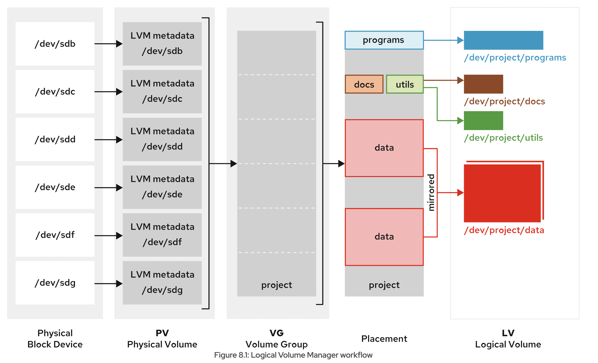

Chuẩn bị physical device
```bash
[root@host ~]# parted /dev/vdb mklabel gpt mkpart primary 1MiB 769MiB
...output omitted...
[root@host ~]# parted /dev/vdb mkpart primary 770MiB 1026MiB
[root@host ~]# parted /dev/vdb set 1 lvm on
[root@host ~]# parted /dev/vdb set 2 lvm on
[root@host ~]# udevadm settle
```

Tạo LVM physical volume
```bash
[root@host ~]# pvcreate /dev/vdb1 /dev/vdb2
  Physical volume "/dev/vdb1" successfully created.
  Physical volume "/dev/vdb2" successfully created.
  Creating devices file /etc/lvm/devices/system.devices
```

Tạo volume group
```bash
[root@host ~]# vgcreate vg01 /dev/vdb1 /dev/vdb2
  Volume group "vg01" successfully created
```

Tạo logical volume
```bash
# theo dung lượng
[root@host ~]# lvcreate -n lv01 -L 300M vg01 
  Logical volume "lv01" created.

# theo số lượng PE
lvcreate -n lv01 -l 32 vg01  # 32 PEs × 4MiB = 128MiB
```

**Tạo Logical Volume hỗ trợ VDO (optional)**

RHEL 9 dùng LVM Virtual Data Optimizer (VDO) để quản lý các VDO volume

VDO cung cấp:
- Deduplication (khử trùng lặp) -> xóa các block trùng lặp để tiết kiệm ko gian
- Nén (compression) - > lưu được nhiều hơn
- Thin provisioning (cấp phát lưu trữ nhiều hơn dung lượng thực)

Các bước tạo LVM VDO:
```bash
# cài công cụ
[root@host ~]# dnf install vdo kmod-kvdo

# tạo LVM VDO
[root@host ~]# lvcreate --type vdo --name vdo-lv01 --size 5G vg01
```

Tạo file system trên các Logical Volume:
- Tạo định dạng trên logical volume
```bash
mkfs -t xfs /dev/vg01/vdo-lv01
```
- Tạo mount point (thư mục để gán ổ)
```bash
mkdir /mnt/data
```
- Mount logical volume 
```bash
# thủ công
mount /dev/vg01/vdo-lv01 /mnt/data

# tự động - sử dụng /etc/fstab
# viết thông tin vào file cấu hình
/dev/vg01/vdo-lv01 /mnt/data xfs defaults 0 0

# chạy lệnh mount
mount /mnt/data
```

### 8.2. Xem các thông tin của từng thành phần LVM

**Thông tin Physical Volume**

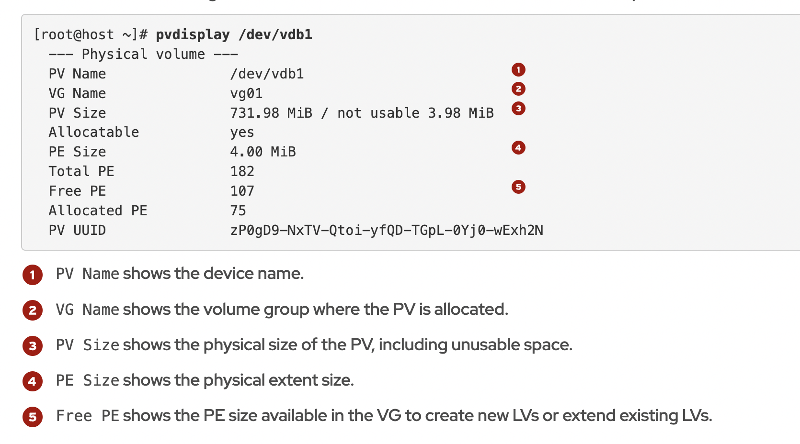

**Thông tin Volume Group**

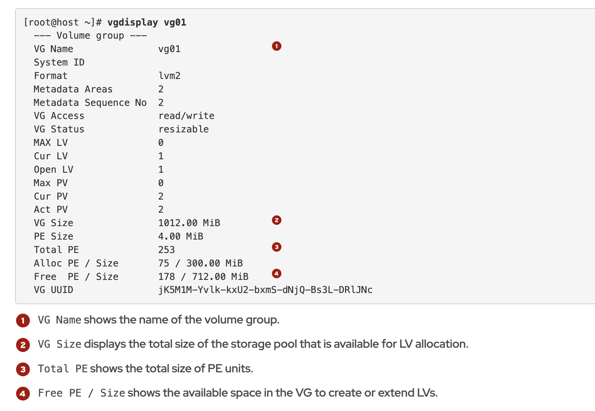

**Thông tin Logical Volume**

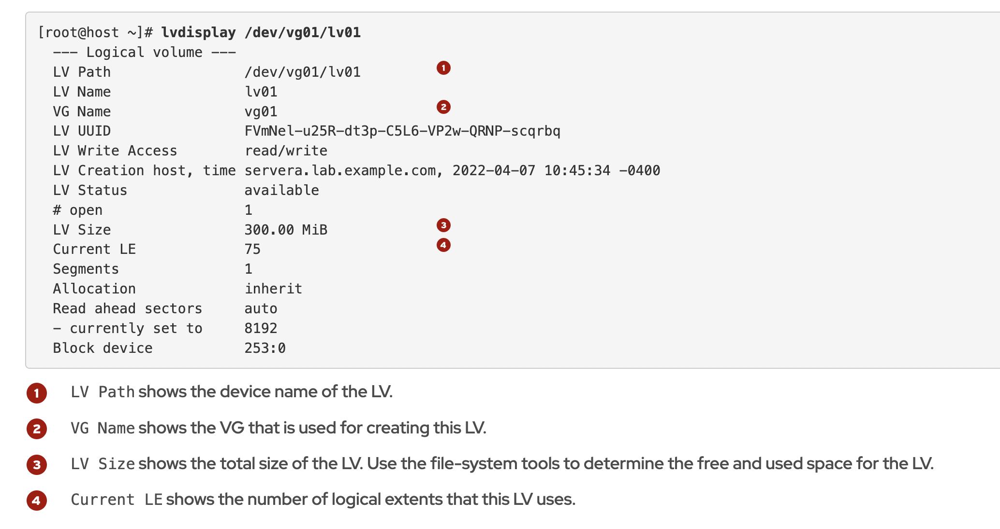

### 8.3. Quy trình mở rộng/ giảm ko gian lưu trữ bằng LVM

**Mở rộng size Volume Group**

Tạo thêm LVM physical volume, sau đó dùng lệnh 'vgextend'
```bash
vgextend vg01 /dev/vdb3
```

**Mở rộng size Logical Volume**

Điều kiện mở rộng là VG tương ứng còn thừa dung lượng
```bash
[root@host ~]# lvextend -L +500M /dev/vg01/lv01
```

**Mở rộng hệ thống tập tin**

| Đặc điểm                            | `xfs_growfs`                                           | `resize2fs`                                                |
| ----------------------------------- | ------------------------------------------------------ | ---------------------------------------------------------- |
| Hệ thống tập tin hỗ trợ             | Chỉ `XFS`                                              | `ext2`, `ext3`, `ext4`                                     |
| Hình thức resize                    | Chỉ **mở rộng (extend)**                               | Có thể **mở rộng và thu nhỏ (shrink)**                     |
| Có cần mount không?                 | **Phải** được mount                                    | Có thể resize khi đang mount (online) hoặc không (offline) |
| Cách sử dụng                        | Dùng **mount point**                                   | Dùng **device name**                                       |
| Có cần tắt hệ thống không?          | Không                                                  | Không, nếu online; Có thể có, nếu offline                  |
| Lệnh mở rộng tự động sau `lvextend` | Có thể dùng `lvextend -r` để tự resize sau khi mở rộng | Cũng hỗ trợ qua `-r`                                       |

**Mở rộng swap space trên LVM**

```bash
# tắt swap trên logical volume
swapoff -v /dev/vg01/swap

# mở rộng logical volume
lvextend -L +300M /dev/vg01/swap

# định dạng lại logical volume
mkswap /dev/vg01/swap

# bật lại swap 
swapon /dev/vg01/swap
```

**Giảm dung lượng của volume group**

Việc giảm dung lượng VG liên quan đến việc loại bỏ PV khỏi VG. Tuy nhiên, nó không liên quan đến việc giảm dung lượng các LV.

Một số file system không hỗ trợ thu nhỏ: XFS, GFS2

Các bước giảm size VG:
```bash
# di chuyển dữ liệu từ PV sẽ xóa sang PV khác cùng VG
pvmove -A y /dev/vdb3

# xóa PV khỏi VG
vgreduce vg01 /dev/vdb3
```

**Xóa LVM Storage**

```bash
# unmount file system
umount /mnt/data

# xóa logical volume
lvremove /dev/vg01/lv01

# xóa volume group
vgremove vg01


# xóa physical volume
pvremove /dev/vdb1 /dev/vdb2
```

Nhớ xóa dòng thông tin trong /etc/fstab

### 8.4. Quản lý lưu trữ nhiều lớp (Layered Storage)

**Storage stack**

Storage trong RHEL gồm nhiều lớp đã hoàn thiện, ổn định và nhiều tính năng hiện đại.

Việc quản lý lưu trữ cần sự quen thuộc với từng stack, và nhận biết các cấu hình lưu trữ ảnh hưởng đến quá trình khởi động, hiệu suất ứng dụng cũng như khả năng cung cấp các tính năng lưu trữ phù hợp cho từng TH

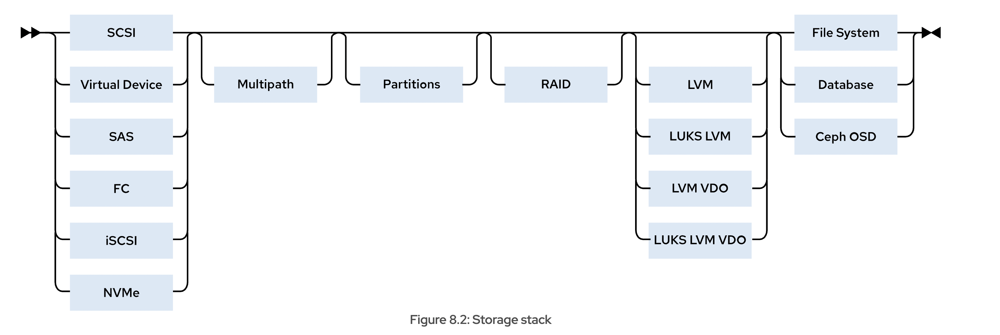

**Block device**

Block device là loại thiết bị lưu trữ mà dữ liệu được đọc/ghi theo khối (block) có kích thước cố định

Layer thấp nhất, cung cấp giao thức thiết bị ổn định và thống nhất

Hầu hết các block device đều có thể truy cập, điều khiển thông qua RHEL SCSI driver: HDD, SSD, NVMe hay ổ ATA đời cũ...

RHEL hỗ trợ nhiều loại block device:
- ATA/SATA HDD & SSD: kết nối truyền thống qua cổng SATA hoặc PATA
- NVMe (Non-Volatile Memory Express): Giao tiếp trực tiếp qua PCIe, tốc độ cao hơn SATA.
- iSCSI (Internet Small Computer Systems Interface): Giao thức SCSI truyền qua mạng TCP/IP. Mục tiêu là thiết bị lưu trữ ở xa, truy cập block device dưới dạng LUN.
- FCoE (Fibre Channel over Ethernet): Truyền dữ liệu Fibre Channel qua hạ tầng Ethernet. Cho phép hợp nhất LAN và SAN trên cùng hệ thống mạng vật lý -> Giảm chi phí phần cứng và cáp.
- SAS (Serial Attached SCSI): Kết nối lưu trữ tốc độ cao, dùng trong máy chủ và thiết bị lưu trữ doanh nghiệp.
- Virtio Block Device (trong máy ảo): Tối ưu hóa hiệu năng truy cập I/O giữa máy ảo và host.

**Multipath**

Một path là một kết nối giữa server và storage.

dm-multipath (Device Mapper Multipath) gộp nhiều path thành một thiết bị logic duy nhất trong /dev/mapper/.

Nếu storage kết nối qua mạng thì có thể dự phòng bằng cách sử dụng network bonding

**Partition**

Phân vùng chia block device thành nhiều phần logic

Sử dụng phân vùng để tạo file system, làm LVM PV hoặc lưu trữ trực tiếp cho database

**RAID**

RAID tạo volume logic từ nhiều đĩa vật lý/ảo

LVM hỗ trợ RAID level 0,1,4,5,6 và 10

RAID logical volune được tạo và quản lý bởi LVM sử dụng mdadm kernel driver. Nếu ko sử dụng LVM thì kernel sử dụng dm-raid

**LVM**

LVM xếp chồng (stack) nhiều loại block device để tạo volume logic

Tính năng nâng cao:
- LUKS encryption (mã hóa toàn thiết bị)
- VDO deduplication & compression

Có thể kết hợp LUKS và VDO trên cùng LVM

**File System hoặc Raw storage**

File system: lưu trữ file (XFS, ext4...) nhưng RHEL khuyến nghị XFS

Raw storage dùng cho DB hoặc ứng dụng cần truy cập trực tiếp, bỏ qua file system caching

Ceph OSD cũng sd raw device hoặc LVM

**Stratis - Storage management hiện đại**

Stratis là một tool quản lý storage được phát triển bới Red Hat và upstream Fedora

Stratis cấu hình các initial storage, thay đổi cấu hình các storage và sử dụng các tính năng mới của storage

Stratis dựng file system từ các pool gồm các thiết bị lưu trữ bằng cách sd thin provisioning.

Thay vì lập tức cấp phát các không gian lưu trữ vật lý cho các file system khi tạo, Stratis sẽ linh động cấp phát thêm các không gian từ pool khi file system lưu trữ thêm dữ liệu.

Thông tin file system có thể là 1 TiB, nhưng thực tế storage nó sử dụng chỉ có 100 GiB được cấp phát từ pool

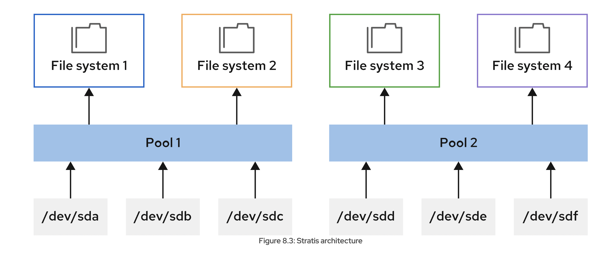

**Các thao tác với Stratis**

Cài đặt và khởi động dịch vụ
```bash
dnf install stratis-cli stratisd

systemctl enable --now stratisd
```

Tạo pool
```bash
stratis pool create pool1 /dev/vdb

# xem ds pool
stratis pool list

# xem block device trong pool
stratis blockdev list pool1

# thêm device vào pool
stratis pool add-data pool1 /dev/vdc
```

**Quản lý file system**
```bash
stratis filesystem create pool1 fs1

# list ds các file system
stratis filesystem list

# tạo snapshot cho file system
stratis filesystem snapshot pool1 fs1 snapshot1
```

Mount file system vĩnh viễn:
```bash
# Lấy UUID của file system
lsblk --output=UUID /dev/stratis/pool1/fs1

# thêm vào etc/fstab
UUID=<uuid> /dir1 xfs defaults,x-systemd.requires=stratisd.service 0 0
```

Lưu ý:
- Khi đã tạo file system bằng Stratis, ko chỉnh thủ công bằng LVM hay mkfs
- Không dùng df để ktra dung lượng vì XFS trong Stratis luôn báo 1 TiB -> dùng 'stratis pool list'

## Chapter 9: Truy cập lưu trữ qua mạng (network-attached storage)

### 9.1. Quản lý network-attached storage bằng NFS

Network file system (NFS) là giao thức chuẩn để chia sẻ file giữa Linux/UNIX qua mạng

NFS server export các thư mục, sau đó NFS client mount các thư mục đã export vào các thư mục mount point ở local.

NFS chỉ export folder, ko export file

NFS client có nhiều cách để mount các thư mục đã export:
- Manually: sử dụng lệnh 'mount'
- Persistent at boot: config file /etc/fstab
- On demand: cấu hình một phương pháp tự động mount (autofs, systemd.automount)

**Query thông tin export**

Để xem 1 server đang export những file/folder nào, sd lệnh
```bash
# với NFSv3
showmount --exports server

Export list for server
/shares/test1
/shares/test2
```

NFSv4 không dùng rpc -> lệnh 'showmount' sẽ bị timeout.

Để xem các export directory cần mount root của server với 1 thư mục và tìm trong folder đó

```bash
[root@host ~]# mkdir /mountpoint
[root@host ~]# mount server:/ /mountpoint
[root@host ~]# ls /mountpoint
```

**Mount các NFS export directory thủ công (tạm thời)**

```bash
# tạo mount point 
[root@host ~]# mkdir /mountpoint

# mount export directory vào mount point vừa tạo
[root@host ~]# mount -t nfs -o rw,sync server:/export /mountpoint

# -t nfs: loại file system là NFS
# -o rw,sync: tùy chọn mount, cho phép đọc/ghi và đồng bộ dữ liệu
# server:/export: server là hostname/IP của NFS server, /export là thư mục chia sẻ
# /mountpoint: thư mục mount trên client
```

**Mount các NFS export directory tự động (vĩnh viễn)**
```bash
# mỏ file /etc/fstab, thêm dòng sau
server:/export   /mountpoint   nfs   rw   0 0

# gõ lệnh
mount /mountpoint
```

Nhược điểm: nếu khi boot mà NFS server chưa sẵn sàng, có thể làm chậm/treo tiến trình boot

**Unmount NFS export**

Sử dụng lệnh 'umount'
```bash
umount /mountpoint

# cần xóa dòng trong /etc/fstab
```

Nếu unmount gặp lỗi 'device is busy' khi umount, nguyên nhân có thể do:
- một ứng dụng vẫn mở file trên NFS export
- một shell của user đang ở trong thư mục mount point hoặc thư mục con của nó

Giải quyết:
- rời khỏi thư mục cần unmount bằng cách cd sang thư mục khác
- tìm tiến trình đang giữ file và kill tiến trình
```bash
# tìm tiến trình đang giữ file
lsof /mountpoint
```
- Sử dụng force 'umount -f /mountpoint'

### 9.2. Tự động mount network-attached storage

Automounter (autofs) là một dịch vụ tự động mount và unmount file system hoặc NFS export theo nhu cầu

Khi người dùng hoặc ứng dụng truy cập vào mount point → autofs sẽ mount ngay lập tức.

Khi không còn tiến trình hoặc người dùng nào sử dụng → autofs tự unmount sau một khoảng timeout ngắn.

Vấn đề mà auto mount giải quyết:
- Người dùng không có quyền mount (mount thủ công yêu cầu root/sudo).
- Thiết bị/FS không mount từ đầu (fstab chỉ mount khi boot).
- Không cần giữ FS luôn mounted → tiết kiệm tài nguyên & giảm nguy cơ lỗi

Lợi ích của autofs
- Tiết kiệm tài nguyên: FS idle hoặc unmount gần như không tốn RAM/CPU.
- Giảm rủi ro hỏng dữ liệu: FS không bị treo mở khi không sử dụng.
- Luôn dùng config mới nhất: mỗi lần mount sẽ lấy cấu hình mount hiện tại (khác fstab mount 1 lần khi boot).
- Chọn đường nhanh nhất: Nếu NFS có nhiều server dự phòng, autofs có thể chọn kết nối tối ưu mỗi lần mount.
- Không cần root để mount: autofs làm việc trong background, mount khi người dùng truy cập.

Nguyên lý hđ:
- Tương tự với cách mount thủ công bằng /etc/fstab
- Khi cần mount, autofs gọi lệnh mount và khi unmount, autofs gọi lệnh umount

| Đặc điểm                    | `/etc/fstab`            | `autofs`                       |
| --------------------------- | ----------------------- | ------------------------------ |
| Thời điểm mount             | Khi boot                | Khi có truy cập                |
| Thời điểm unmount           | Khi shutdown            | Khi idle + timeout             |
| Dùng config mới nhất        | ❌ (phải reboot/remount) | ✅ (mỗi lần mount)              |
| Tiết kiệm tài nguyên        | ❌                       | ✅                              |
| Yêu cầu quyền root để mount | ✅                       | ❌ (tự mount khi user truy cập) |

**Khái niệm direct map và indirect map của autofs**

Direct map:
- Direct map = kiểu cấu hình autofs trong đó các mount point được khai báo bằng đường dẫn tuyệt đối.
- Không cần “mountpoint cha” như indirect map (/nfs/...).
- Thay vào đó, mỗi entry trong map chỉ định rõ ràng mount point cụ thể trên client.

Nói cách khác: direct map mount NFS trực tiếp vào đúng chỗ bạn muốn

Cấu hình thường nằm trong /etc/auto.master trỏ đến file map /etc/auto.direct

```bash
# file /etc/auto.master
/-    /etc/auto.direct

# /- nghĩa là direct map, các mount point được định nghĩa ở file /etc/auto.direct

# file /etc/auto.direct
/projects  -rw,sync  nfs-srv:/export/projects

# /project: mount point tuyệt đối
```

Indirect map:
- Với indirect map, bạn mount NFS dưới một directory gốc chung (ví dụ /nfs) và mỗi entry trong map sẽ tạo một subdir bên trong.
- Khi user truy cập vào /nfs/projectA, autofs mới mount NFS server /export/projectA vào đó.

```bash
# file /etc/auto.master
/home    /etc/auto.home

# /home là điểm mount gốc của các thư mục con
# /etc/auto.home là file chứa danh sách các mount point

# file /etc/auto.home
user1   -rw,sync  nfs-srv:/export/home/user1
user2   -rw,sync  nfs-srv:/export/home/user2

# khi truy cập vào /home/user1 sẽ chuyển sang nfs-srv:/export/home/user1
# tương tự với user2
```

**Các bước cấu hình dịch vụ auto mount**

Master map file là file cấu hình mặc định của dịch vụ 'autofs'. Có thể sửa file /etc/autofs.conf để đổi master map file.

Mỗi dòng có cấu trúc;
```bash
mount-point     map-file

# mount-point: thư mục gốc mà autofs quản lý
# map-file: file cấu hình các mount point con
```

Có thể sd 1 file chứa nhiều dòng mount-point hoặc tạo nhiều file trong folder /etc/auto.master.d/ với đuôi .autofs, mỗi file gom nhóm các cấu hình liên quan

Map file là file map chứa cấu hình chi tiết của từng mount point con. Mỗi dòng có dạng
```bash
mount-point     mount-options     source-location

# mount-point không có '/' ở đầy -> indirect map
# mount-point có ghi đường dẫn tuyệt đối -> direct map
```

Hoawjc sd 2 file 

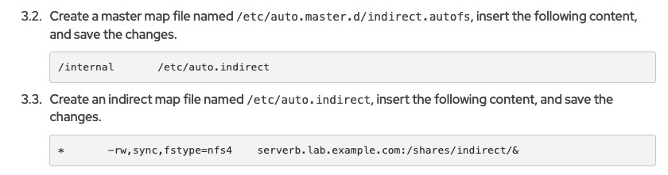

Với indirect map, có thể dùng wildcard để rút ngắn số lượng dòng cần viết
```bash
# file /etc/auto.master
/shares   /etc/auto.direct

#file /etc/auto.direct
*  -rw,sync  hosta:/shares/&

# * là wildcard key
# & là place holder đẻ chèn lại giá trị key khớp với *

# khi client có user truy cập /shares/docs thì sẽ mount thư mục tương ứng ở server /shares/docs
```

Với direct map, mount point trong /etc/auto.master luôn là /- vì file map cần chứa đường dẫn tuyệt đối

**Chạy dịch vụ auto mount**

Sử dụng autofs:
- Tạo master map file /etc/auto.master
- Tạp map file /etc/auto.direct hoặc /etc/auto.indirect
- Bật dịch vụ
```bash
systemctl enable --now autofs
```

Sử dụng systemd.automount:
- Cấu hình automount ngay trong /etc/fstab bằng cashch thêm tùy chọn 'x-systemd.automount' vào thư mục cần mount
```bash
# file /etc/fstab
hosta:/shares/docs   /mnt/docs   nfs   rw,sync,x-systemd.automount   0 0
```
- Reload lại systemd và chạy dịch vụ
```bash
systemctl daemon-reload
# systemd sẽ tạo file unit .automount từ cấu hình

systemctl start mnt-docs.automount
```

So sánh:
| Tiêu chí                | autofs                           | systemd.automount                        |
| ----------------------- | -------------------------------- | ---------------------------------------- |
| Loại path hỗ trợ        | Indirect + Direct                | Chỉ Direct (absolute path)               |
| Cấu hình                | File master map + map file riêng | Ngay trong `/etc/fstab`                  |
| Linh hoạt wildcard      | Có (`*` và `&`)                  | Không                                    |
| Quản lý mount NFS nhiều | Tiện hơn, dễ nhóm cấu hình       | Không linh hoạt như autofs               |
| Phụ thuộc               | autofs service                   | systemd (có sẵn trên mọi Linux hiện đại) |

## Chapter 10: Điều khiển tiến trình khởi chạy (boot process)

### 10.1. Quy trình boot của RHEL 9 (x86_64)

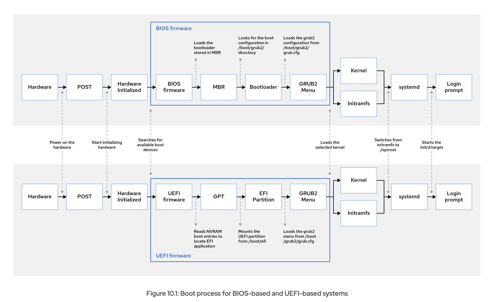

B1: Khi bật máy, BIOS hoặc UEFI chạy Power on self test (POST) để kiểm tra phần cứng

B2: Firmware (phần mềm) tìm thiết bị boot 
- Với BIOS -> tìm các ổ đĩa được chọn làm boot loader theo thứ tự trong cấu hình boot order -> nếu MBR trên ổ đĩa hợp lệ, BIOS sẽ nhảy vào boot loader code để nạp hệ điều hành
- với UEFI -> boot manager của UEFI sẽ đọc boot order từ NVRAM -> trên từng thiết bị, UEFI tìm xem nó có ESP không, sau đó vào thư mục /EFI/BOOT/ hoặc các thư mục cụ thể cho từng hệ điều hành và lấy file boot loader .efi -> nạp file vào RAM để thực thi

B3: Nạp boot loader

GRUB2 là boot loader mặc định của RHEL 9
- BIOS: GRUB2 nằm trong MBR/boot sector
- UEFI: Dùng file /boot/efi/EFI/redhat/grubx64.efi (có chữ ký số để Secure Boot hoạt động).

Lưu ý: ko dùng 'grub2-install' trên UEFI vì nó sẽ tạo mới file grubx64.efi từ mã nguồn hiện có -> file mới này ko có chữ ký số hợp lệ -> Secure boot sẽ chặn và hệ thống ko boot được

Nếu lỡ xóa/ghi đè grubx64.efi, khôi phục file chuẩn bằng dnf hặc yum
```bash
dnf reinstall grub2-efi-x64

yum reinstall grub2-efi-x64
```

B4: GRUB2 lấy cấu hình từ các file cấu hình đã nạp

Grub2 sẽ tự tìm đến file grub.cfg phù hợp với chế độ boot và đọc các entry:
- Với BIOS, file cấu hình chính nằm ở '/boot/grub2/grub.cfg'
- Với UEFI, cấu hình chính nằm ở '/boot/efi/EFI/redhat/grub.cfg'

File grub.cfg không thể cấu hình vì nó được sinh tự động, grub2 lấy thông tin từ 2 nguồn:
- '/etc/grub.d/' - chứa các script tạo từng phần của grub.cfg

```bash
00_header -> thiết lập chung
10_linux -> tạo menu boot cho các kernel linux
```

- '/etc/default/grub/' - chứa các biến cấu hình chính
```bash
GRUB_TIMEOUT=5
GRUB_DEFAULT=0
GRUB_CMDLINE_LINUX="rhgb quiet"
```

Để tạo lại file grub.cfg sau khi cấu hình 2 file trên, chạy lệnh:
```bash
# BIOS
grub2-mkconfig -o /boot/grub2/grub.cfg

# UEFI
grub2-mkconfig -o /boot/efi/EFI/redhat/grub.cfg
```

B5: Sau khi grub2 chọn kernel để boot -> kernel và initramfs được tải vào RAM

Kernel (vmlinuz-*) là nhân linux, điều khiển phần cứng và quản lý tài nguyên hệ thống

Initramfs (initramfs-<kernel-version>.img) là một image RAM ảo (archive .cpio.gz) chứa:
- kernel modules cho các thiết bị cần thiết khi boot
- scripts khởi tạo
- root filesystem tạm thời để kernel khởi chạy trước khi mount root FS thật
- systemd unit ở chế độ initramfs

Quá trình:
- load file kernel và file initramfs vào RAM
- kernel bắt đầu chạy nhưng chưa mount vào FS thật mà mount vào initramfs làm hệ thống tạm
- systemd trong initramfs thực thi các script
- switch root từ initramfs sang root thật

Cấu hình initramfs:

Từ RHEL 9, initramfs được tạo bởi dracut với file cấu hình nằm ở '/etc/dracut.conf.d'

```bash
# lệnh tạo lại initramfs
dracut -f /boot/initramfs-$(uname -r).img $(uname -r)

# ktra nội dung initramfs
lsinitrd /boot/initramfs-$(uname -r).img
```

B6: Giao quyền từ boot loader sang kernel

Sau khi tải kernel và initramfs vào RAM, grub2 sẽ:
- Nhảy sang địa chỉ bắt đầu của kernel trong bộ nhớ
- Truyền các tham số dòng lệnh kernel (kernel command line)

B7: Kernel bắt đầu thực thi script sau khi grub2 giao quyền điều khiển

Kernel được tải vào RAM và bắt đầu chạy:
- Quét phần cứng
- Nạp driver từ initramfs nếu thấy module phù hợp (nếu driver cần thiết để đọc root file system ko có trong initramfs -> ko boot được với lỗi kernel panic)

Kernel chạy tiến trình /sbin/init từ initramfs:
- sau khi phần cứng cơ bản đã sẵn sàng, kernel tìm tiến trình đầu tiên (PID 1)
- /sbin/init trong initramfs không phải là file binary mà là symlink trỏ tới systemd unit trong RHEL 9
- Systemd lúc này chạy trong môi trường root tạm thời trong initramfs

B8: Systemd chạy trong môi trường initramfs thực hiện tất cả các unit trong initrd.target

Initrd.target gồm các unit cần thiết để mount root file system thật trên ổ đĩa vào thư mục tạm thời /sysroot

Cấu hình đường dẫn các root file system được xác định trong file /etc/fstab

B9: Kernel thay đổi (pivots) các root file system từ initramfs sang hệ thống thật

Sau khi các root file system thật đã được mount vào /sysroot ở bước trước, kernel thay đổi root file system sang /sysroot

Lúc này, /sysroot trở thành '/' và initramfs bị unmount (giải phóng RAM)

Systemd trong initramfs lúc này re-exec chính nó bằng bản systemd nằm trên root thật

Toàn bộ unit và service lúc này sẽ chạy dựa trên config thật trong /etc/systemd/system

Nếu pivot thất bại -> hệ thống sẽ lỗi 'emergency shell'

Nguyên nhân thường gặp:
- Ko tìm thấy thiết bị root
- Sai UUID/label trong /etc/fstab
- Initramfs thiếu driver

B10: Systemd tìm các default target và chạy các unit phụ thuộc cũng như dừng các unit xung đột với target

Các default target mặc định:
- Được pass từ biến 'systemd.unit=' khi chạy kernel command line 
- Nếu ko có tham số, systemd mặc định đọc file /etc/systemd/system/default.target (thường là 1 symlink tới 1 target thật)

Mỗi target là 1 tập hợp các unit (service, mount, socket...) cần khởi động để đạt trạng thái mong muốn

Ví dụ: graphical.target → khởi động môi trường đồ họa + login GUI

Mỗi target sẽ định nghĩa Requires= và Wants= để kéo theo các unit khác

### 10.2. Power off và Reboot

**Power off**

Sử dụng lệnh
```bash
systemctl poweroff

# hoặc
poweroff
```

Hoạt động của poweroff:
- Dừng tất cả các service đang chạy
- Unmount tất cả các file system (hoặc remount thành read-only nếu không thể unmount hoàn toàn)
- Gửi tín hiệu tắt nguồn máy

**Reboot**

Sử dụng lệnh
```bash
systemctl reboot

# hoặc
reboot
```

Tương tự poweroff nhưng thay vì gửi tín hiệu tắt nguồn -> gửi tín hiệu reboot

**Halt**

Lệnh:
```bash
systemctl halt

# hoặc
halt
```

Không tắt nhuồn mà chỉ dừng hệ thống ở trạng thái an toàn để có thể tắt nguồn thủ công/ bảo trì

### 10.3. Chọn các systemd target

Systemd target là một set gồm các systemd unit mà hệ thống cần khởi chạy để đạt được trạng thái mong muốn

Một số target được sd thường xuyên:
| Target              | Mục đích                                                                     |
| ------------------- | ---------------------------------------------------------------------------- |
| `graphical.target`  | Nhiều người dùng, hỗ trợ login đồ họa và text.                               |
| `multi-user.target` | Nhiều người dùng, chỉ login dạng text (runlevel 3 cũ).                       |
| `rescue.target`     | Chế độ một người dùng để sửa lỗi hệ thống (runlevel 1).                      |
| `emergency.target`  | Hệ thống tối thiểu nhất, dùng khi `rescue.target` cũng không khởi động được. |

Một target có thể là 1 phần của target khác, sử dụng lệnh sau để xem sự phụ thuộc

```bash
[user@host ~]$ systemctl list-dependencies graphical.target | grep target
graphical.target
* └─multi-user.target
*   ├─basic.target
*   │ ├─paths.target
*   │ ├─slices.target
*   │ ├─sockets.target
*   │ ├─sysinit.target
*   │ │ ├─cryptsetup.target
*   | | ├─integritysetup.target
*   │ │ ├─local-fs.target
...output omitted...
```

Liệt kê các target đang sẵn có:
```bash
[user@host ~]$ systemctl list-units --type=target --all
  UNIT                      LOAD      ACTIVE   SUB    DESCRIPTION
  ---------------------------------------------------------------------------
  basic.target              loaded    active   active Basic System
...output omitted...
  cloud-config.target       loaded    active   active Cloud-config availability
  cloud-init.target         loaded    active   active Cloud-init target
  cryptsetup-pre.target     loaded    inactive dead   Local Encrypted Volumes (Pre)
  cryptsetup.target         loaded    active   active Local Encrypted Volumes
...output omitted...
```
**Thay đổi target khi hệ thống đang chạy**

Sử dụng lệnh 'systemctl isolate'
```bash
systemctl isolate multi-user.target
```

Khi isolate 1 target:
- Start các service mà target mới cần mà hệ thống chưa chạy
- Stop các service mà target mới không cần

Chỉ các target có 'AllowIsoldate=yes' trong unit file mới có thể isolate
```bash
[user@host ~]$ systemctl cat graphical.target
# /usr/lib/systemd/system/graphical.target
...output omitted...
[Unit]
Description=Graphical Interface
Documentation=man:systemd.special(7)
Requires=multi-user.target
Wants=display-manager.service
Conflicts=rescue.service rescue.target
After=multi-user.target rescue.service rescue.target display-manager.service
AllowIsolate=yes
```

**Thay đổi target mặc định khi boot**

Mỗi lần boot chỉ có duy nhất 1 default target được dùng làm điểm khởi đầu khi hệ thống lên

Thường thì target mặc định ở file /etc/systemd/system/default.target chỉ là 1 symlink trỏ tới 1 unit target thật

Hệ thống boot -> Systemd đọc symlink -> load file .target -> load các dependency

```bash
# xem default target hiện tại
[root@host ~]# systemctl get-default
multi-user.target

# set 1 default target mới
[root@host ~]# systemctl set-default graphical.target
Removed /etc/systemd/system/default.target.
Created symlink /etc/systemd/system/default.target -> /usr/lib/systemd/system/graphical.target.
```

**Thay đổi target lúc boot (áp dụng cho 1 lần boot)**

Thêm option 'systemd.unit=target.target' vào kernel command line từ menu của boot loader grub2

Thực hiện các bước;
- Chạy lệnh boot/reboot
- Ngắt countdown của boot loader grub2 bằng phím bất kỳ (trừ Enter, Enter sẽ thực hiện boot bình thường)
- Chọn kernel cần boot, bấm e để edit
- Tìm dòng bắt đầu bằng linux, thêm nội dung vào cuối dòng
```bash
systemd.unit=emergency.target
```
- Bấm Crtl + X để áp dụng thay đổi và boot 

### 10.4. Reset mật khẩu root

**Reset từ boot loader (nếu install hệ thống từ DVD)**

Task này khá đơn giản nếu admin vẫn đang login vào 1 user có quyền sudo hoặc user root nhưng sẽ phức tạp hơn khi admin không login

Trên RHEL, một số script chạy trong initramfs có thể tạm dừng ở 1 số chỗ. Các scripts này thường dành cho debug và cũng có thể reset mật khẩu root

Các bước thực hiện:
- Khởi động lại hệ thống -> ngắt countdown của boot loader bằng cách phím bất kỳ (trừ Enter)
- Chọn kernel boot là rescue kernel
- Nhấn e để edit
- Tìm dòng bắt đầu với 'linux' và thêm rd.break vào cuối dòng
- Ctrl + X để boot với thay đổi

Lúc này hệ thống sẽ dừng ngay trước khi chuyển từ initramfs sang root file system thật

-> Hệ thống sẽ cho ta 1 shell root và root file system thật được mount read-only tại /sysroot

Tiếp tục các bước:
- Remount /sysroot sang read-write
```bash
mount -o remount,rw /sysroot
```

- Vào chroot jail để /sysroot được thành '/'
```bash
chroot /sysroot
```

- Đặt mk root mới
```bash
passwd root
```

- Đảm bảo hệ thống sẽ relabel tất cả các file chưa được label, bao gồm cả /etc/shadow khi hệ thống boot
```bash
touch /.autorelabel
```

- Gõ exit 2 lần (1 lần thoát khỏi chroot jail và 1 lần thoát khởi debug shell của initramfs)

**Reset trên hệ thống cài từ cloud image**

Nếu cài hệ thống từ cloud image thay vì qua installer, các bước reset gần tương tự với installer nhưng sẽ có 1 vài điểm khác:
- Không có rescue kernel: vì cloud image ko tạo entry 'rescue' trong grub2 nên thêm luôn 'rd.break' vào kernel mặc định
- Khác với RHEL cài từ DVD, cloud image cho phép 'rd.break' bypass trực tiếp mà ko hỏi root password để vào maintenance mode
- Console hiển thị có thể khác, shell của 'rd.break' chỉ hiện ở console cuối cùng trong danh sách nên có thể cần đổi thứ tự 'console=' tamh thời khi edit grub

Quy trình sau khi đã thay đổi:
- Reboot -> vào menu grub
- Chọn kernel mặc định -> bấm e để edit
- Thêm 'rd.break' vào dòng linux
- Chỉnh lại thứ tự 'console=' để đảm bảo thấy shell
- Crtl + X để boot
- Làm các bước remount, chroot, passwd, touch /.autorelabel, rồi thoát tương tự như với rescue kernel

### 10.5. Xem log của những lần boot trước

Nếu các journal của hệ thống tồn tại sau các lần reboot, có thể sd 'journalctl' để kiểm tra các journal log đó

Mặc định, các journal lưu tại thư mục '/run/log/journal' và sẽ bị xóa khi reboot

Để lưu log giữa các lần reboot:
- Sửa file '/etc/systemd/journald.conf'
```bash
[Journal]
Storage=persistent
```

- Tạo thư mục '/var/log/journal' nếu chưa có
- Restart dịch vụ
```bash
systemctl restart systemd-journald.service
```

Lúc này có thể xem log của các lần boot
```bash
journalctl -b -1 # lần boot trước

journalctl -b -1 -p err # lần boot trước , chỉ lấy lỗi

journalctl --list-boots # ds các lần boot

journalctl -b <ID> # log theo ID
```

### 10.6. Chẩn đoán và sửa lỗi khi systemd gặp sự cố trong quá trình boot

**Bật Early debug shell**

```bash
systemctl enable debug-shell.service

systemctl disable debug-shell.service
```

Lệnh này sẽ sinh ra 1 root shell ở tty9 (Ctrl+Alt+F9) ngay từ đầu quá trình boot

Ưu điểm:
- Dùng để debug khi OS chưa boot xong
- Ko cần mật khẩu

Nhược điểm: rất nguy hiểm vì ai có quyền truy cập console đều có root

Có thể bật tạm thời qua grub:
- Vào menu grub -> bấm e
- Tìm dòng kernel -> thêm 'systemd.debug-shell' vào cuối dòng
- Ctrl+X để boot

**Sử dụng Emerrgency target và Rescue target**

Tương tự các mục trước:
- Vào menu grub -> bấm e 
- Tìm dòng kernel và thêm nội dung
```bash
systemd.unit=rescue.target

# hoặc
systemd.unit=emergency.target
```
- Ctrl+X

Với emergency.target, muốn sửa file cấu hình cần remount
```bash
mount -o remount,rw /
```

So sánh:

| Mục              | emergency.target                     | rescue.target                         |
| ---------------- | ------------------------------------ | ------------------------------------- |
| File system root | read-only                            | read-write (sau sysinit.target)       |
| Mức init         | Rất tối thiểu                        | Nhiều dịch vụ hơn (logging, mount FS) |
| Dùng để          | Sửa lỗi /etc/fstab, sự cố mount nặng | Sửa cấu hình dịch vụ, kiểm tra log    |

**Xác định job bị stuck khi boot**

Bật Early debug shell như mục trước hoặc boot vào 2 target trên, sau đó dùng lệnh:
```bash
systemctl list-jobs
```

### 10.7. Sửa các lỗi liên quan đến file system khi boot

Trong quá trình boot, systemd mount các file system cố định được định nghĩa trong /etc/fstab

Lỗi trong /etc/fstab hoặc file system bị lỗi sẽ ngăn hệ thống hoàn thành quá trình boot và trong 1 số TH, sẽ thoát khỏi quá trình boot và mở 1 root shell yêu cầu mk root

**Các lỗi có thể xảy ra**

File system bị honhr (corrupted):
- systemd gọi fsck để sửa
- nếu lỗi nặng ko tự sửa được -> mở emergency shell

Thiết bị hoặc UUID ko tồn tại:
- /etc/fstab tham chiếu tới ổ đĩa hoặc phân vùng đã bị tháo hoặc UUID sai
- systemd sẽ đợi thiết bị xuất hiện. Nếu quá timeout → emergency shell

**Các bước sửa lỗi khi gặp lỗi file system khi boot**

Thực hiện mở các shell bằng Early debug shell hoặc emergency target, rescue target

Kiểm tra thiết bị và phân vùng:
```bash
lsblk
blkid

# Đảm bảo UUID hoặc device name trong /etc/fstab còn tồn tại.
```

Sửa file /etc/fstab
```bash
mount -o remount,rw /
vi /etc/fstab

# Sửa hoặc comment (#) các dòng mount bị lỗi.
# Lưu ý: dùng UUID hoặc LABEL chuẩn xác (blkid để tra).
```

Kiểm tra/sửa file system
```bash
fsck -y /dev/sda1

# -y để tự động chấp nhận sửa lỗi.
```

Sau khi đã confirm ko còn lỗi, reboot hệ thống

Trong file /etc/fstab, các line có option 'nofail' để cho phép hệ thống boot kể cả khi file system mount ko thành công

Ko nên dùng 'nofail' cho production vì hệ thống sẽ thiếu tệp -> hậu quả nghiêm trọng

## Chapter 11: Quản lý bảo mật cho mạng

### 11.1. Quản lý firewall của server

Linux kernel cung cấp 'netfilter' framework để quản lý các hoạt động của network traffic như lọc gói tin, chuyển đổi địa chỉ mạng, chuyển đổi port

Netfilter framework bao gồm các hook cho kernel module để tương tác với các gói tin mạng khi chúng đi qua ngăn xếp mạng của hệ thống.

Các hook của netfilter là các chương trình con của kernel giúp chặn các sự kiện (vd: gói tin đi vào interface) và chạy các chương trình (vd: firewall rule)

**nftables framework**

nftables là framework giúp phân loại và lọc gói tin bằng cách áp dụng các firewall rule cho network traffic dựa trên nền tảng là netfilter 

nftables là thành phần cốt lõi của firewall, thay thế cho iptable đã lỗi thời

nftables áp dụng được cho cả ipv4 và ipv6 cùng lúc

**firewall service**

firewall service là dịch vụ quản lý tường lửa động, có thể thay đổi và áp dụng rule mới mà ko cần khởi động lại dịch vụ hay reboot

Cách hoạt động:
- Phân loại mạng thành các 'zone' (vùng), mỗi zone có bộ quy tắc riêng cho phép hoặc chặn các port/ dịch vụ cụ thể
- Một gói tin khi đến máy sẽ được gán vào zone dựa trên địa chỉ nguồn (source IP) hoặc giao diện mạng mà gói tin đi vào (interface)
- Nếu giao diện mạng hoặc địa chỉ nguồn ko được gán zone riêng thì sẽ áp dụng zone mặc định
- Zone mặc định là zone 'public', giao diện lo (loopback) được gán vào zone 'trusted'

Các zone và chính sách:
- Mỗi zone cho phép các traffic đi qua firewall nếu trùng với danh sách các cổng và giao thức cụ thể đã được định nghĩa (vd mở cổng 22 cho ssh)
- Ngoài các cổng đã được mở thì mọi traffic sẽ bị chặn
- Riêng zone 'trusted' cho phép mọi lưu lượng đi qua

Tính năng kết hợp với Network Manager:
- Với laptop hay các thiết bị thường xuyên thay đổi mạng, Network Manager có thể tự động gán zone firewall phù hợp theo mạng bạn kết nối (vd: mạng cty, mạng nhà, mạng công cộng...)
- Điều này giúp ích cho 1 số dịch vụ như ssh, chỉ mở ở mạng đáng tin cậy, mạng công cộng sẽ bị chặn

**Các zone có sẵn**

| Zone name    | Mô tả chính sách mặc định                                                                                                                                    |
| ------------ | ------------------------------------------------------------------------------------------------------------------------------------------------------------ |
| **trusted**  | Cho phép tất cả các kết nối đến (incoming traffic)                                                                                                           |
| **home**     | Từ chối các kết nối đến, ngoại trừ: các kết nối liên quan đến traffic đi ra hoặc các dịch vụ định sẵn như ssh, mdns, ipp-client, samba-client, dhcpv6-client |
| **internal** | Giống `home`: từ chối kết nối đến trừ các dịch vụ định sẵn (ssh, mdns, ipp-client, samba-client, dhcpv6-client)                                              |
| **work**     | Từ chối kết nối đến trừ các dịch vụ ssh, ipp-client, dhcpv6-client                                                                                           |
| **public**   | Từ chối kết nối đến trừ các dịch vụ ssh, dhcpv6-client; Đây là zone mặc định cho giao diện mạng mới                                                          |
| **external** | Từ chối kết nối đến trừ dịch vụ ssh; đồng thời masquerade (NAT) cho IPv4 outgoing traffic được chuyển tiếp qua zone này                                      |
| **dmz**      | Từ chối kết nối đến trừ dịch vụ ssh (dùng cho mạng vùng ngoài - demilitarized zone)                                                                          |
| **block**    | Từ chối tất cả kết nối đến, trừ các kết nối liên quan đến traffic đi ra                                                                                      |
| **drop**     | Bỏ (drop) tất cả các kết nối đến, kể cả không phản hồi ICMP (im lặng tuyệt đối)                                                                              |

Lưu ý:
- Mặc định, tất cả zone cho phép traffic đi ra và cho phép traffic đi vào nếu thuộc về phiên làm việc (session) mà hệ thống đã khởi tạo trước đó
- Có thể tùy chỉnh thêm/xóa các cổng và dịch vụ của zone theo nhu cầu

**Các dịch vụ có sẵn**

| Service name      | Mô tả                                | Port/Protocol                               |
| ----------------- | ------------------------------------ | ------------------------------------------- |
| **ssh**           | Kết nối SSH đến máy cục bộ           | 22/tcp                                      |
| **dhcpv6-client** | DHCPv6 client                        | 546/udp (IPv6 link-local fe80::/64)         |
| **ipp-client**    | In ấn qua IPP                        | 631/udp                                     |
| **samba-client**  | Chia sẻ file/print qua SMB (Windows) | 137/udp, 138/udp                            |
| **mdns**          | Multicast DNS (name resolution)      | 5353/udp (224.0.0.251 IPv4 / ff02::fb IPv6) |
| **cockpit**       | Web console quản trị RHEL            | 9090/tcp                                    |

Thay vì phải nhớ dịch vụ này cần mở port nào, chỉ cần nhớ tên và add các service đã định nghĩa sẵn -> các cấu hình còn lại sẽ tự động cấu hình bằng firewalld, giúp giảm lỗi và tiết kiệm thời gian

Xem ds các dịch vụ có sẵn:
```bash
firewall-cmd --get-services
```

Nếu ko có dịch vụ có sẵn, có thể mở port thủ công hoặc tạo dịch vụ mới trong /etc/firewalld/services/ bằng XML

```bash
# mở port thủ công
firewall-cmd --add-port=8080/tcp --permanent
```

### 11.2. Cấu hình firewall

**Qua web console**

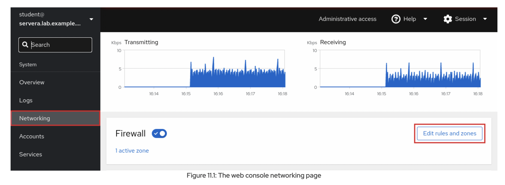

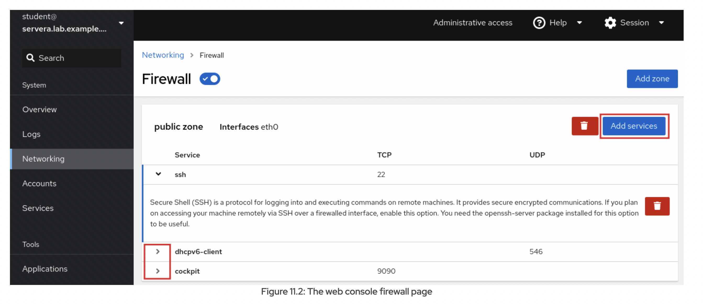

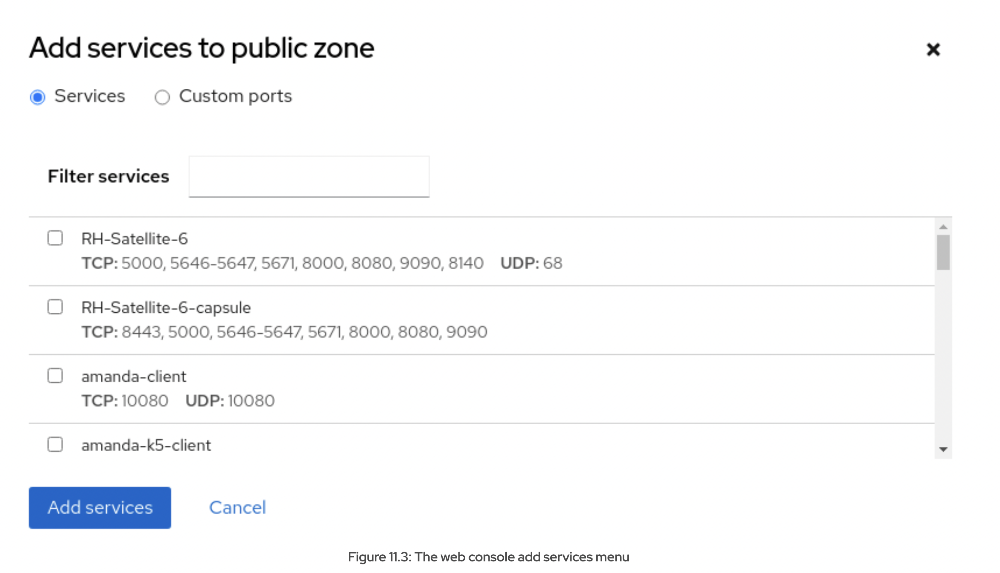

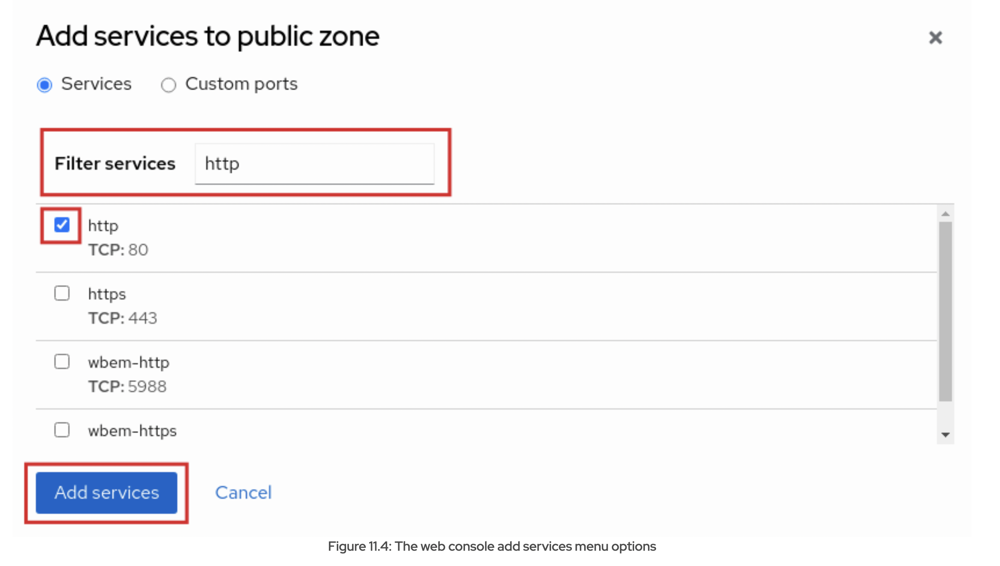

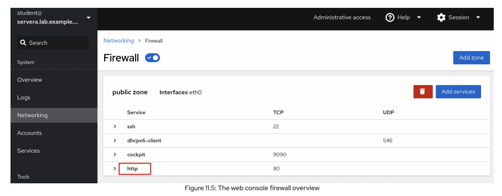

**Qua firewall-cmd**

firewall-cmd là công cụ CLI tương tác với firewalld daemon

Các lệnh sẽ áp dụng cho runtime configuration (tạm thời, mất khi reboot hoặc reload)

Nếu muốn lưu các thay đổi vĩnh viễn, cần có '--permanent' và reload lại firewalld

Sử dụng option '--zone=' để chỉ định zone, nếu không các thay đổi sẽ áp dụng cho default zone

Nếu câu lệnh yêu cầu netmask, sử dụng CIDR (vd: 192.168.1/24)

Một số lệnh thông dụng:

| Lệnh                           | Mô tả                                                     |
| ------------------------------ | --------------------------------------------------------- |
| `--get-default-zone`           | Xem zone mặc định hiện tại                                |
| `--set-default-zone=ZONE`      | Đặt zone mặc định (runtime + permanent)                   |
| `--get-zones`                  | Liệt kê tất cả zone khả dụng                              |
| `--get-active-zones`           | Xem zone nào đang hoạt động kèm interface/source          |
| `--add-source=CIDR`            | Gán tất cả traffic từ IP/mạng vào zone                    |
| `--remove-source=CIDR`         | Gỡ gán traffic từ IP/mạng ra khỏi zone                    |
| `--add-interface=INTERFACE`    | Gán traffic từ interface vào zone                         |
| `--change-interface=INTERFACE` | Chuyển interface sang zone khác                           |
| `--list-all`                   | Liệt kê interfaces, sources, services, ports trong 1 zone |
| `--list-all-zones`             | Xem toàn bộ thông tin của tất cả zones                    |
| `--add-service=SERVICE`        | Mở dịch vụ (vd: ssh, http)                                |
| `--add-port=PORT/PROTOCOL`     | Mở port cụ thể (vd: 8080/tcp)                             |
| `--remove-service=SERVICE`     | Chặn dịch vụ                                              |
| `--remove-port=PORT/PROTOCOL`  | Chặn port                                                 |
| `--reload`                     | Áp dụng lại cấu hình permanent                            |

Ví dụ:

```bash
# gán default zone là dmz
firewall-cmd --set-default-zone=dmz

# gán mạng LAN hiện tại là zone internal
firewall-cmd --permanent --zone=internal \
--add-source=192.168.0.0/24

# mở port cho dịch vụ MySQL 
firewall-cmd --permanent --zone=internal --add-service=mysql

firewall-cmd --reload
```

### 11.3. Quản lý dán nhãn cho port của SELinux

Ngoài việc gán context label cho file system và tiến trình, SELinux cũng gán label cho các port.

SELinux kiểm soát quyền truy cập mạng bằng cách dán nhãn các port để kiểm soát dịch vụ nào được bind vào port đó

Ví dụ: port 22/tcp của SSH đươc gán context 'ssh_port_t'

Khi tiến trình được quản lý bới SELinux muốn listen trên 1 port, SELinux kieemrtra policy:
- Nếu process type được phép bind vào port -> cho phép
- Nếu không -> bị chặn

**Quản lý dán nhãn của SELinux**

Nếu chạy dịch vụ trên port không tiêu chuẩn và port không được dán nhãn với SELinux type phù hợp, SELinux có thể từ chối bind

Giải pháp: Thêm hoặc đổi nhãn SELinux cho port phù hợp với dịch vụ.

```bash
# Kiểm tra các port của service
grep gopher /etc/services

gopher          70/tcp
gopher          70/udp

# liệt kê toàn bộ port label SELinux, lọc theo service name
semanage port -l | grep ftp

ftp_data_port_t                tcp      20
ftp_port_t                     tcp      21, 989, 990
ftp_port_t                     udp      989, 990
tftp_port_t                    udp      69

# liệt kê toàn bộ port label SELinux, lọc theo port number
semanage port -l | grep -w 70

gopher_port_t                  tcp      70
gopher_port_t                  udp      70
```

Lưu ý:
- một port chỉ có thể có 1 context duy nhất
- việc chỉnh sửa port label phải dùng semanage port -a (add)/-m (modify)/-d (delete)

**Quản lý port binding**

Các dịch vụ mặc định trên RHEL đã có sẵn port context trong policy module của SELinux.

Không thể thay đổi port mặc định bằng semanage port -m nếu đó là port mặc định được định nghĩa trong policy module.

Muốn thay đổi port mặc định, phải sửa và reload policy module (ngoài phạm vi)

Bạn chỉ có thể:
- Gán nhãn SELinux cho port mới (thêm mới)
- Xóa nhãn
- Sửa nhãn của port mà bạn đã gán trước đó

```bash
# thêm port label
semanage port -a -t <port_label> -p <tcp|udp> <PORT>

# xóa port label
semanage port -d -t <port_label> -p <tcp|udp> <PORT>

# sửa port label
semanage port -m -t <new_port_label> -p <tcp|udp> <PORT>
```

## Chapter 12: Cài đặt RHEL 

### 12.1. Trouble shooot trong quá trình cài đặt

Hai loại virtual console trong quá trình install:
- Ctrl+Alt+F6: mặc định hiển thị giao diện đồ họa Anaconda
- Ctrl+Alt+F1: mở tmux terminal multiplexer

Sử dụng tmux: 
- Bấm và thả Ctrl+B, sau đó bấm số 1–5 để chuyển cửa sổ
-  Alt+Tab → Chuyển lần lượt qua các cửa sổ hiện tại

| Phím tắt     | Nội dung                                                           |
| ------------ | ------------------------------------------------------------------ |
| **Ctrl+B 1** | Trang thông tin chính của quá trình cài đặt.                       |
| **Ctrl+B 2** | Mở root shell (dùng gõ lệnh kiểm tra). File log được lưu ở `/tmp`. |
| **Ctrl+B 3** | Xem `/tmp/anaconda.log` (log tổng thể của trình cài).              |
| **Ctrl+B 4** | Xem `/tmp/storage.log` (log về lưu trữ, partition, disk).          |
| **Ctrl+B 5** | Xem `/tmp/program.log` (log về các chương trình Anaconda gọi).     |

Nếu quá trình cài bị treo hoặc lỗi, chuyển sang Ctrl+Alt+F1 → Ctrl+B 2 để mở shell và kiểm tra log (cat /tmp/anaconda.log, less /tmp/storage.log, …)

### 12.2. Tự động cài đặt với Kickstart

Kickstart là file cấu hình dạng text để Anaconda cài đặt hệ thống hoàn toàn tự động (không cần thao tác tay)

Cấu trúc:
- Các lệnh cài đặt (nguồn, phân vùng, network, bảo mật…).
- %packages: chọn gói cài đặt (gói đơn, nhóm gói @, environment @^, module @module:stream/profile).
- %pre: script chạy trước khi phân vùng đĩa.
- %post: script chạy sau khi cài đặt xong.

Có thể có nhiều section %post hoặc %pre

**Câu lệnh cài đặt**

```bash
# chỉ định url chứa bộ cài RHEL
# là đường dẫn đến thư mục ISO được mount hoặc repo cài đặt
url --url="http://server/path/rhel9.0/x86_64/dvd/"

# repo: chỉ định kkho dnf bổ sung để lấy thêm package cho quá trình install
repo --name="appstream" --baseurl=http://server/path/AppStream/

# Buộc quá trình install chạy ở chế độ dòng lệnh (text mode) thay vì đồ họa (GUI)
text

# enable VNC, cho phép cài đặt qua giao diện đồ họa từ xa bằng VNC viewer
vnc --password=redhat
```

**Câu lệnh cài thiết bị lưu trữ và phân vùng**

## Chapter 13: Chạy container

### 13.1. Container

Container là một tiến trình (process) được đóng gói kèm tất cả các thư viện và thành phần cần thiết để chạy ứng dụng

Các thư viện cụ thể của ứng dụng nằm bên trong container, còn những thư viện chung không liên quan trực tiếp thì container sử dụng từ hệ điều hành host

Nhờ đó container nhẹ hơn so với máy ảo (VM) và chạy nhanh hơn, khởi động và dừng gần như tức thì

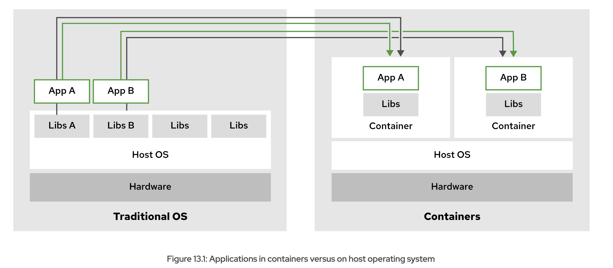

**Cách container hoạt động**

Container engine (như Docker, Podman) tạo Union File System bằng cách:
- Gộp (merge) các lớp (layers) của container image
- Các lớp này immutable (không thay đổi được)
- Khi chạy, engine thêm một lớp ghi (writable layer) để lưu thay đổi tạm thời
- Ephemeral (tạm thời): khi container bị xóa, lớp ghi này biến mất

Containers tận dụng tính năng kernel Linux:
- Namespaces → cô lập môi trường (process, network, filesystem).
- Control Groups (cgroups) → giới hạn CPU, RAM, IO cho container.
- SELinux → kiểm soát quyền truy cập, tăng bảo mật.
- seccomp → giới hạn các syscall mà container được phép gọi.

**Container image và container instance**

Container image
- Dữ liệu gần như bất biến (immutable), chứa toàn bộ app và thư viện cần thiết
- Giống như file cài đặt hoặc bản thiết kế
- Tuân theo chuẩn OCI image-spec

Container instance
- Bản đang chạy của container image
- Có thêm thông tin runtime như network, storage, volume mount…
- Tuân theo chuẩn OCI runtime-spec

**Container và VM**

Mặc dù mục tiêu khá giống (cô lập ứng dụng trong môi trường riêng), nhưng cách thực hiện khác nhau:

| **Tiêu chí**            | **Virtual Machine (VM)**                                       | **Container**                               |
| ----------------------- | -------------------------------------------------------------- | ------------------------------------------- |
| **Phần mềm điều khiển** | Hypervisor (KVM, Xen, VMware, Hyper-V)                         | Container Engine (Podman, Docker)           |
| **Mức ảo hóa**          | Toàn bộ máy (kernel + OS + app)                                | Chỉ môi trường cần thiết cho app            |
| **Kích thước**          | GB                                                             | MB                                          |
| **Tốc độ khởi động**    | Chậm (phút)                                                    | Nhanh (giây)                                |
| **Tính di động**        | Thường chỉ chạy được trên cùng loại hypervisor                 | Chạy trên bất kỳ engine OCI-compliant       |
| **Kernel**              | Có thể khác kernel host                                        | Dùng chung kernel host                      |
| **Khi nào nên dùng**    | Khi cần OS khác hoặc kernel khác, hoặc yêu cầu phần cứng riêng | Khi muốn triển khai nhanh, nhẹ, dễ nhân bản |

Quản lý:
- VM: Quản lý bằng phần mềm quản trị hypervisor (VD: Virtual Machine Manager, vCenter).
- Container: Quản lý trực tiếp bằng container engine hoặc công cụ orchestration (Kubernetes, OpenShift).
- OpenShift đặc biệt vì quản lý được cả container và VM từ một giao diện chung.

### 13.2. Tạo container với Podman

Là công cụ mã nguồn mở để tạo, chạy, quản lý container và image.

Tuân thủ chuẩn OCI (Open Container Initiative), nên có thể chạy hầu hết image từ Docker Hub hoặc các registry khác.

Hỗ trợ chạy container, tạo pod, và build image

Podman là một công cụ quản lý container tương tự Docker, nhưng có vài điểm khác biệt:

| Tiêu chí                    | Docker                                                   | Podman                                                                                     |
| --------------------------- | -------------------------------------------------------- | ------------------------------------------------------------------------------------------ |
| **Daemon**                  | Cần Docker daemon (`dockerd`) chạy nền.                  | **Daemonless** – không có tiến trình trung gian, Podman tương tác trực tiếp với container. |
| **Quyền root**              | Thường chạy với quyền root (trừ khi dùng rootless mode). | Hỗ trợ **rootless mode** mặc định – chạy container với quyền user thường, bảo mật hơn.     |
| **Tương thích lệnh**        | Dùng `docker` CLI.                                       | Lệnh **tương tự Docker** – nhiều trường hợp chỉ cần `alias docker=podman` là chạy được.    |
| **Pod concept**             | Không có khái niệm pod.                                  | Có khái niệm **pod** như Kubernetes – nhóm nhiều container chia sẻ network và storage.     |
| **Single point of failure** | Docker daemon chết → toàn bộ container bị ảnh hưởng.     | Không có daemon → container vẫn chạy nếu Podman CLI thoát.                                 |

Các cách tương tác với Podman
- CLI (Command Line Interface) – giống Docker CLI.
- RESTful API – cho phép điều khiển Podman qua HTTP.
- Podman Desktop – giao diện đồ họa, dễ quản lý container cho người mới.

**Làm việc với Podman**

```bash
# ktra version
podman -v

# pull image
podman pull registry.redhat.io/rhel9/rhel-guest-image:9.4

# list image
podman images

# chạy container
podman run registry.redhat.io/rhel9/rhel-guest-image:9.4 echo 'Red Hat'

# xem container đang chạy
podman ps

# xem các thông tin container
podman ps --all --format=json
```

Mặc định, dịch vụ bên trong container chỉ chạy trong môi trường container → bên ngoài không truy cập được.

Để truy cập từ bên ngoài, cần map port của host sang port trong container

```bash
podman run -p HOST_PORT:CONTAINER_PORT IMAGE

# vd
podman run -p 8080:8080 registry.access.redhat.com/ubi9/httpd-24:latest
```

Environment variable trong container là giá trị cấu hình bên ngoài, ứng dụng có thể đọc được khi chạy.

Dùng để truyền thông tin như hostname DB, API key, cấu hình môi trường…

```bash
podman run -e NAME='Red Hat' registry.redhat.io/rhel9/rhel-guest-image:9.4 printenv NAME
```

### 13.3. Container image registry

Container Registry là kho lưu trữ cho các container image, tương tự như:
- Docker Hub
- Quay.io
- Amazon ECR
- Red Hat Registry

Bạn có thể push image (tải lên) hoặc pull image (tải xuống) từ registry.

Red Hat registry có 2 loại:
- registry.access.redhat.com - ai cũng tải được
- registry.redhat.io - yêu cầu tài khoản Red Hat

**Cấu trúc tên image**

```bash
registry.access.redhat.com/ubi9/nodejs-18:latest
```

- Registry URL: registry.access.redhat.com
- User/Organization: ubi9
- Image repository: nodejs-18
- Tag: latest

Nếu sd tên rút gọn, podman sẽ tra cứu danh sách registry trong file '/etc/containers/registries.conf' theo thứ tự

Có thể block 1 registry
```bash
[[registry]]
location="docker.io"
blocked=true
```

**Quản lý registry với Skopeo**

Skopeo cho phép inspect (xem metadata) mà ko cần tải image
```bash
skopeo inspect docker://registry.access.redhat.com/ubi9/nodejs-18
```

Copy giữa các registry
```bash
skopeo copy \
  docker://registry.access.redhat.com/ubi9/nodejs-18 \
  docker://quay.io/myuser/nodejs-18
```

Copy image vào các thư mục local
```bash
skopeo copy \
  docker://registry.access.redhat.com/ubi9/nodejs-18 \
  dir:/var/lib/images/nodejs-18
```

**Quản lý registry credential với Podman**

Một số registry như 'redhat.io' cần đăng nhập, bạn có thể chọn image khác từ các repo free hoặc đăng nhập
```bash
[user@host ~]$ podman login registry.redhat.io
Username: YOUR_USER
Password: YOUR_PASSWORD
Login Succeeded!
```

Thông tin được lưu ở file
```bash
${XDG_RUNTIME_DIR}/containers/auth.json
```

User, pass được mã hóa bằng base64

Cả hai công cụ Podman và Skopeo đều lấy thông tin đăng nhập từ file auth.json

Nếu đã login bằng Podman → Skopeo cũng dùng được

### 13.4. Quản lý vòng đời của container

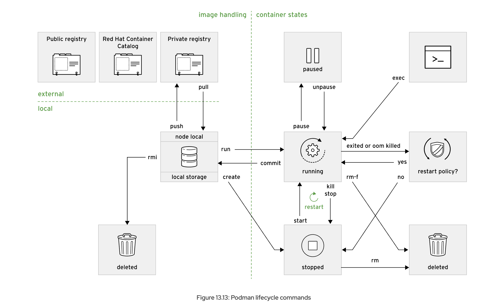

```bash
# list
podman ps --all

# inspec
podman inspect <id/name>

# stop container graceful
podman stop <id/name>

# stop container bắt buộc
podman kill <id/name>

# pause
podman pause <id/name>
podman unpause <id/name>

# restart
podman restart <id/name>

# remove
podman rm <id/name>
```

**Container Persistent Storage**

Container mặc định dùng storage ephemeral → dữ liệu mất khi container bị xoá

Để lưu trữ lâu dài → dùng host directory mount với -v host_path:container_path

Nhưng khi mount, phải đảm bảo quyền sở hữu (UID/GID) và SELinux context khớp giữa host và container

Sd lệnh 'unshare cat' để xem UID/GID mapping giữa user trong container và user của máy host
```bash
[user@host ~]$ podman unshare cat /proc/self/uid_map
         0       1000          1
         1     100000      65536

# 3 cột
<UID trong namespace>   <UID thực trên host>   <Số lượng UID liên tiếp>
```

Ở ví dụ này, lệnh trả về kqua:
- UID 0 bên trong container (root) ánh xạ đến UID 1000 ở máy host và 1 nghĩa là ánh xạ 1 UID duy nhất
- UUID  bên trong container ánh xạ tới UID 100000 trên host và ánh xạ đến 1 block 65536 UID liên tiếp

-> đảm bảo các user ko phải root trong container sẽ được map sang dải UUID ảo

hi dùng Podman hoặc Docker, bạn có thể chỉ định user
```bash
podman run --user 1001:1001 myimage
docker run --user 1001:1001 myimage

# Khi đó, container sẽ chạy với UID=1001, GID=1001 bên trong.
```

**SELinux context**

Mặc định, SELinux sẽ chặn container truy cập thư mục trên host nếu thư mục đó không có context phù hợp.

Với container, SELinux yêu cầu thư mục hoặc file mount phải có type là container_file_t.

Nếu không, container sẽ bị lỗi kiểu "Permission denied" ngay cả khi quyền file system (chmod/chown) là đúng.

Khi chạy podman run, thêm hậu tố :Z vào sau tùy chọn -v:
- :Z này làm relabel thư mục /home/user/db_data để SELinux gán type container_file_t
- Điều này cho phép container truy cập thư mục như persistent storage

```bash
[user@host ~]$ podman run -d --name db01 \
-e MYSQL_USER=student \
-e MYSQL_PASSWORD=student \
-e MYSQL_DATABASE=dev_data \
-e MYSQL_ROOT_PASSWORD=redhat \
-v /home/user/db_data:/var/lib/mysql:Z \
registry.lab.example.com/rhel8/mariadb-105
```

Kiểm tra context file
```bash
[user@host ~]$ ls -Z /home/user/
system_u:object_r:container_file_t:s0:c81,c1009 db_data
...output omitted...
```

**Chạy container khi boot**

Tạo file systemd service cho container

```bash
podman generate systemd --name <container-name> --files

# lệnh này sẽ tạo
/home/user/<container-name>.service
```

Chuyển file vào thư mục systemd

```bash
mkdir -p ~/.config/systemd/user
mv container-web.service ~/.config/systemd/user/
```

Reload và khởi động service

```bash
systemctl --user daemon-reload

# Khởi động container
systemctl --user start container-web.service  

# Dừng container
systemctl --user stop container-web.service  

# Kiểm tra trạng thái
systemctl --user status container-web.service  

# Cho phép tự khởi động khi login
systemctl --user enable container-web.service  

# Ngừng tự khởi động khi login
systemctl --user disable container-web.service  
```

Hoặc copy vào folder systemd của hệ thống để khởi động ngay khi hệ thống boot và quản lý bằng systemctl