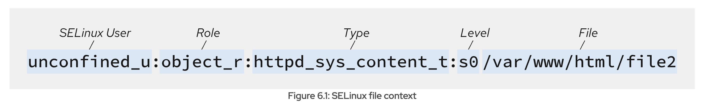

# SELinux

## 1. Something

Gồm 3 mode:
- enforcing
- permissive
- disable

Selinux gán context (label) cho:
- Tiến trình
- File/ folder
- Port

## 2. Context



### 2.1. Xem context

Tiến trình ko có file context, context của tiến trình được đặt khi bắt đầu chạy, dựa trên Domain và Policy của process.

```bash
# thêm option Z để xem context của tiến trình
ps axZ

ps -Z -C httpd
```

Port cũng ko có file lưu context, conext của port được list khi dùng 'semanage'

```bash
semanage port -l | grep http
```

File context được lưu trong 1 file-based database nằm ở thư mục /etc/selinux/targeted/contexts/files/file_contexts

```bash
cat /etc/selinux/.../file_contexts

# hoặc sd semanage
ls -Z /path
```

User context lưu trong /etc/selinux/targeted/contexts/users/*

```bash
cat /etc/selinux/.../user/container_u

# hoặc sd semanage
semanage login -l  # xem user linux nào ứng với user selinux nào

id -Z  # đăng nhập vào user linux và xem context của user selinux tương ứng
```

### 2.2. Chỉnh sửa context

**Sửa context của file/folder**

Thay đổi context tạm thời (mất khi reboot)
```bash
chcon -t httpd_sys_content_t /var/www/html/index.html

# option -R để áp dụng context cho cả các file trong folder
# ko dùng được regex (/.*)? vì chcon ko hiểu regex
chcon -R -t httpd_sys_content_t /var/www/html
```

Thay đổi context vĩnh viễn
```bash
# file
semanage fcontext -a -t httpd_sys_content_t "/var/www/html/index.html"
restorecon /var/www/html/index.html

#folder với recruisive
semanage fcontext -a -t httpd_sys_content_t "/var/www/html(/.*)?"
restorecon -R /var/www/html
```

**Sửa context của port**

Sửa context của port luôn là sửa vĩnh viễn

```bash
semanage port -a -t http_port_t -p tcp 8080
```

**Sửa context của process**

Thay đổi context của process tạm thời
```bash
runcon -t httpd_t -u staff_u -- /usr/sbin/httpd -DFOREGROUND
```

Domain = process type

Không thể thay đổi context của process vĩnh viễn vì các process luôn thay đổi context theo:
- Policy
- Booleans

## 3. Policy

### 3.1. Xem policy

Các file định nghĩa policy cho Selinux trước khi biên dịch (dạng text) không tìm được

Sau khi biên dịch (kernel đã load) thì các policy mặc định được gộp hết vào 1 file nhị phân nằm ở /etc/selinux/targeted/policy/policy.34

Các module bổ sung (như sshd, httpd...) cũng có bộ policy riêng nằm ở file dạng CIL /var/lib/selinux/targeted/active/modules/100/ssh/cil 

Để xem policy đang có, phải cài thêm tool sesearch

```bash
dnf install setools-console

sesearch -A -s httpd_t
```

### 3.2. Thay đổi policy

Khi nói đến chỉnh sửa policy trong selinux, có 3 hướng chính:
- Sử dụng booleans để bật/tắt một số quyền
- Viết thêm 1 file policy rồi load nó vào kernel
- Chỉnh sửa file policy có sẵn trong hệ thống (không khuyến khích)

Với các case bình thường, chỉ cần bật/tắt booleans là đủ

Viết thêm policy và load vào kernel:
- Viết file .te định nghĩa policy mới
- Sử dụng checkmodule và semodule_package để đóng gói thành .pp
- Load vào kernel bằng 'semodule -i'

-> Khi dùng cách này, dễ revert vì ko động vào các policy có sẵn

-> Cách này giống như viết thêm 1 module mới với các rule bổ sung cho các module hiện có 

Cũng có thể viết rule booleans trong file để bật/tắt khi cần

## 4. Xem booleans

Booleans là các hành vi mở rộng của policy, có thể bật/tắt linh hoạt (optional, có thể thêm hoặc ko)

```bash
# xem ds các booleans hiện có và trạng thái của chúng
getsebool -a 

# xem ds các booleans chi tiết hơn (gồm trạng thái, trạng thái mặc định, mô tả)
semanage boolean -l

# xem rule/policy của booleans
sesearch --bool <tên-booleans> -A
```

**Bật/tắt booleans**

Bật/tắt tạm thời:

```bash
setsebool httpd_enable_homedirs on
```

Bật/tắt vĩnh viễn (vẫn giữ sau khi reboot)

```bash
setsebool -P httpd_enable_homedirs on
```

## 5. User

Mỗi user linux đều được gán một user selinux thông qua semanage login

```bash
semanage login -l
```

Các user của Linux mặc định sẽ được gán với 'unconfined_u' của selinux, có thể gán vào các selinux user khác nếu được định nghĩa

```bash
Login Name           SELinux User         MLS/MCS Range        Service
__default__          unconfined_u         s0                   *
root                 unconfined_u         s0-s0:c0.c1023       *
huy                  staff_u              s0                   *
```

User trong selinux ko có context

User selinux định nghĩa xem user linux hiện tại được phép thực hiện các hành động nào trong selinux:
- Định nghĩa có thể tạo các process với type như nào
- Cho phép gán các role nào cho file/port/process
- Có thể gán mức bảo mật nào

Các định nghĩa này của selinux user được viết trong policy